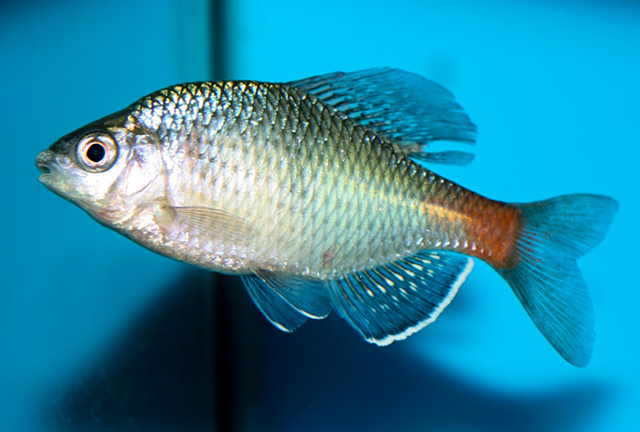
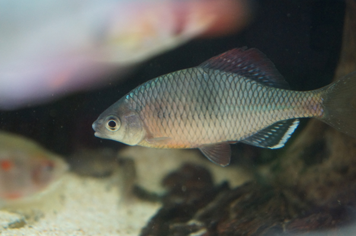

## 越南鱊

Acheilognathus tonkinensis  (Vaillant, 1892)

CAFS:

<http://www.fishbase.org/summary/54709>

### 简介

又名越南刺鰟鲏。体较高而扁薄，外形呈长卵圆形，头后背部显著隆起，腹缘浅弧形。臀鳍具有2根硬刺。侧线完全。尾鳍分叉深。腹腔膜灰褐色，体背部深灰色，腹侧面灰白色。体侧上半部每个鳞片的后援黑色。鳃孔后上方第一个侧线鳞上有一大黑点。沿尾柄中线有一条明显的纵纹。背鳍有三列小黑点。臀鳍灰黑色，边缘白色。其它各鳍灰白色。生活习性和其它鰟鲏亚科类似。主要分布于长江流域、珠江流域和福建等地。

### 形态特征

体高而侧扁，头后背部特隆起，背缘薄，腹缘厚而平直。头似锥形，头长大于头高，但不及体高。口亚下位，口顶水平线在眼下缘之上，上颌末端在眼下缘之下，口呈弧形，两口角间距长于口角间距中点至下颌顶端距离。有口角须，其长约为眼径的1/2或更短。
无锡；河南板桥；福建宁化；安徽石台；山东济南。
眼侧上位。眼间略凸。鳃孔上角在眼上缘水平线之下。鳃盖膜联于峡部。侧线完全，行于体中轴。
背、臀鳍末根不分枝鳍条粗于各自首根分枝鳍条，末端分节。背鳍起点约在吻端和尾鳍基之间，或近吻端。背鳍基长往往长于从背鳍基末至尾鳍基距离，偶尔等长。臀鳍走点和背鳍第四至第六根分枝鳍条相对，臀鳍基长于尾柄长或等长。腹鳍基部和背鳍起点在一个垂直线上或略有重叠，亦位于胸鳍基和臀鳍起点之间。肛门位于腹鳍基和臀鳍走点之间或近前者。尾鳍分叉，最长鳍条约为中央最短鳍条的2倍。
下咽骨近弧形，咽齿侧扁、细长，多数齿侧有深凹纹，个别无，咀嚼面狭，齿端带钩。鳃耙短，约为最长鳃丝的1/4长。鳔2室，前室短，不及后室之半。消化管约为体长的3.3—5.5倍。腹膜黑褐色。
种群个体的大小似乎与性别有关，往往雌鱼小于雄鱼。两性个体的背鳍和臀鳍均呈现黑白相间的纵条纹。雄鱼除了繁殖期具珠星外，在婚姻色上雄鱼较雌鱼更为鲜艳，如在虹膜、背鳍和臀鳍前几根分枝鳍条之末端及尾鳍基部布有红色斑点。雌雄体腹鳍带黄色，雄鱼又夹有红色。尾柄中轴呈现有隐约蓝宝绿色纵条，向头方伸延，但未与近鳃盖上角的黑斑相连。

### 地理分布

广布于我国长江以南各水域。

### 生活习性

栖息于泥沙底质，多水草的湖泊或河流的浅水区，常集群活动。以水生植物为主食。每年4月为繁殖期，产卵于蚌类的外腔中。生殖季节雄鱼的吻端及眼眶前缘有珠星，而雌鱼有产卵管。

### 资源状况

### 参考资料

- 北京鱼类志 P67

### 线描图片

### 标准图片

### 实物图片

