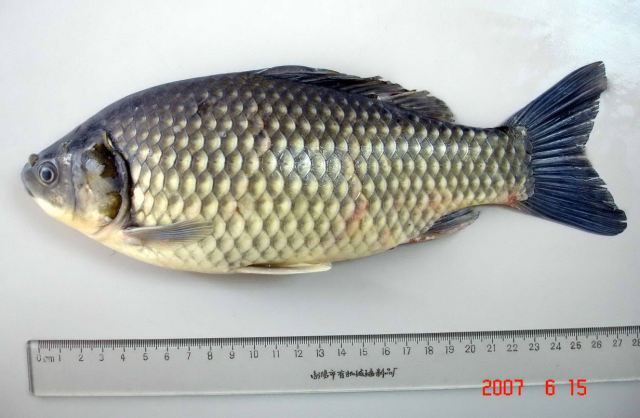
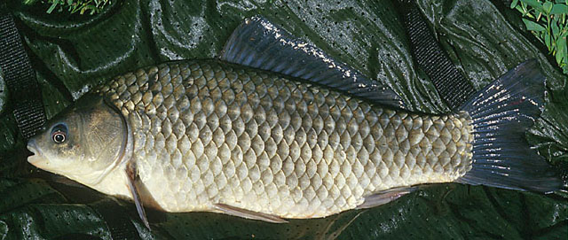

## 银鲫

Carassius gibelio  (Bloch, 1782)

CAFS:750200040B20020001012

<http://www.fishbase.org/summary/6376>

### 简介

体侧扁，宽而高。腹部圆。头小，吻钝。口端位，呈弧形；口裂宽大于口裂长。无须。背鳍基长，其起点距吻端较距尾鳍基近，最末根硬刺粗壮。尾鳍分叉较浅。生活于湖泊、河湾等水流缓慢的水域。成鱼为杂食性，适应性强，常因栖息环境不同，体色有明显变化；同时形成了在形态和生态上都稍有差异的地方性种群。为我国北方主要经济鱼类之一，也用于养殖。

### 形态特征

背鳍条III~Ⅳ―16~19；臀鳍条III-5；胸鳍条I―16，腹鳍条I―8。鳃耙43~53。下咽齿1行，4―4，侧线鳞 。 体长为体高的1.9~2.7（2.4）倍，为头长的3.4~4.3（3.8）倍，为尾柄长的5.7~8.6（8.2）倍。为尾柄高的5.6~6.7（6.3）倍。头长为吻长的2.8~4.5（3.5）倍，为眼径的5.3~6.1（5.6）倍，为眼间距的2.2~2.6（2.4）倍。尾柄长为尾柄高的0.5~0.9（0.8）倍。 体侧扁，体高，腹部圆，头短小，吻钝，口端位，下唇厚。眼小，下咽齿第一枚成圆柱形，后3枚侧扁，齿冠有一道沟纹，鳃耙较多，细长。背鳍外缘平直，起点位于体长的中点，第三根硬刺后缘具锯齿，粗壮。腹鳍起点稍在背鳍起点之前，末端尖。臀鳍起点与背鳍后部第三至第五根分支鳍条相对。尾鳍分叉浅。 标二室，后室长为前室1.4~1.7倍。腹膜灰黑色。

### 地理分布

黑龙江与绥芬河水系支流，广泛分布江河、湖泊、水库。黑龙江水系鲫属仅三倍体银鲫一种。

### 生活习性

栖息静止或流水水域，喜居水草丛生水体。对各种水域环境适应能力很强。耗氧量较小。

### 资源状况

大为减少。

### 参考资料

- 北京鱼类志 P17

### 线描图片

### 标准图片

### 实物图片

