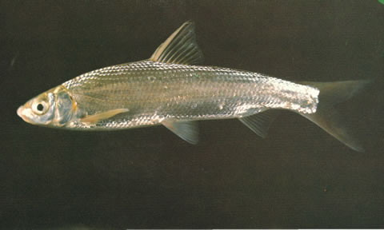
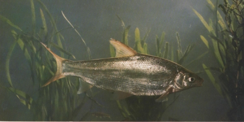

## 银鲴

Xenocypris macrolepis  Bleeker, 1871

CAFS:750200040B10010005

<http://www.fishbase.se/summary/11099>

### 简介

又名密鲴、红鳃。体侧扁，长形。头小。吻钝。口下位。下颌前缘有薄的角质。无须。眼较大，侧上
位。尾鳍分叉较深。鳃盖膜后缘有桔黄色斑块。体银白色，背侧略带暗绿色。胸、腹、臀鳍基部呈浅黄色，背鳍灰色，尾鳍常带黄色。性情活波，喜集群游泳，栖息在水的中下层。常以下颌的角质边缘在其它物体上刮取食物，以食藻类和高等植物碎片为主，也食浮游动物。在长江、黑龙江、黄河、珠江流域及云南均有分布。

### 形态特征

背鳍条III―7；臀鳍条III-8~9；胸鳍条I―15~16，腹鳍条I―8~9。鳃耙35~51。下咽齿3行，2.4.6―6.4.2。侧线鳞 。 体长为体高的3.3~4.0（3.60）倍，为头长的3.7~4.7（4.2）倍，为尾柄长的8.4~10.7（9.4）倍。为尾柄高的8.6~10.1（9.2）倍。头长为吻长的2.3~3.8（3.6）倍，为眼径的3.3~4.7（4.0）倍，为眼间距的2.1~2.9（2.6）倍。尾柄长为尾柄高的0.6~1.2（1.0）倍。 体侧扁，稍延长，头小，吻钝，口下位，上、下颌具角质边缘。鳃耙短 ，排列紧密，下咽齿内行侧扁，顶端成钩状，外侧细条状。鳞片较大，腹鳍基部有1~2片长型的腋鳞。侧线前部微弯，完全。背鳍有一粗壮光滑的硬棘。背鳍起点与腹鳍起点相对，至吻端的距离较至尾鳍基的距离为近。腹鳍起点在胸鳍起点至臀鳍起点间距离的中点，臀鳍起点距尾鳍基较距腹鳍起点近，肛门紧靠臀鳍。腹部无腹棱。尾鳍分叉较深。 鳔二室，后室长，为前室2倍。肠为体长的4.4~6.7（5.6）倍，腹膜黑色。体背部灰黄色，体侧与腹膜银白色。鳃盖膜上有一明显的桔黄色斑块。腹、胸、臀鳍呈浅黄色，背鳍与尾鳍为浅灰色。

### 地理分布

分布于全国各主要水系。

### 生活习性

栖息江河及支流，喜生活在有水流的水域，有集群活动习性，在河道深处越冬。栖息于江、湖的中下层。刮食着生藻类和高等植物碎屑。在自然条件下银鲴以腐屑底泥为主食，同时也摄食硅藻和固着藻类。2年鱼可达性成熟，4～6月在流水中产卵，卵漂流性。天然产量大，尤以江河中上游的数量更多。

### 资源状况

### 参考资料

- 北京鱼类志 P58

### 线描图片

### 标准图片

### 实物图片

