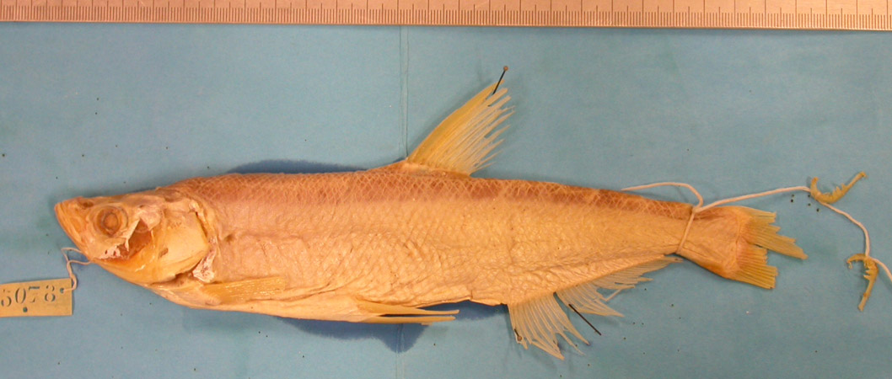
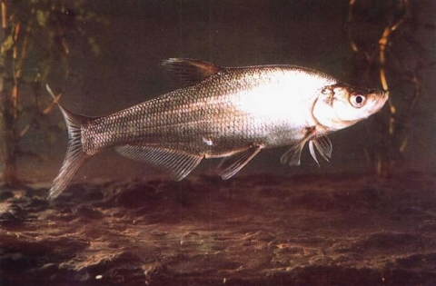

## 青梢红鲌

Chanodichthys dabryi  (Bleeker, 1871)

CAFS:750200040A90110006

<http://www.fishbase.se/summary/46610>

### 简介

又名大眼红鲌、达氏鲌。体长形，侧扁，背部较厚，在头后隆起，腹部在腹鳍处稍凹入，腹棱存在丁腹鳍基至肛门，尾柄较短。侧线前部微弯，后部平直，伸达尾鳍基。体背部灰黑色，腹部银灰色，鳍均呈灰黑色。喜栖息于静水湖泊，在水的中上层游动摄食。以小虾尾食料，偶尔兼食小鱼。凶猛鱼类，在黑龙江、长江、珠江等流域均有分布。

### 形态特征

背鳍条Ⅲ－7，臀鳍条Ⅲ－26～29，胸鳍条I－13，腹鳍条I－8。侧线鳞66（14～15）/（7～8-Ⅴ）70。鳃耙20～22。下咽齿3行，2·4·4-5·4·2。 体长为体高的3.3～4.1(3.7±0.12)倍，为头长的3.6～4.9(4.0±0.17)倍，为尾柄长的7.O～13.3(9.5±0.56)倍。头长为吻长的3.0～5.2(3.7±0.66)倍，为眼径长的4.O～6.0(4．4±0.2)倍，为眼间距的3.O～4.0(3.8±0.42)倍。尾柄长为尾柄高的1.0～1.4(1.1±0.06)倍。 体形长而侧扁，头背面平直，头后背部显著隆起。口半上位，口裂斜，下颌突出。侧线较直，前部略下弯。腹棱自腹鳝基部至肛门。背鳍具有硬刺，起点居中，胸鳍末端达到或超过腹鳍基部，腹鳍基部的腹部向内凹，臀鳍起点位于鳃盖后缘至最后鳞片的中点。尾鳍深叉。 腹腔膜白色。鳔三室，中室最大。三室长度比，由前至后为1:1.9:0.9。背部呈深灰色，体侧银白色，尾鳍镶有黑色边缘。

### 地理分布

分布于全国各主要水系，湖泊、水库均产。

### 生活习性

中上层鱼类，在湖泊内多生活于水草丛生的浅湖湾中，在江河内多在水流缓慢的河湾中。幼鱼以浮游动物为主要食料，成鱼主要食虾和小鱼，亦食少量的水生昆虫和甲壳类。生殖期在5—7月。产卵场多位于水草丛生的湖汊或河湾中，卵具粘性，产出后粘附水草上发育。

### 资源状况

### 参考资料

- 北京鱼类志 P51

### 线描图片

### 标准图片

### 实物图片

