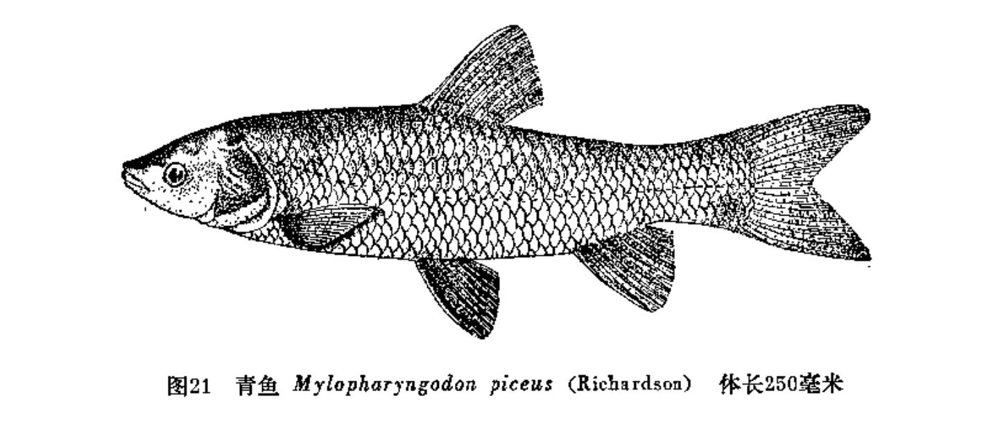
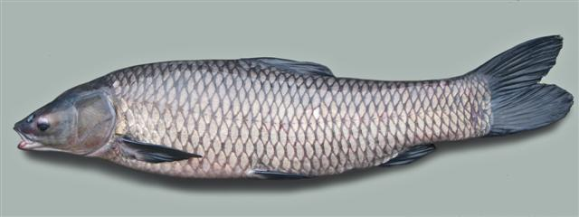
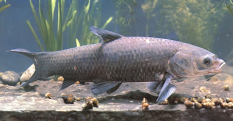

## 青鱼

Mylopharyngodon piceus  (Richardson, 1846)

CAFS:750200040B70120001

<http://www.fishbase.org/summary/4602>

### 简介

又名青鲩、黑鲩、乌鲩、螺蛳青、钢青。体粗壮，近圆筒形，腹部圆，无腹棱。鳃孔宽，向前伸至前鳃盖骨后缘的下方；鳃盖膜与峡部相连；峡部较宽。鳞中大；侧线约位于体侧中轴，浅弧形，向后伸达尾柄正中。体呈青灰色，背部较深，腹部灰白色，鳍均呈黑色。栖息于大江河和湖泊的下层，一般不游至水面。以软体动物为主要食料，有时也食小虾和水生昆虫。生长快，个体大。分布于长江以南平原地区，黑龙江、黄河等水系也有分布。

### 形态特征

背鳍条3，7；臀鳍条3，8～9;胸鳍条1,16～18;腹鳍条2,8;侧线鳞39～44；侧线上鳞6～7，侧线下鳞4～5；下咽齿1行，4(5)-5(4)；背鳍前鳞14～17;围尾柄鳞16～18。第一鳃弓外侧鳃耙13～18。脊椎骨4+37～39。体长为体高的3.3～4.1倍，为头长的3.5～4.4倍，为尾柄长的6.8～8.6倍，为尾柄高的6.3～7.9倍。头长为吻长的3.4～4.6倍，为眼径的5.1～8.8倍，为眼间距的2.0～2.6倍,为尾柄长的1.7～2.2倍,为尾柄高的1.7～2.1倍。尾柄长为尾柄高的0.8～1.1倍。体粗壮，延长，略呈棒形。头顶部宽平，尾部稍侧扁。口端位。呈弧形；上颌稍长于下颌，向后伸至眼前缘之下方。眼适中，位于头侧的中部。鳃耙稀而短小。下咽齿呈臼齿状，齿面光滑。背鳍、臀鳍无硬刺；尾鳍深叉，上下叶等长；体披六角形大圆鳞，鳞中心略偏于前部。体呈青灰色，背面较深，腹部灰白色，各鳍均呈黑色。腹部圆，无腹棱。

### 地理分布

除青藏高原外，广泛分布于我国黑龙江至云南元江。

### 生活习性

喜在中下层活动，一般不游到水面。4～10月摄食季节常集中在江河湾道、沿江湖泊及附属水体中肥育。冬季在河床深水处越冬。在江河中产卵。鱼苗和鱼种阶段，主要摄食浮游动物。体长约15cm时即开始摄食小螺蛳或蜆子。随着下咽齿的发育，压碎功能增强，幼鱼就以软体动物为主食，如蚌、蜆、螺狮等。此外，也食虾、螃蟹和昆虫幼虫。

### 资源状况

现在全国各地均有养殖，但南方养殖较多，北方养殖很少，故北方市场亦很少见。

### 参考资料

- 北京鱼类志 P34

### 线描图片

### 标准图片

### 实物图片

