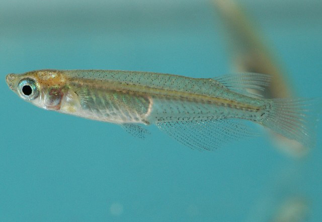
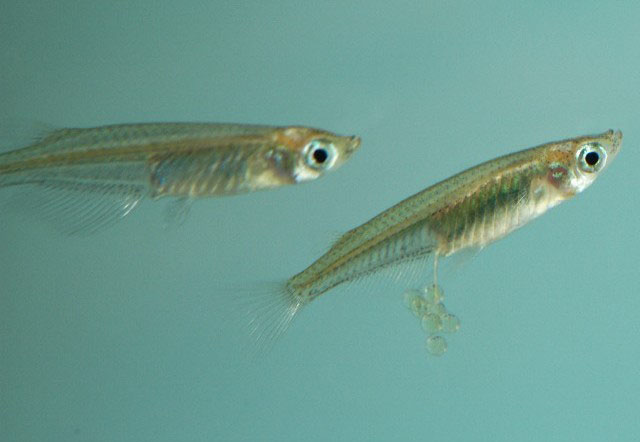

## 青鳉

Oryzias latipes  (Temminck & Schlegel, 1846)

CAFS:750130A10020010001

<http://www.fishbase.org/summary/4669>

### 简介

又名大眼贼。体很小，侧扁，背部较平直，腹面下凸。头中等大，较平扁。无须。眼大。头部及体侧均被圆鳞，体鳞较大。背鳍靠后，接近尾鳍。胸鳍位置较高。尾鳍宽大，后缘稍内凹。体呈青灰色，腹部及各鳍灰白色，臀鳍及尾鳍均散布有黑色小点。小型鱼类，生活在池塘、湖泊、稻田及沟渠。常成群活动于水的上层。分布于海南岛、福建、四川、辽宁、山东等地。

### 形态特征

背鳍条6，臀鳍条16～19，纵列鳞27～30。体长为体高的3.8～4.9倍，为头长的3.4～4.6倍，为尾柄长的5.5～7.0倍,为尾柄高的8.7～11.0倍。头长为吻长的3.7～4.7倍，为眼径的2.2～3.5倍，为眼间距的2.2～2.8倍。体侧扁，背部轮廓较平直，腹缘略呈圆弧状。头中等大，较平扁，眼大，侧上位。口小，上位，口横裂呈"一"字形。下颌稍长于上颌，头部及身体被圆鳞。无侧线。背鳍靠近尾部，其基部末端和臀鳍基部几乎相对。臀鳍基较背鳍基长，其起点距鳃孔末端与距尾鳍基部约等长。背鳍和臀鳍均具柔软的分节鳍条。腹鳍腹位。尾鳍截形。体背淡灰色，体侧及腹面银白色。臀鳍及尾鳍均散布有黑色小斑点，其他各鳍淡色。

### 地理分布

华南、华东各省、东北各省较丰富。

### 生活习性

常成群地栖息于静水或缓流水的表层。在稻田及池塘、沟渠中常见。以昆虫幼虫、小软体动物为食。产卵期为4月下旬到7月中旬。

### 资源状况

### 参考资料

- 北京鱼类志 P87

### 线描图片

### 标准图片

### 实物图片

