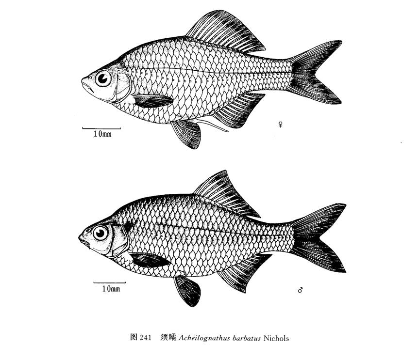

## 须鱊

Acheilognathus barbatus  Nichols, 1926

CAFS:

<http://www.fishbase.org/summary/55891>

### 简介

体侧扁，呈长卵圆形。头小。吻尖。侧线完全，略平直。背鳍和臀鳍均具硬刺。体上部各鳞片边缘黑色，鳃孔后方第一个侧线鳞上有一大斑。长江中下游及福建有分布。

### 形态特征

体侧扁，近卵圆形，体高约为体宽（头后躯部最大左右侧距）2.8倍，未超过3倍。
头较短，头长和头高几相近。吻短钝，通常接近眼径或稍小。口小，亚下位，口顶约在瞳孔下缘水平线上，上颌末端不达眼前缘，亦在眼下缘水平线之下，口裂浅弧形，两口角间距相等或略大于两口角间距中点至上领顶端距离，下唇较上唇肥厚，上下唇联于口角。口角须1对，约有眼径长。眼侧上位。眼间较宽凸。鳃孔上角位在眼上缘水平线之下。鳃盖膜在鳃盖骨前缘下方连于峡部。侧线完全，行至与腹鳍对应处略下弯，继人尾中央。
背、臀鳍末根不分枝鳍条比各自首根分枝鳍条稍粗硬，背鳍起点雄鱼在吻端和尾鳍基之间，雌鱼近尾鳍基较之吻端。背鳍基底长不超过从背鳍基末至尾柄末片鳞的距离。臀鳍基底长于尾柄长，臀鳍起点约与背鳍第七分枝鳍条（雌鱼）或第五（雄鱼）相对应。腹鳍位于背鳍之前下方，腹鳍基部与背鳍起点相距2鳞片或少些，亦在胸鳍基部与臀鳍起点之间。胸鳍和腹鳍约等长，胸鳍末端不达腹鳍，相距1—2鳞片。肛门约在腹鳍基部和臀鳍起点之间。尾鳍分叉较浅，最长分枝鳍条约为中央最短鳍条的2倍。
下咽骨似弧形，咽齿长而侧扁，齿侧缘有凹纹或平滑。背鳍前鳞不及1/2呈棱状。鳔2室，前短后长。消化管长约为体长的4.4—5.6倍。
固定标本体色灰黑，侧线以上色较深。鳃盖上角有一小黑斑。沿尾柄中央有一黑纵条，向前止于背鳍基中点之下方，其粗细往往随性别而异。雄鱼的臀鳍外缘无色，约占最长鳍条1/4，而从臀鳍基部至无色外缘之间的鳍条和间膜密集黑色素；背鳍外缘亦无色，但明显狭于臀鳍。

### 地理分布

分布于长江中下游、福建、山东等地。

### 生活习性

同其它鰟鲏亚科鱼。

### 资源状况

### 参考资料

- 北京鱼类志 P68
- 中国鲤科鱼类志上 P214

### 线描图片

### 标准图片

### 实物图片

