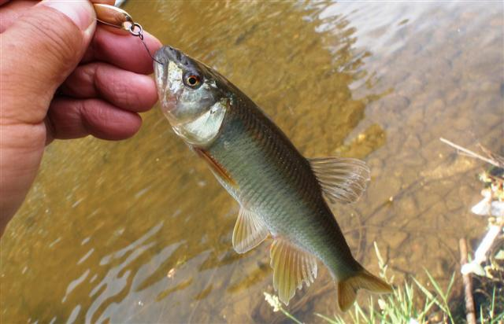

## 马口鱼

Opsariichthys bidens  Günther, 1873

CAFS:750200040A70060002

<http://www.fishbase.org/summary/27264>

### 简介

体厂而侧扁，背、腹部较圆，口大。背部灰蓝色，腹部银白色，体侧有许多蓝绿色的垂直斑条。背鳍和臀鳍具蓝黑色小斑点。胸鳍、腹鳍桔黄色。眼上方有一红色斑点。喜栖息于山涧溪流中，尤喜水流较急多砂砾的支流中，与鱲常集群游泳，性情活波，清晨和傍晚常跃出水面。小型凶猛鱼类，以小鱼、水生无脊椎动物为主要食物。分布于各大水系。

### 形态特征

体长而侧扁，体高略小于或等于头长，腹部圆。吻钝。口亚上位，口裂向下倾斜，上颌骨向后延伸可达眼中部垂直下方。下颌稍长于上颌，前端有1显著的突起与上颌中部凹陷相吻合，上下颌之侧缘凹凸相嵌。无口须。雄性个体在吻和颊部有发达的珠星。眼较小，侧上位。眼后头长大于吻长。眼间距约等于或稍小于吻长。体被圆鳞，中等大小，鳞片之疏密从南到北稍有变异。侧线完全，在胸鳍上方显著下弯，沿体侧下部向后延伸，入尾柄后回升到体侧中部。
背鳍起点约与腹鳍起点相对或稍前，离吻端的距离稍远于到尾鳍基部的距离。胸鳍末端稍尖，向后不达腹鳍起点。腹鳍较钝，末端也不及肛门。肛门紧挨于臀鳍之前。臀鳍条长，性成熟个体最长鳍条向后延伸可达尾鳍基部。尾鳍叉形，末端尖，下叶稍长。
下咽骨弧形，较窄。咽齿锥形，末端钩状。鳃耙稀疏。肠管长度约等于体长。鳔2室，后室长约为前室长的2倍，末端稍尖。腹膜灰白，间或带有细小的黑点。
生活时背部灰黑，腹部银白。颊部及偶鳍和尾鳍下叶橙黄，背鳍的鳍膜带有黑色斑点，体侧具有10-14道浅蓝色垂直斑条。生殖季节的雄鱼尤为鲜艳。固定标本蓝斑变黑。雌体横斑不显著，仅在尾部体侧具有一条不明显的纵行黑纹。

### 地理分布

分布极广，南起海南岛、元江（红河），北至黑龙江流域的我国东部（台湾岛除外）的各江河均有分布。

### 生活习性

栖息于水域上层，喜低温的水流。为肉食性鱼类。马口鱼多生活于山涧溪流中，尤其是在水流较急的浅滩，底质为砂石的小溪或江河支流中；在静水湖泊及江河深水处皆少见。它们通常集群活动，常同鱲鱼一起游泳、生活。性凶猛，以小鱼和水生昆虫为食。最大个体可达20厘米左右。

### 资源状况

### 参考资料

- 北京鱼类志 P42

### 线描图片

### 标准图片

### 实物图片

