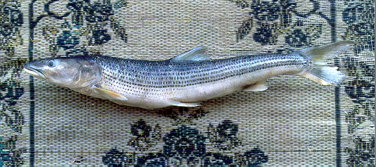
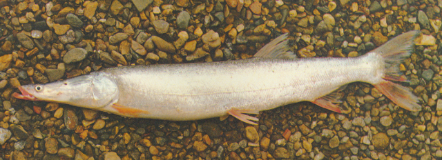

## 鯮鱼

Luciobrama macrocephalus  (Lacepède, 1803)

CAFS:

<http://www.fishbase.org/summary/54895>

### 简介

体细长，近圆筒状，尾柄粗壮。头尖长，前部呈管状，稍平扁，眼后头部侧扁。口上位，下颌显著长于上颌。无须。眼小，位头之前上方，眼后头长远大于吻长。体背深灰，体侧及腹面银白，背鳍灰黄，其他鳍及尾鳍下叶红色。性情凶猛，游动性强，以追捕小鱼为食，危害其它鱼类，是凶猛的肉食鱼类之一。主要分布于长江流域和珠江流域。

### 形态特征

俗名：吹火筒、尖头鳡、马头鯮、鸭嘴鯮、鸭嘴鳡、鹤嘴鳡、长嘴鳡、喇叭鱼、大筒嘴。体细长，略呈圆筒形。腹圆无棱、头细长，前部稍成管状，吻部平扁似鸭嘴形。口较小，上位，下颌向上倾斜，且长于上颌。颊部侧扁。眼小，位于头侧上方，距吻端近；眼后头长为吻长的2.5倍左右。下咽齿细长，末端微弯曲。鳞细小，背鳍起点在腹鳍上方之后；尾鳍分叉深，下叶稍长于上叶。体青灰色，腹部银白；胸鳍淡红色，背鳍、腹鳍和臀鳍灰白色，尾鳍后缘微黑色。

### 地理分布

鯮鱼资源在我国分布较广，珠江、黑龙江、红河、黔江、浔江等水系均有存在，尤其是在长江流域中，不论是上中下游，还是干支流及附属的大中小型湖泊、水库都有鯮鱼的踪迹。

### 生活习性

生活在江河或湖泊的中下层，矫健凶猛，游泳力强，鱼苗时即能吞食其它鱼苗。当体长在30厘米以前，都以游弋方式在水的中上层掠取其它鱼类为食；成鱼则以长形的吻部的石缝中觅食小鱼。性极饕餮，虽消化管内已充满了食物，仍不断吞食，终至将半消化的食物，从肛门处挤出。生长速度较快，性成熟年龄在5龄以上，生殖期为4-7月。成熟的亲鱼于春季即上溯至江河流水较急江段进行繁殖。幼鱼期至湖泊中肥育，仔幼鱼阶段食枝角类和鱼苗；成鱼转为食鱼类，常以其管筒状的长吻在石缝或水草丛中觅食小型鱼类。产卵期4～7月。

### 资源状况

由于过度捕捞、江湖阻隔而影响其幼鱼进入湖泊生活与肥育、大江河中鱼类资源总体下降而使大型凶猛肉食鱼类的食物短缺等原因，导致鯮的种群个体数量显著减少。已很难见到其个体。

### 参考资料

- 北京鱼类志 P35

### 线描图片

### 标准图片

### 实物图片

