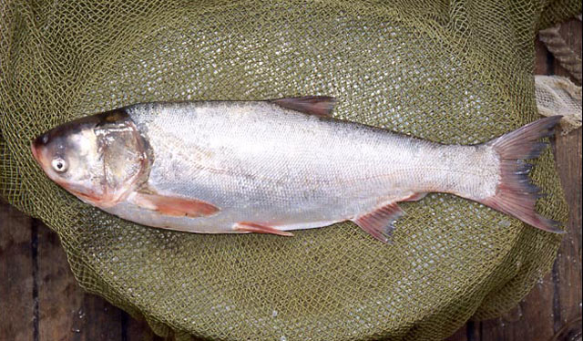
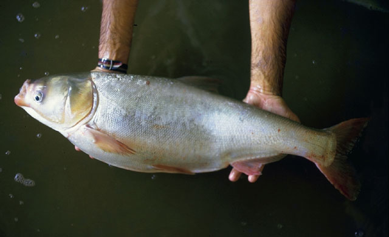

## 鲢鱼

Hypophthalmichthys molitrix  (Valenciennes, 1844)

CAFS:750200040B30010002

<http://www.fishbase.org/summary/274>

### 简介

又名白鲢。头大，吻钝圆，口宽，眼位于头侧下半部，眼间距宽。鳃耙特化，彼此联合成多孔的膜质片，有螺旋形的鳃上器。鳞细小。胸鳍末端不达腹鳍基部。腹部狭窄，自喉部至肛门有发达的腹棱。背鳍短、无硬刺。体呈银白色，胸、腹鳍尾灰白色。栖息于水的中上层，性情活波，受惊动时能跳出水面。以浮游植物为食。分布于黑龙江、长江、珠江、西江等流域。

### 形态特征

体长为体高的2.7—3.6倍，为头长的2.8—4.9倍，为尾柄长的5.3—9.0倍，为尾柄高的7.7—11.7倍。头长为吻长的3.0—4.7倍，为眼径的3.0—7.4倍，为眼间距的1. 8—3.4倍，为头宽的1. 7—1. 9倍。尾柄长为尾柄高的1.0—1.8倍。
体侧扁，稍高，腹部扁薄，从胸鳍基部前下方至肛门间有发达的腹棱。头较鳙小。吻短而钝圆。口宽大，端位，口裂稍向上倾斜，后端伸达眼前缘的下方。无须。鼻孔的位置很高，在眼前缘的上方。眼较小，位于头侧中轴的下方，眼间宽，稍隆起。下咽齿阔而平扁，呈构状。鳃耙彼此连合呈多孔的膜质片。左右鳃盖膜彼此连接而不与峡部相连。具发达的螺旋形鳃上器。鳞小。侧线完全，前段弯向腹侧，后延至尾柄中轴。
背鳍基部短，起点位于腹鳍起点的后上方，第3根不分枝鳍条为软条。胸鳍较长，但不达或伸达腹鳍基部。腹鳍较短，伸达至臀鳍起点间距离的3/5处，起点距胸鳍起点较距臀鳍起点为近。臀鳍起点在背鳍基部后下方，距腹鳍较距尾鳍基为近。尾鳍深分叉，两叶末端尖。
鳔大，分两室，前室长而膨大，后室锥形，末端小。肠长约为体长的6倍。腹腔大，腹腔膜黑色。成熟雄鱼在胸鳍第1鳍条有明显的骨质细栉齿，雌性则较光滑。

### 地理分布

我国东部地区各江河、湖泊、水库均有分布。

### 生活习性

栖息于江河干流及附属水体的上层。性活泼，善跳跃。刚孵出的仔鱼随水漂流；幼鱼能主动游人河湾或湖泊中索饵。产卵群体每年4月中旬开始集群，溯河洄游至产卵场繁殖。产卵后的成鱼往往进人饵料丰盛的湖泊中摄食。冬季，湖水降落，成体多数到河床深处越冬，幼体大多留在湖泊等附属水体深水处越冬。冬季处于不太活动的状态。以浮游植物为主食，但是鱼苗阶段仍以浮游动物为食，是一种典型的浮游生物食性的鱼类。生殖季节在4—7月间。成熟年龄一般为4龄，最小为3龄。繁殖时对外界环境条件的要求与鳙相同。鲢鱼常年摄食，强烈摄食在夏、秋季，也是其生长最迅速的时期，冬季虽也摄食，但食量有限。

### 资源状况

### 参考资料

- 北京鱼类志 P72

### 线描图片

### 标准图片

### 实物图片

