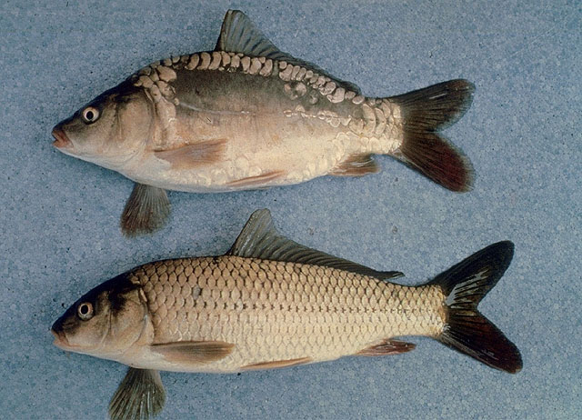
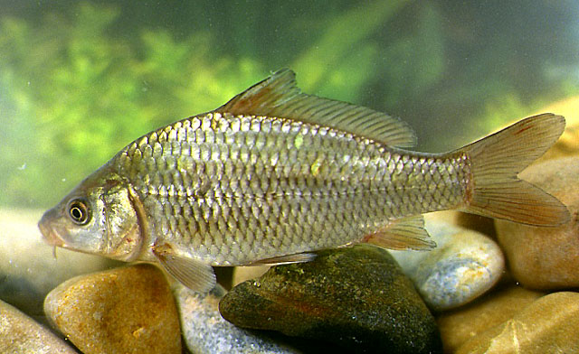

## 鲤鱼

Cyprinus carpio Linnaeus

CAFS:750200040B20040010

<http://www.fishbase.org/summary/1450>

### 简介

俗称鲤拐子。身体侧扁而腹部圆，口呈马蹄形，须2对。背鳍基部较长，背鳍和臀鳍均有一根粗壮带锯齿的硬棘。体侧金黄色，尾鳍下叶橙红色。鲤鱼平时多栖息于江河、湖泊、水库、池沼的水草丛生的水体底层，以食底栖动物为主。其适应性强，耐寒、耐碱、耐缺氧。在流水或静水中均能产卵，产卵场所多在水草丛中，卵粘附于水草上发育。

### 形态特征

体长为体髙的2.5—3.4倍，为头长的3.1 — 4.0倍，为尾柄长的6.5—8.5倍，为尾 柄髙的6.4—7.8倍，为背鳍基长的2.1 — 2.7倍。头长为吻长的2.h3.7倍，为眼径的 3.4—6.5倍，为眼间距的2.2—2.9倍，为尾柄长的1.7—2.6倍，为尾柄高的1.9-2.4 倍。尾柄长为尾柄高的0.8—1.1倍。
体长，侧扁，背部隆起，腹部平直，尾柄宽短，尾柄髙一般大于眼后头长，约与尾 柄长相等或稍大。头较小，近锥形，头长小于背鳍基长及体髙。吻略尖，吻长大于眼径。口亚下位，呈深弧形，上颌稍长于下颌。下颌骨后关节不显著外突，下颌骨长小于 眼间距。唇发达。须2对，发达，口角须长于吻须。眼中等大，眼下缘通常在口裂顶端 水平线之下；眼间宽突，眼间距为眼径2倍以上。鳃盖膜在前鳃盖骨后缘的下方与颊部相连。鳞中等大，侧线前部呈弧形，后部平直，伸达尾鳍基。
背鳍外缘凹人，末根不分枝鳍条为后缘带锯齿的硬刺，剌较粗壮；背鳍起点前于腹 鳍起点，至吻端距离较至尾鳍基为近。臀鳍外缘微凹，末根不分枝鳍条为硬剌，后缘具 锯齿，起点在背鳍倒数第四至第五根分枝鳍条的下方，鳍条末端可达尾鳍基。胸鳍末端略圆，后伸不达腹鳍起点。腹鳍末端不伸达肛门。尾鳍分叉，上下叶约等长，末端稍圆钝。
鳃耙短，呈三角形，排列较稀。下咽骨较短，前臂短于后臂，主行第一枚咽齿为光 滑圆锥形，大于或等于第二枚咽齿，其余咽齿呈臼齿状，齿冠具2—4道沟纹。鳔2室, 前后室约等长，但后室随鱼体增长而相对地缩短。肠较短，盘曲多次，肠长大于体长。腹膜灰白至灰黑色。
体背部呈灰黑色或黄褐色，体侧带金黄色，腹部银白或浅灰色；尾鳍下叶红色，偶 鳍淡红色，背鳍和尾鳍基微黑；体侧鳞片后部有新月形黑斑。

### 地理分布

黑龙江、淮河、长江、钱塘江、闽江、珠江水系，及青藏高原、新疆、内蒙古、海南、台湾。

### 生活习性

鲤鱼是底栖性鱼类。一般喜在水体下层活动，春季生殖后即大量摄食肥育，冬季游动较迟缓；在江中往往进入深水处，而在湖泊中则常游人水草丛生的水域或深水湖槽中越冬。它们对水体生活环境和繁殖条件反映出很强的适应性，因此能在各种水域生活。 鲤鱼的摄食强度是和水温、生殖有密切关系，一般3、4月份随着水温升高，水体中水生植物丛生，它们就开始摄食了，肠管的充塞指数逐渐增大，但到5～6月份生殖季节时，所解剖的性成熟个体的肠管全部是空的，这说明产卵时期停止摄食；产后则大量摄食，从8月一12月是鲤鱼的肥育期，这个时期肠管充塞指标最高，到冬季则摄食强度又大大减低，但并不是完全停止摄食。鲤鱼是杂食性鱼类。从肠管的解剖中经常出现的食物可分动物性和植物性两大类，属于动物性食料的有；螺蛳、黄蜆、幼蚌、淡水壳菜，摇蚊幼虫、脉翅目幼虫、虾、幼鱼。属于植物性食料的有：轮叶黑藻、苦草、茨藻、芡实的果实、腐烂的植物碎片，肠管中食物种类周年是变化的，春夏季以植物性食物为主，秋季以动物性的食物为主，冬季则高等植物种子出现率增大。

### 资源状况

产量高，主要食用鱼类，最大可生长到10kg，是我国最早的水产养殖对象。

### 参考资料

- 中国动物志-硬骨鱼纲-鲤形目下册 P412
- 北京鱼类志 P14

### 线描图片

### 标准图片

### 实物图片

