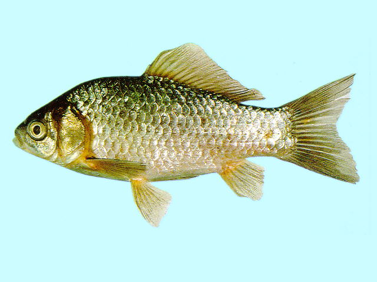
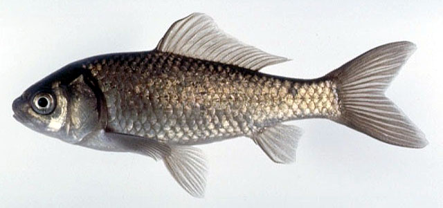

## 鲫鱼

Carassius auratus  (Linnaeus, 1758)

CAFS:750200040B20020001

<http://fishbase.org/summary/271>

### 简介

又名喜头、鲫鱼、鲫壳、鲫瓜子。体侧扁而高。头较小，吻钝。无须。下咽齿侧扁。背鳍基部较短。背鳍、臀鳍具粗壮的、带锯齿的硬刺。为广布、广适性鱼类，分布自亚寒带至亚热带，能适应各种恶劣环境。杂食性，食浮游生物、底栖动物及水草等。繁殖力强，成熟早。3—7月，在浅水湖汊或河湾的水草丛生地带繁殖，分批产卵，卵粘附于水草或其他物体上。为中小型鱼类，常见为半市斤左右。广布于全国各水系。

### 形态特征

背鳍条3，15～19；臀鳍条3，5；胸鳍条1,16～17;腹鳍条1,8;侧线鳞27～30；背鳍前鳞12～14;围尾柄鳞16;下咽齿1行，4－4，第一鳃弓外侧鳃耙37～54，脊椎骨4+26～28。体长为体高的2.2～2.8倍，为头长的3.2～4.0倍，为尾柄长的6.5～8.5倍，为尾柄高的5.3～6.5倍,为背鳍基部长度的2.5～2.6倍。头长为吻长的3.2～4.4倍，为眼径的3.4～5.0倍，为眼间距的2.0～2.5倍,为眼后头长的1.6～2.0倍,为尾柄长的2.4～2.7倍,为尾柄高的1.7～1.8倍。尾柄长为尾柄高的0.8～1.0倍。体侧扁，厚而高，腹部圆,尾柄宽短。头小，眼大，口端位，无须。背鳍和臀鳍最后1根硬刺后缘具锯齿。鳔2室。体色背部灰黑，腹部灰白，各鳍灰色。

### 地理分布

除青藏高原外全国各水系和各种水体中。

### 生活习性

广适性鱼类，比较喜欢栖息在水草丛生的浅水河湾湖汊中，生命力较强，对各种环境有广泛的适应性，在不良环境如低氧，碱性较大的水中也能生长繁殖。鲫鱼是周年都摄食的，不因为冬季水温降低和生殖季节生理变化而停止摄食。杂食性鱼类。

### 资源状况

### 参考资料

- 北京鱼类志 P16

### 线描图片

### 标准图片

### 实物图片

