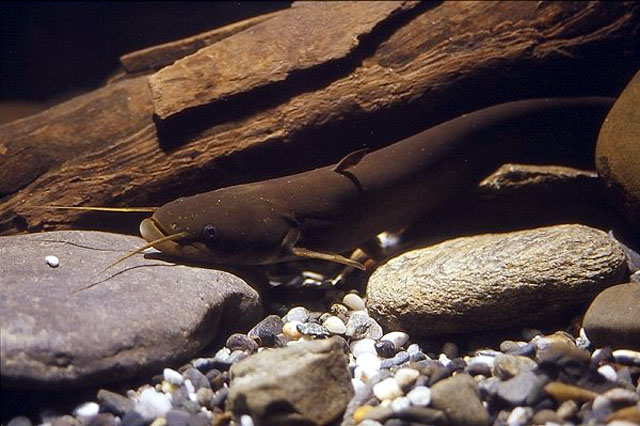
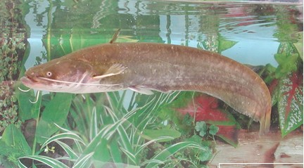

## 鲇（鲶鱼）

Silurus asotus  Linnaeus, 1758

CAFS:750200050070A40006

<http://www.fishbase.org/summary/6566>

### 简介

又名鲇、猫鱼、黄骨鱼、鲐巴鱼、青花鱼、油胴鱼、鲭鱼、青条鱼。体延长，前部略呈短圆筒形，后部渐侧扁。头纵扁，宽大于头高，钝圆。吻宽且纵扁。口大，次上位，口裂呈弧形且浅，伸达眼前缘垂直下方。唇厚，口角唇褶发达，上唇沟和下唇沟明显。臀鳍基部甚长，后端与尾鳍相连。胸鳍圆形，侧下位，骨质硬刺前缘具弱锯齿，被以皮膜，后缘锯齿强，鳍条后伸不及腹鳍。体色随栖息环境不同而有所变化，一般生活时体呈褐灰色，体侧色浅，具不规则的灰黑色斑块，腹面白色，各鳍色浅。大型鱼类，常生活于水草丛生、水流较缓的泥底层。为肉食性鱼类，以虾、小鱼为食。在各地分布广泛。

### 形态特征

背鳍4—5；臀鳍条75—86；胸鳍条Ⅰ-9—13；腹鳍条i-12—13。鳃耙9—13。
体长为体高的4．3—6．1倍，为头长的4．3—5．4倍，为前背长的2．8—3．6倍。头长为吻长的3．1—4．4倍，为眼径的6．6一l0倍，为眼间距的1．6—2．2倍，为头宽的1．2—1．7倍，为口裂宽的1．3—2倍。游离脊椎骨50—540 。
体延长，前部略呈短圆筒形，后部渐侧扁。头纵扁，宽大于头高，钝圆。吻宽且纵扁。口大，次上位，口裂呈弧形且浅，伸达眼前缘垂直下方。唇厚，口角唇褶发达，上唇沟和下唇沟明显。下颌突出于上颌。上、下颌具绒毛状细齿，形成弧形宽齿带，中央分离或分离界限不明显；犁骨齿形成一条弧形宽齿带，两端较尖，内缘中央较窄。眼小，侧上位，为皮膜覆盖。前后鼻孔相离较远，前鼻孔呈短管状，后鼻孔圆形。颌须较长，后伸达胸鳍基后端；颏须短。鳃孔大。鳃盖膜不与鳃峡相连。
背鳍短小，约位于体前1／3处、腹鳍起点垂直上方之前，无硬刺。臀鳍基部甚长，后端与尾鳍相连。胸鳍圆形，侧下位，骨质硬刺前缘具弱锯齿，被以皮膜，后缘锯齿强，鳍条后伸不及腹鳍。腹鳍起点位于背鳍基后端垂直下方之后，距臀鳍起点小于至胸鳍基后端。肛门距臀鳍起点较距腹鳍基后端为近。尾鳍微凹，上、下叶等长。
体色随栖息环境不同而有所变化，一般生活时体呈褐灰色，体侧色浅，具不规则的灰黑色斑块，腹面白色，各鳍色浅。

### 地理分布

除青藏高原及新疆外，遍布全国各水系。

### 生活习性

生活在江河、湖泊、水库的中下层，多栖息在水草丛生、水流缓慢的底层。白天多隐蔽，晚间则十分活跃，习惯于游至浅水处觅食。秋后潜居于深水或污泥中越冬。为肉食性底栖鱼类，经常伏身于水草丛生的水底，等候小鱼接近时张口吞食，也食虾类和水生昆虫。

### 资源状况

### 参考资料

- 北京鱼类志 P86

### 线描图片

### 标准图片

### 实物图片

