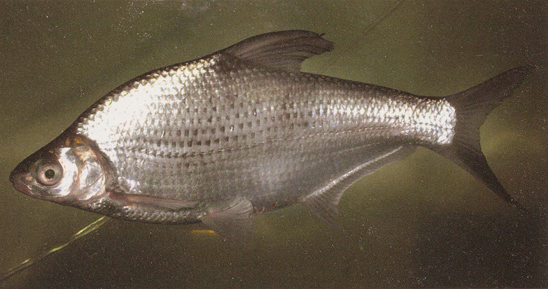
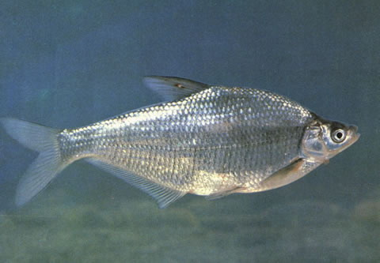

## 鳊鱼

Parabramis pekinensis  (Basilewsky, 1855)

CAFS:750200040A90060001

<http://www.fishbase.org/summary/282>

### 简介

又名鳊，亦称长身鳊、鳊花、油鳊、长春鳊。体高，甚侧扁，呈长菱形，背部窄，腹部自胸鳍基下方至肛门具腹棱，尾柄宽短。头
小，侧扁，略尖，头长远较体高为小。体背部青灰色，略带浅绿色光泽，体侧和腹面银灰色，各鳍均为灰白色。栖息于水的中下层，喜栖息在河床上有岩石的流水中，冬季群集于深水处。草食性鱼类。幼鱼喜食浮游动物、藻类、水生昆虫以及少量水生植物碎片。广泛分布于国内各大水域。

### 形态特征

体高，甚侧扁，呈长菱形，背部窄，腹部自胸鳍基下方至肛门具腹棱，尾柄宽短。头小，侧扁，略尖。头长远较体高为小。吻短，吻长大于或等于眼径。口端位，口裂小而斜，上下颌约等长，上颌骨伸达鼻孔前缘的下方。眼中大，位于头侧，眼后缘至吻端的距离小于眼后头长。眼间宽，圆凸，眼间距较眼径为大。鳃孔伸至前鳃盖骨后缘稍前的下方；鳃盖膜与峡部相连。鳞中大，背腹部鳞较体侧为小。侧线平直，约位于体侧中央，向后伸达尾鳍基。
背鳍位干腹鳍基的后上方，末根不分枝鳍条为硬刺，刺长一般大于头长，第一分枝鳍条一般长于头长；背鳍起点至吻端的距离与至尾鳍基的距离相等或近尾鳍基。臀鳍基部长，外缘微凹，起点与背鳍基部末端相对，至腹鳍起点的距离大于臀鳍基部长的1/2。胸鳍末端稍尖，一般不伸达腹鳍起点。腹鳍位于背鳍的前下方，后伸不达肛门。尾鳍深分叉，末端尖形，下叶略长于上叶。
鳃耙短小，呈三角形。下咽骨宽短，呈弓形，前臂粗短，后角突显著。主行咽齿近侧扁，末端微弯。鳔3室，中室最大，后室小而末端尖。肠长，多次盘旋，肠长为体长的2.5—3.0倍。腹膜灰黑色。
体背侧青灰色，腹侧银白色，鳍呈灰色。

### 地理分布

广泛分布于黑龙江、松花江、嫩江、镜泊湖、兴凯湖等水域。

### 生活习性

鳊鱼为草食性鱼类，鱼种及成鱼以苦草、轮叶黑藻、眼子菜等水生维管束植物为主要食料，也喜欢吃陆生禾本科植物和菜叶，还能摄食部分湖底植物碎屑和少量浮游动物，因此食性范围较广。鳊鱼平时栖息于底质为淤泥、并长有沉水植物的敞水区的中、下层中，冬季喜在深水处越冬。它生活于江河、湖泊中。平时栖于水的中下层。比较适于静水性生活。

### 资源状况

### 参考资料

- 北京鱼类志 P50

### 线描图片

### 标准图片

### 实物图片

