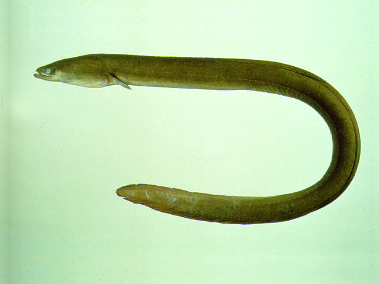
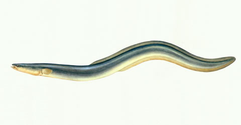

## 鳗鲡

Anguilla japonica Temminck et Schlegel,1846

CAFS: 750180200020010005

<http://www.fishbase.org/summary/295>

### 简介

又名日本鳗鲡，俗称青鳝、白鳝、鳗鱼、鳗，体长440厘米，体细长，前部圆柱形，后部侧扁，头部钝尖。体呈灰黑色，腹部黄白色。为降河入海产卵的洄游性鱼类。成鱼栖息于江河湖泊及水库底层，白天潜伏于洞穴或石缝中，夜间出来活动，以小鱼、小虾、水生昆虫、甲壳动物为食，也食动物尸体。肉质细嫩，含脂量高。分布于长江、闽江、珠江流域，以及海南岛等地。

### 形态特征

体长为体高的16.0～20.7倍，为头长的6.9～7.8倍。头长，为吻长的4.4～5.5倍，为眼径的10.7～13.7倍，为眼间距的4.8～6.0倍，为胸鳍长的2.9～3.4倍。脊椎骨108～110。身体细长，前部近圆筒状，后部稍侧扁。头长而尖，约等于或稍大于背鳍起点至臀鳍起点的垂直间距。口较大，端位，口裂后端仲达眼后缘，上下颌具细齿，唇厚，为肉质。眼很小，位于口角之上方。鳃孔小，位于胸鳍基部下方，左右分离。侧线完全，鳞细而长，隐藏于表皮内。背鳍很低且长，其起点至尾鳍基部为至吻端距离的2.2倍左右，后端与尾鳍相连。脚鳍短圆，位于体侧正中，贴近鳃孔。无腹鳍。臀鳍低而长，与尾鳍相连，尾鳍末端较尖。鳔1室，较小，壁厚，有一管沿其腹面通至食道。胃有盲囊。体腔膜白色。体背部暗褐色，腹部白色，无斑点。
　
　   　   　
### 地理分布

日本、朝鲜及中国沿海地区，我国北起鸭绿江，南至北仓河、 海南岛，东起台湾省，西至长江上游均有分布 。 　

### 生活习性

鳗鲡是一种降河性洄游鱼类。每年春季，有大批幼鳗（也称鳗线）成群自海进人长江口。雄鳗通常就在长江口成长，而雌鳗则逆流上溯进入长江的干、支流和与江相通的湖泊中，有的甚至跋涉几千公里到达长江的上游各水系，如金沙江、岷江、嘉陵江地区。它们在江河湖泊中生长、肥育、昼伏夜出。到了一定的年龄（成熟年龄约5～8年），在秋季又大批降河，游到长江口会同在长江口一带的雄鳗继续游到海洋中进行繁殖。 常在夜间捕食，食物中有小鱼、蟹、虾、甲壳动物和水生昆虫。也食动物腐败尸体，更有部分个体的食物中发现有高等植物碎屑。摄食强度随水温升高而增强，一般以春、夏两季为最高。池养的鳗鲡在盛夏摄食强度降低。

### 资源状况

过度开发，已严重缺乏。

### 参考资料

- 北京鱼类志 P10

### 线描图片

### 标准图片

### 实物图片

