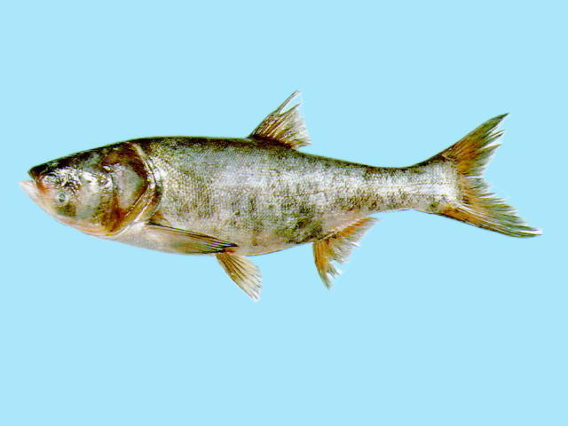
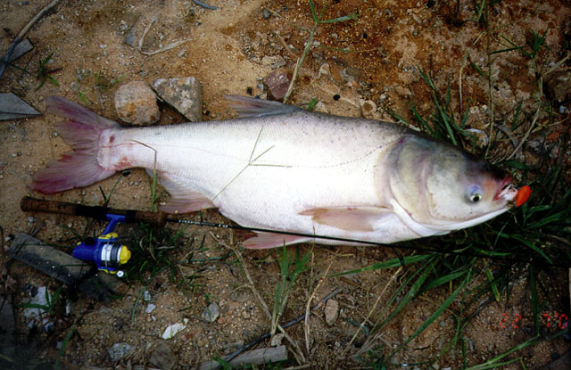

## 鳙鱼

Hypophthalmichthys nobilis  (Richardson, 1845)

CAFS:750200040B30020001

<http://www.fishbase.se/summary/275>

### 简介

又名花鲢、黑鲢、包头鱼、胖头、松鱼。体侧扁，较高，腹部在腹鳍基部之前较圆，其后部至肛门前有狭窄的腹棱。头极大，前部宽阔，头长大于体高。背部及体侧上半部微黑，有许多不规则的黑色斑点；腹部灰白色。各鳍呈灰色，上有许多黑色小斑点。背鳍短、无硬刺。体背及体侧灰黑色，间有浅黄色光泽，腹部银白色。生活于水的中上层，性情温顺，行动迟缓，不善跳跃，易捕获。以浮游动物为食，偶食浮游植物。在国内分布极广，但在黄河以北各水体的数量较少。

### 形态特征

体长为体高的2.7—3.7倍，为头长的2.5—3.9倍，为尾柄长的5.2—7.6倍，为尾 柄高的7.7—11.6倍。头长为吻长的3.0—4.2倍，为眼径的3.6—7.7倍，为眼间距的1. 8—3.0倍，为头宽的1. 4—1. 9倍。尾柄长为尾柄高的1. 3—1. 9倍。
体侧扁，较高，腹部在腹鳍基部之前较圆，其后部至肛门前有狭窄的腹棱。头极大，前部宽阔，头长大于体高。吻短而圆钝。口大，端位，口裂向上倾斜，下颌稍突出，口角可达眼前缘垂直线之下，上唇中间部分很厚。无须。眼小，位于头前侧中轴的下方；眼间宽阔而隆起。鼻孔近眼缘的上方。下咽齿平扁，表面光滑。鳃耙数目很多，呈页状，排列极为紧密，但不连合。具发达的螺旋形鳃上器。鳞小。侧线完全，在胸鳍末端上方弯向腹侧，向后延伸至尾柄正中。
背鳍基部短，起点在体后半部，位于腹鳍起点之后，其第1-3根分枝鳍条较长。胸鳍长，末端远超过腹鳍基部。腹鳍末端可达或稍超过肛门，但不达臀鳍。肛门位于臀鳍前方。臀鳍起点距腹鳍基较距尾鳍基为近。尾鳍深分叉，两叶约等大，末端尖。
鳔大，分两室，后室大，为前室的1.8倍左右。肠长约为体长的5倍左右。腹膜黑色。雄性成体的胸鳍前面几根鳍条上缘各具有1排角质“栉齿”，雌性无此性状或只在鳍条的基部有少量“栉齿”。
背部及体侧上半部微黑，有许多不规则的黑色斑点；腹部灰白色。各鳍呈灰色，上有许多黑色小斑点。

### 地理分布

分布极广，南起海南岛，北至黑龙江流域的我国东部各江河、湖泊、水库均有分布，但在黄河以北各水体的数量较少，东北和西部地区均为人工迁入的养殖种类。

### 生活习性

生活于江河干流、平缓的河湾、湖泊和水库的中上层，幼鱼及未成熟个体一般到沿江湖泊和附属水体中生长，性成熟时到江中产卵，产卵后大多数个体进人沿江湖泊摄食肥育，冬季湖泊水位跌落，它们又回到江河的深水区越冬，翌年春暖时节则上溯繁殖。为温水性鱼类，适宜生长的水温为25—30℃，能适应较肥沃的水体环境。性情温驯，行动迟缓。从鱼苗到成鱼阶段都是以浮游动物为主食，兼食浮游植物，是典型的浮游生物食性的鱼类。

### 资源状况

### 参考资料

- 北京鱼类志 P73

### 线描图片

### 标准图片

### 实物图片

