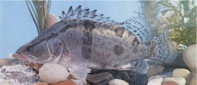

## 鳜鱼

Siniperca chuatsi  (Basilewsky, 1855)

CAFS:750200430030E10006

<http://www.fishbase.org/summary/28054>

### 简介

又名翘嘴鳜、胖鳜、季花鱼、鳌花、桂鱼、桂花鱼、螯鱼、花鲫鱼。体高而侧扁，背部隆起，背缘呈弧形，腹部圆凸。口裂略向上倾斜。上颌、下颌、犁骨和口盖骨均有大小不等的小齿。眼较大，位于头的前部，侧上位。鳞片为细小的圆鳞。后鳃盖骨的边缘有平扁的大刺。背鳍长，前部为硬刺，后部为鳍条。胸鳍圆形。腹鳍有硬刺。臀鳍由硬刺和软鳍条组成。尾鳍圆形。体呈黄绿色，腹部灰白色，体侧具有多个不规则的暗棕色斑块。背、尾、臀鳍均有暗棕色条斑纹。一般生活在静水或缓流的水体中，白天卧穴，夜间活动。冬季在深水处越冬。肉食性凶猛鱼类，以其它鱼类为主要食物。全国各江河湖泊均有分布。

### 形态特征

背鳍条Ⅷ，13～15；臀鳍条Ⅲ，9一11；侧线鳞121～128；鳃耙外侧6～7；脊椎骨26；幽门垂132～323。体长为体高的2.7～3.1倍，为头长的2.5～2.9倍，为尾柄长的5.9～6.8倍，为尾柄高的8.7～10.0倍。头长为吻长的3.3～3.8倍，为眼径的5.3～8.1倍，为眼间距的6.6一8.0倍。体较高而侧扁，背部隆起。口大，端位，口裂略倾斜。上颌骨延伸至眼后缘，下颌稍突出。上下颌、犁骨和口盖骨均具有绒毛状小齿，而上下颌前部的小齿则扩大成犬齿状。眼上侧位。前鳃盖骨后缘锯齿状，有4～5个大棘。鳃盖骨后部有2个平扁的棘。鳞细小，圆鳞，侧线沿背弧向上弯曲。背鳍长，为二部分，前部为硬刺。胸鳍圆形。腹鳍近胸部。尾鳍圆形。缥大，1室。腹腔膜白色。体黄绿色，腹部灰白色。体侧具有不规则的暗棕色斑点及斑块。自吻端穿过眼眶至背鳍前下方有一条狭长的黑色带纹，在背鳍的第6～7根刺的下方，有一条较宽的暗棕色垂直带纹。奇鳍上均有暗棕色的斑点连成带纹。

### 地理分布

除青藏高原外，分布于全国各主要水系。

### 生活习性

鳜一般生活在静水或缓流的水体中，尤以水草茂盛的湖泊中数量最多。冬季不大活动，常在深水处越冬。在春季，鳜鱼游向浅水区，白天有卧穴的习性，渔民即用“踩鳜鱼”或“鳜鱼夹”等方法捕捉，而夜间鳜鱼又喜在水草丛中觅食，则用三角网捞捕。生殖季节，亲鱼群集到产卵场进行产卵活动。幼鱼常游动在沿岸水草丛中。 鳜鱼为肉食性凶猛鱼类，以其他鱼类为主要食料。冬季一般停止摄食，在春、秋季捕食最为旺盛。食物中的主要成分是鳑鮍、鲫鱼、虾等。

### 资源状况

### 参考资料

- 北京鱼类志 P91

### 线描图片

### 标准图片

### 实物图片

