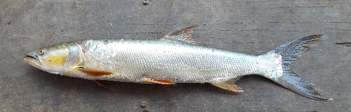
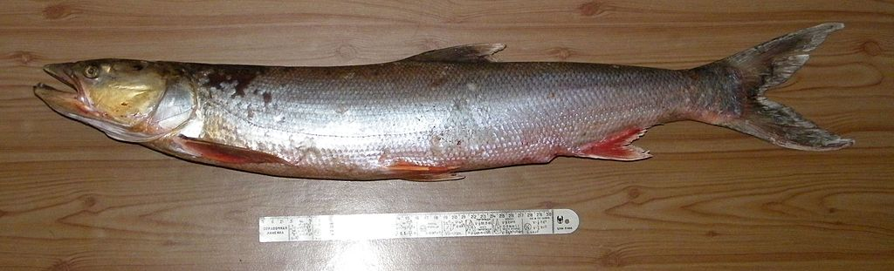

## 鳡鱼

Elopichthys bambusa  (Richardson, 1845)

CAFS:750200040B70060001

<http://www.fishbase.org/summary/12068>

### 简介

又名竿鱼、大口鳡介鱼、黄钻、虎鱼、横杆子、黄尖、横色、鳡条。体修长，头锥形，吻部尖。下颌前端有一坚硬的骨质凸起，与上颌的凹陷相嵌合。鳞细小。背鳍起点位于腹鳍之后上方。鲜活时体背侧灰黑色，腹侧银白色；背鳍、尾鳍深灰色，其余鳍及峡部呈黄色，尾鳍边缘黑色。大型凶猛性鱼类，性情活波，游动迅速，善于猎食，常在敞水区域追捕鲢、鳙、鮊类等鱼为食。上等的食用鱼类，但危害其它鱼类。出西北、西南外，在各水系广泛分布。

### 形态特征

鳡的身形如梭，体色微黄，腹部银白，背鳍、尾鳍青灰色。体细长，稍侧扁，腹部圆，无腹棱。体长约80厘米，最大者可达2米，重可达67公斤。头长而前端尖，吻长远超过吻宽。口大，端位，口裂末端可达眼缘的下方。下颌前端有一坚硬的骨质突起，与上颌前缘的凹陷相吻合，上下颌均粗壮。眼小，鳞细，侧线鳞110～117。背鳍Ⅲ9～10，很小，起点位于腹鲭之后。臀鳍Ⅲ10～11。尾鳍分叉很深。体微黄，腹部银白色；背鳍、尾鳍青灰色，颊及其他各鳍淡黄色。

### 地理分布

我国除西北、西南之外，从北至南平原地区的水系中皆有分布。

### 生活习性

鳡鱼，生活在江河、湖泊的中上层，游泳迅速，行动敏捷，是一种主要以鱼类为食的典型的凶猛鱼类，也是大型的淡水经济鱼类。该鱼生长快、个体大、肉味鲜美，一向被视为高档淡水鱼类。

### 资源状况

近几年来，由于山区水利工程的建造、水域环境的恶化等原因，使鱤鱼自然资源急剧下降，现今，除长江及与长江直接相通的湖泊中尚可捕到鱤鱼外，绝大部分的江河、湖泊已难寻鱤鱼踪迹。

### 参考资料

- 北京鱼类志 P41

### 线描图片

### 标准图片

### 实物图片

