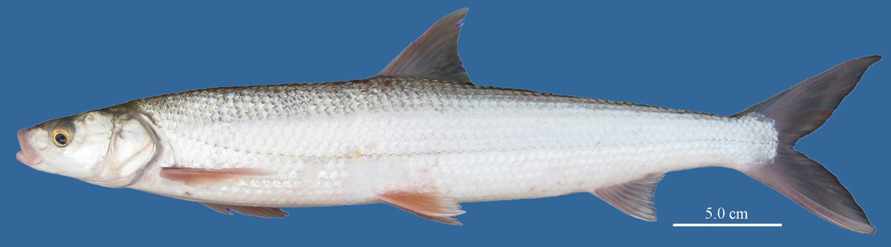

## 鳤鱼

Ochetobius elongatus  (Kner, 1867)

CAFS:

<http://www.fishbase.org/summary/25599>

### 简介

体低而延长，呈圆筒状，尾柄低。头短，稍侧扁。吻短，稍失，吻长大于眼径。鲜活时体背侧灰黑色，腹部银白色。鳞片中等大小，尾鳍末端尖，分叉深。背鳍、臀鳍、尾鳍带淡黄色，尾鳍边缘黑色。中型鱼类，有江湖洄游习性，性情温和，生活在水的中上层，以浮游动物为食，有时也吃小鱼。广泛分布于各大水系。

### 形态特征

体细长，近似筒状。头小，呈锥状。口较小，端位，口裂平直，无须。下咽齿3行，宽大而光滑，末端成钩状。背鳍无硬刺，其起点与腹鳍相对。尾鳍分叉很深，两叶末端均尖。体背部呈蓝绿色，腹部银白，体侧正中上方有一条浅黄绿色的纵带；偶鳍和臀鳍桔黄色，尾鳍灰黑色。

### 地理分布

我国长江流域及其以南各类水体中均产。

### 生活习性

食物多为动物性成分，如水生昆虫、枝角类，小鱼、虾等。外形似鳡，但性情较温和，有江湖洄游的习性。每年7-9月进入湖泊中肥育，到生殖季节时重又回到江河急流中进行生殖。生殖季节为4-6月，性成熟年龄为3-5冬龄。产卵场所需要有流水，而在静水中不能繁殖。

### 资源状况

### 参考资料

- 北京鱼类志 P43

### 线描图片

### 标准图片

### 实物图片

