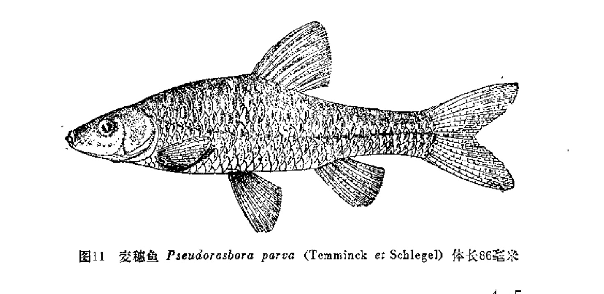
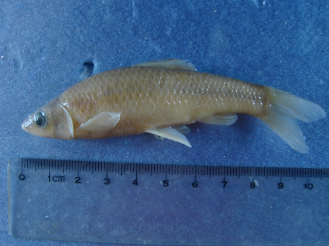
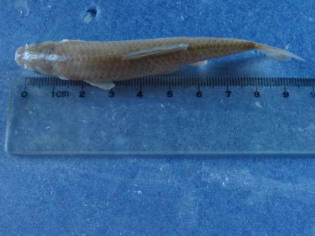

## 麦穗鱼

Pseudorasbora parva  (Temminck & Schlegel, 1846)

CAFS:750200040B10120002

<http://www.fishbase.org/summary/4691>

### 简介

又名罗汉鱼、肉碗儿、野草鱼。体长，侧扁，尾柄较宽，腹部圆。。尾鲭宽阔，分叉浅，上下叶等长，末端圆。体背及体侧灰黑色，腹部银白色。体侧鳞片的后缘有新月形的黑斑。各鳍灰白色。为江河、湖泊、池塘等水体中常见的小型鱼类。喜栖息于水草丛生的浅水水域。杂食，主食浮游动物。产卵期4—6月。卵椭圆形，具粘性，成串地粘附于石片、蚌壳等物体上，孵化期雄鱼有守护的习性。

### 形态特征

背鳍条3，7；臀鳍条3，6，胸鳍条1,12～13;腹鳍条1,7;侧线鳞34～38；背鳍前鳞12～14;围尾柄鳞12～14。第一鳃弓外侧鳃耙7～9；下咽齿1行，5－5、5－4或4-5。脊椎骨4+30～35。体长为体高的3.4～4.3倍，为头长的3.7～4.8倍，为尾柄长的4.0～5.4倍，为尾柄高的7.4～10.0倍。头长为吻长的2.6～3.6倍，为眼径的3.5～5.2倍，为眼间距的2.0～3.0倍,为尾柄长的1.1～1.4倍,为尾柄高的1.6～2.5倍;尾柄长为尾柄高的1.5～2.0倍。体高较短,稍延长，头小，口小，上位。下颌略向上突起，且长于上颌，口角无须。背部、背鳍无硬刺，背鳍起点在吻端至尾鳍基部的中点。臀鳍起点距腹鳍基部比距尾鳍基部为近。胸鳍不达腹鳍，尾鳍分叉，侧线完全，鳔2室，腹腔膜银白色。体背及体侧上半部呈灰黑色，腹部银白色，自吻端通过眼中部沿体侧中轴直达尾鳍基部纵贯一黑色条纹。体侧每个鳞片的后缘均有一半月形的黑色斑纹，幼鱼更为显著。在生殖季节，雌鱼产卵管稍延长，雄鱼体色变为暗黑色，头部有粗糙的"珠星"出现。

### 地理分布

分布甚广,几遍布中国各主要水系。

### 生活习性

通常栖息于水草丛中，食物以浮游生物为主，其中桡足类和枝角类最多，其次为藻类和水草，也吃昆虫。

### 资源状况

### 参考资料

- 北京鱼类志 P21

### 线描图片

### 标准图片

### 实物图片

