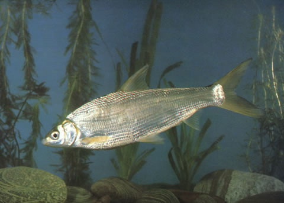

## 黄尾鲴

Xenocypris davidi  Bleeker, 1871

CAFS:750200040B10010001

<http://www.fishbase.org/summary/54925>

### 简介

又名黄尾、黄片、黄鱼、黄姑子。体长而侧扁，较银鲴为厚。头小。吻钝。口下位，略呈弧形。下颌前缘有薄的角质层。背部灰黑色，腹部肌体侧下半部银白色，鳃盖骨后缘有一浅浅黄色斑块，尾鳍黄色。本种和银鲴较相似，容易混淆。主要区别为本种体相对地高、厚；鳞片数较多；新鲜时尾鳍黄色；分布范围也较银鲴狭。栖息于水的中下层，以高等植物碎片、藻类为食，也食少量浮游动物、虾、水生昆虫等。分布广泛，长江流域最为常见。

### 形态特征

体长而侧扁，较银鲴为厚。头小。吻钝。口下位，略呈弧形。下颌前缘有薄的角质层。眼较大，侧上位。眼后头长大于吻长。鼻孔位于眼的前上部，至吻端与至眼前缘的距离约相等。鳞中大；侧线完全，在胸鳍上方略下弯，向后伸人尾柄中央。
背鳍起点约与腹鳍起点相对或稍前，至吻端的距离小于至尾鳍基的距离。胸鳍末端尖，后伸不达腹鳍起点。腹鳍末端不达肛门，其基部有1—2片长形腋鳞。腹部无腹棱或在肛门前有短的腹棱。臀鳍末端不达尾鳍基部。尾鳍叉形。
鳃耙短，呈三角形，排列紧密。下咽骨近弧形，较窄。下咽齿3行，主行齿侧扁，上端有长的咀嚼面，顶端稍尖；外侧两行咽齿细长。鳔2室，后室长为前室长的2. 3倍左右。成鱼肠长为体长的3.8—6.9倍，多为5—6倍。腹膜黑色。
新鲜标本背部灰黑色，腹部及体下半部银白色。鳃盖骨后缘有一浅黄色斑块，尾鳍呈黄色，固定标本黄色消褪。

本种和银鲴较相似，容易混淆。主要区别为本种体相对地高、厚；鳞片数较多；新鲜时尾鳍黄色；分布范围也较银鲴狭。

### 地理分布

### 生活习性

栖息于我国天然水域的中上层。以下颌角质边缘刮食底层着生藻类和高等植物碎屑。2年性成熟，4～6月产卵。生殖季节亲鱼群集溯游到浅滩处产卵，卵粘性。

### 资源状况

### 参考资料

- 北京鱼类志 P60

### 线描图片

### 标准图片

### 实物图片

