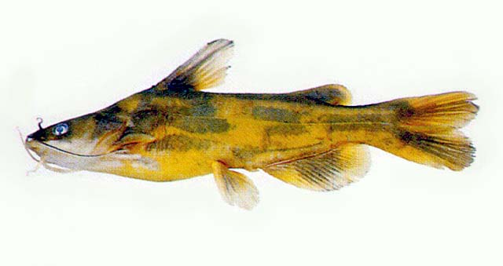
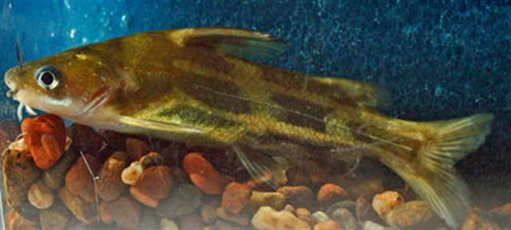

## 黄颡鱼

Tachysurus fulvidraco  (Richardson, 1846)

CAFS:750200050050A20003

<http://www.fishbase.org/summary/28052>

### 简介

又名黄辣丁、嘎鱼。体延长，稍粗壮，吻端向背鳍上斜，后部侧扁。头略大而纵扁，头背大部裸露；上枕骨棘宽短，接近项背骨。吻部背视钝圆。口大，下位，弧形。背鳍较小，具骨质硬刺，前缘光滑，后缘具细锯齿，起点距吻端大于距脂鳍起点。脂鳍短，基部位于背鳍基后端至尾鳍基中央偏前。背部黑褐色，至腹部渐浅黄色。沿侧线上下各有一狭窄的黄色纵带，约在腹鳍与臀鳍上方各有一黄色横带，交错形成断续的暗色纵斑块。尾鳍两叶中部各有一暗色纵条纹。适应性很强，广泛分布于各种水体中，栖息于水流缓慢、水生植物丛生的水底层。白天极少活动，夜间外出寻食。以水生昆虫及其幼虫、小虾、软体动物及小鱼为食。如麦穗鱼、小鲫鱼、虾虎鱼。在各地分布广泛。

### 形态特征

背鳍条Ⅱ，6-7；臀鳍条19-23；鳃耙外侧14-16；脊椎骨36-38。体长为体高的3.8-4.2倍，为头长的3.6-4.2倍，为尾柄长的6.7-7.8倍，为尾柄高的9.4-11.8倍，为背鳍起点至吻端距的2.7-2.9倍，为背鳍基部末端至脂鳍起点的3.7-4.2倍，为脂鳍基长的6.9-8.7倍。头长为吻长的2.9-3.8倍，为眼径的4.6-6.0倍，为眼间距的2.1-2.3倍，为胸鳍刺长的1.2-1.6倍。体长，腹面平，体后半部稍侧扁。头大且扁平。吻圆钝。口裂大，下位，上颌稍长于下颌，上下颌均具绒毛状细齿。眼小，侧位，眼间隔稍隆起。须4对，鼻须达眼后缘，上颌须最长，伸达胸鳍基部之后；颐须2对，外侧一对较内侧一对为长。背鳍不分支鳍条为硬刺，后缘有锯齿，背鳍起点至吻端较小于至尾鳍基部的距离。胸鳍硬刺较发达，且前后缘均有锯齿，前缘具30-45枚细锯齿，后缘具9-17枚粗锯齿。胸鳍略呈扇形，末端近腹鳍。脂鳍较臀鳍短，末端游离，起点约与臀鳍相对。尾鳍深叉形。体背部黑褐色，体侧黄色，并有三块断续的黑色条纹，腹部淡黄色，各鳍灰黑色。

### 地理分布

广布各水系及附属水体。

### 生活习性

多在静水或江河缓流中活动，营底栖生活，白天栖息于湖水底层，夜间则游到水上层觅食。对环境的适应能力较强，因之在不良的环境条件下也能生活。动鱼多在江湖的沿岸带觅食。 觅食活动多在夜间进行，不同大小的黄颡鱼食性有所差异：体长2～4厘米的幼鱼主要的食物是桡足类和枝角类；体长5～8厘米的个体，主要吃浮游动物以及水生昆虫的幼虫；超过8厘米的个体摄食软体动物和小型鱼类。曾检查24尾守巢雄鱼，胃甚饱满，内含物有螺蛳、摇蚊幼虫、鞘翅目幼虫、绿色水蜘蛛；此外，还有苦草、马来眼子菜、聚草叶、植物须根和腐屑等。看来植物性饵料是在清巢时所摄取的，动物性饵料是进入巢内被吞食的。

### 资源状况

### 参考资料

- 北京鱼类志 P84

### 线描图片

### 标准图片

### 实物图片

