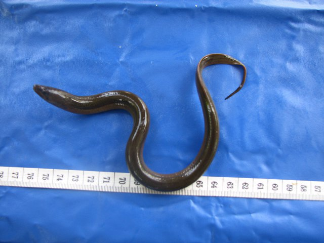

## 黄鳝

Monopterus albus  (Zuiew, 1793)

CAFS:750200370010A10001

<http://www.fishbase.org/summary/4663>

### 简介

又名鳝鱼。体细长，呈蛇形，尾部尖而短，头部上下隆起，口大，上颌稍突出。上颌、下颌和颚骨都有细齿。体光滑无鳞。鳔退化。无胸鳍和腹鳍，背鳍和臀鳍退化为皮褶状。体黄褐色，具有许多不规则的黑色斑点，腹部灰白色。生活在水边，喜穴居石隙中，夜间出穴觅食。能直接呼吸空气。肉食性鱼类，主要食小鱼、昆虫幼虫及蝌蚪、幼蛙等。适应性强，分布广泛。

### 形态特征

体前部较圆，尾部尖短。头高比体高略大。吻端较尖。眼甚小。鼻孔每侧两个，相距较远。口裂越眼的下方，上颌突出。唇甚发达，唇褶明显。体裸露无鳞，皮肤光滑。侧线明显，纵贯体侧中部。背鳍与臀鳍均与尾鳍相连。胸鳍及腹鳍均无。尾鳍不发达。肛门在体后方1/3处。体黄褐色，背部色稍暗，腹部色较淡，全身有不规则的黑色斑点。

### 地理分布

在中国各地均有分布。

### 生活习性

为底层鱼类，广泛栖息于稻田，湖泊，河流，沟渠等多种水体环，喜在堤埂或泥岸边钻洞穴居，有很强的钻穴能力。白昼潜伏，夜间游出捕食。鳃不发达，可借助口腔及咽喉的内壁表皮作为辅助呼吸器官，直接进行一定程度的空气呼吸。肉食凶猛性鱼类，多在夜间出外摄食，能捕食各种小动物，如昆虫及其幼虫，也能吞食蛙、蝌蚪和小鱼。黄鳝之摄食多属啜吸方式，每当感触到有小动物在其口边，即张口啜吸。冬季越冬，夏季产卵。

### 资源状况

### 参考资料

- 北京鱼类志 P89

### 线描图片

### 标准图片

### 实物图片

