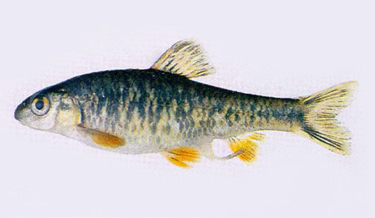

## 黑鳍鳈

Sarcocheilichthys nigripinnis  (Günther, 1873)

CAFS:

<http://www.fishbase.org/summary/12225>

### 简介

又名花腰、火烧鱼。体长10厘米左右，略侧扁．尾柄稍短，腹部圆。头较小，头长略小于体高。体背及体侧灰暗，问杂有黑色和棕黄色的斑纹，腹部白色。鳃盖后缘、峡部、胸部均呈桔黄色，鳃孔后缘的体前部具有一条深黑色的垂直条纹，背鳍、尾鳍灰黑色较深，其他各鳍呈黑色。常游于水草繁茂处，有跃水的习性。以水生昆虫和水草碎片为食。在长江、黄河、珠江水系及海南岛、台湾均有分布。

### 形态特征

体长，略侧扁，尾柄稍短，腹部圆。头较小，头长略小于体高。吻略短，圆钝，稍突出。口小，下位，呈弧形。唇较薄，下唇狭长，前伸几达下颌前缘。唇后沟中断，间 隔狭窄，下颌前缘角质层较薄。须退化，一般仅留痕迹。眼小，位于头侧上方，位略前，眼后头长远大于吻长。眼间较宽，稍隆起。体被圆鳞，中等大小，侧线完全，较平直。
背鳍短，无硬刺，其起点距吻端远小于至尾鳍基的距离。胸鳍较短小，后缘圆钝，不达腹鳍起点。腹鳍末端可达肛门，其起点位于背鳍起点之稍后方。肛门位置约在腹鳍基与臀鳍起点间的中点。臀鳍短，起点距腹鳍基较至尾鳍基部为近。尾鳍分叉，上下叶等长，末端稍呈圆钝形。
下咽齿主行的最大2枚侧扁，顶端尖，稍钩曲。鳃耙不发达，甚短小。肠管较短，肠管长为体长的0.8—0.9倍。鳔2室，前室卵圆或椭圆形，后室粗长，其长度为前室长的1.4—1.6倍。腹膜白色，略透明。
体背及体侧灰暗，间杂有黑色和棕黄色的斑纹，腹部白色。体侧中轴沿侧线自鳃盖后上角至尾鳍基具黑色纵纹，鳃盖后缘、峡部、胸部均呈桔黄色，鳃孔后缘的体前部具有一条深黑色的垂直条纹，背鳍、尾鳍灰黑色较深，其他各鳍呈黑色。生殖期间雄鱼体侧斑纹黑色更明显，一般呈浓黑色，颊部、颌部及胸鳍基部处为橙红色，尾鳍呈黄色，吻部具有多数白色珠星；雌鱼产卵管稍延长，体色不及雄鱼鲜艳。

### 地理分布

分布甚广，珠江、闽江、钱塘江、长江、黄河及海南、台湾诸水系均有分布。

### 生活习性

鳈属鱼类栖息于水质澄清的流水或静水中。喜食底栖无脊椎动物和水生昆虫，亦食少量甲壳类、贝壳类、藻类及植物碎屑。体质健壮，性情温和，喜群游，易饲养，可单养，也可混养。饲养水温为18～26℃。一龄鱼即可达性成熟。产卵期3～5月，分批产卵。

### 资源状况

### 参考资料

- 北京鱼类志 P24

### 线描图片

### 标准图片

### 实物图片

