<!-- MarkdownTOC autolink="true" autoanchor="true" -->

- [绿绒蒿属 Meconopsis Vig.](#%E7%BB%BF%E7%BB%92%E8%92%BF%E5%B1%9E-meconopsis-vig)
- [皮刺绿绒蒿 Meconopsis aculeata](#%E7%9A%AE%E5%88%BA%E7%BB%BF%E7%BB%92%E8%92%BF-meconopsis-aculeata)
- [白花绿绒蒿 Meconopsis argemonantha](#%E7%99%BD%E8%8A%B1%E7%BB%BF%E7%BB%92%E8%92%BF-meconopsis-argemonantha)
- [久治绿绒蒿 Meconopsis barbiseta](#%E4%B9%85%E6%B2%BB%E7%BB%BF%E7%BB%92%E8%92%BF-meconopsis-barbiseta)
- [藿香叶绿绒蒿 Meconopsis betonicifolia](#%E8%97%BF%E9%A6%99%E5%8F%B6%E7%BB%BF%E7%BB%92%E8%92%BF-meconopsis-betonicifolia)
- [椭果绿绒蒿 Meconopsis chelidonifolia](#%E6%A4%AD%E6%9E%9C%E7%BB%BF%E7%BB%92%E8%92%BF-meconopsis-chelidonifolia)
- [优雅绿绒蒿 Meconopsis concinna](#%E4%BC%98%E9%9B%85%E7%BB%BF%E7%BB%92%E8%92%BF-meconopsis-concinna)
- [长果绿绒蒿 Meconopsis delavayi](#%E9%95%BF%E6%9E%9C%E7%BB%BF%E7%BB%92%E8%92%BF-meconopsis-delavayi)
- [毛盘绿绒蒿 Meconopsis discigera](#%E6%AF%9B%E7%9B%98%E7%BB%BF%E7%BB%92%E8%92%BF-meconopsis-discigera)
- [西藏绿绒蒿 Meconopsis florindae](#%E8%A5%BF%E8%97%8F%E7%BB%BF%E7%BB%92%E8%92%BF-meconopsis-florindae)
- [丽江绿绒蒿 Meconopsis forrestii](#%E4%B8%BD%E6%B1%9F%E7%BB%BF%E7%BB%92%E8%92%BF-meconopsis-forrestii)
- [黄花绿绒蒿 Meconopsis georgei](#%E9%BB%84%E8%8A%B1%E7%BB%BF%E7%BB%92%E8%92%BF-meconopsis-georgei)
- [细梗绿绒蒿 Meconopsis gracilipes](#%E7%BB%86%E6%A2%97%E7%BB%BF%E7%BB%92%E8%92%BF-meconopsis-gracilipes)
- [大花绿绒蒿 Meconopsis grandis](#%E5%A4%A7%E8%8A%B1%E7%BB%BF%E7%BB%92%E8%92%BF-meconopsis-grandis)
- [川西绿绒蒿 Meconopsis henrici](#%E5%B7%9D%E8%A5%BF%E7%BB%BF%E7%BB%92%E8%92%BF-meconopsis-henrici)
- [多刺绿绒蒿 Meconopsis horridula](#%E5%A4%9A%E5%88%BA%E7%BB%BF%E7%BB%92%E8%92%BF-meconopsis-horridula)
- [滇西绿绒蒿 Meconopsis impedita](#%E6%BB%87%E8%A5%BF%E7%BB%BF%E7%BB%92%E8%92%BF-meconopsis-impedita)
- [全缘叶绿绒蒿 Meconopsis integrifolia](#%E5%85%A8%E7%BC%98%E5%8F%B6%E7%BB%BF%E7%BB%92%E8%92%BF-meconopsis-integrifolia)
- [长叶绿绒蒿 Meconopsis lancifolia](#%E9%95%BF%E5%8F%B6%E7%BB%BF%E7%BB%92%E8%92%BF-meconopsis-lancifolia)
- [琴叶绿绒蒿 Meconopsis lyrata](#%E7%90%B4%E5%8F%B6%E7%BB%BF%E7%BB%92%E8%92%BF-meconopsis-lyrata)
- [威氏绿绒蒿 Meconopsis wilsoni](#%E5%A8%81%E6%B0%8F%E7%BB%BF%E7%BB%92%E8%92%BF-meconopsis-wilsoni)
- [柱果绿绒蒿 Meconopsis oliverana](#%E6%9F%B1%E6%9E%9C%E7%BB%BF%E7%BB%92%E8%92%BF-meconopsis-oliverana)
- [锥花绿绒蒿 Meconopsis paniculata](#%E9%94%A5%E8%8A%B1%E7%BB%BF%E7%BB%92%E8%92%BF-meconopsis-paniculata)
- [吉隆绿绒蒿 Meconopsis pinnatifolia](#%E5%90%89%E9%9A%86%E7%BB%BF%E7%BB%92%E8%92%BF-meconopsis-pinnatifolia)
- [报春绿绒蒿 Meconopsis primulina](#%E6%8A%A5%E6%98%A5%E7%BB%BF%E7%BB%92%E8%92%BF-meconopsis-primulina)
- [拟多刺绿绒蒿 Meconopsis pseudohorridula](#%E6%8B%9F%E5%A4%9A%E5%88%BA%E7%BB%BF%E7%BB%92%E8%92%BF-meconopsis-pseudohorridula)
- [拟秀丽绿绒蒿 Meconopsis pseudovenusta](#%E6%8B%9F%E7%A7%80%E4%B8%BD%E7%BB%BF%E7%BB%92%E8%92%BF-meconopsis-pseudovenusta)
- [红花绿绒蒿 Meconopsis punicea](#%E7%BA%A2%E8%8A%B1%E7%BB%BF%E7%BB%92%E8%92%BF-meconopsis-punicea)
- [五脉组绒蒿 Meconopsis quintuplinervia](#%E4%BA%94%E8%84%89%E7%BB%84%E7%BB%92%E8%92%BF-meconopsis-quintuplinervia)
- [总状绿绒蒿 Meconopsis racemosa](#%E6%80%BB%E7%8A%B6%E7%BB%BF%E7%BB%92%E8%92%BF-meconopsis-racemosa)
- [单叶绿绒蒿 Meconopsis simplicifolia](#%E5%8D%95%E5%8F%B6%E7%BB%BF%E7%BB%92%E8%92%BF-meconopsis-simplicifolia)
- [贡山绿绒蒿 Meconopsis smithiana](#%E8%B4%A1%E5%B1%B1%E7%BB%BF%E7%BB%92%E8%92%BF-meconopsis-smithiana)
- [美丽绿绒蒿 Meconopsis speciosa](#%E7%BE%8E%E4%B8%BD%E7%BB%BF%E7%BB%92%E8%92%BF-meconopsis-speciosa)
- [高茎绿绒蒿 Meconopsis superba](#%E9%AB%98%E8%8C%8E%E7%BB%BF%E7%BB%92%E8%92%BF-meconopsis-superba)
- [毛瓣绿绒蒿 Meconopsis torquata](#%E6%AF%9B%E7%93%A3%E7%BB%BF%E7%BB%92%E8%92%BF-meconopsis-torquata)
- [秀丽绿绒蒿 Meconopsis venusta](#%E7%A7%80%E4%B8%BD%E7%BB%BF%E7%BB%92%E8%92%BF-meconopsis-venusta)
- [紫花绿绒蒿 Meconopsis violacea](#%E7%B4%AB%E8%8A%B1%E7%BB%BF%E7%BB%92%E8%92%BF-meconopsis-violacea)
- [乌蒙绿绒蒿 Meconopsis wumungensis](#%E4%B9%8C%E8%92%99%E7%BB%BF%E7%BB%92%E8%92%BF-meconopsis-wumungensis)
- [藏南绿绒蒿 Meconopsis zangnanensis](#%E8%97%8F%E5%8D%97%E7%BB%BF%E7%BB%92%E8%92%BF-meconopsis-zangnanensis)
- [人工种植进展](#%E4%BA%BA%E5%B7%A5%E7%A7%8D%E6%A4%8D%E8%BF%9B%E5%B1%95)

<!-- /MarkdownTOC -->

## 绿绒蒿属 Meconopsis Vig.

绿绒蒿是野生高山花卉，生长于海拔三千至四千米以上的流石滩和冰川的前沿。人称“高山牡丹”，欧洲人推崇为“世界名花”。因全株被有绒毛或刚毛而得名。罂粟科，绿绒蒿属。

绿绒蒿是一年或多年生草本，具黄色液汁。绿绒蒿全世界共有49种，主产于亚洲中南部，以我国最为丰富，除1种产于西欧外，其余均分布在我国喜马拉雅山和横断山脉。丽江就有8种。多集中分布于滇西北海拔3000～5000米的雪山草甸、高山灌丛、流石滩，少数种类在滇中、滇东北的亚高山地带，横断山脉则是绿绒蒿家族的中心，这里的绿绒蒿有39种，其中尤以淡蓝色的丽江绿绒蒿、鲜黄色的贡山绿绒蒿等最为著名。西北祁连山区也有分布。常见为黄色，形色惊艳。

一年生或多年生草本，具黄色液汁。主根明显，肥厚而延长或萝卜状增粗。茎分枝或不分枝，或为基生花葶，被刺毛、硬毛、柔毛或无毛。叶全部基生成莲座状或也生于茎上，莲座状叶在冬季通常宿存；叶片全缘、具锯齿、羽状浅裂至羽状全裂，无毛至具刺毛；基生叶和下部茎生叶具长柄，上部茎生叶具短柄或无柄，有时抱茎。花生于花葶上或生于无苞片或具苞片的花序上，单生或总状、圆锥状排列。花大而美丽，蓝色、紫色、红色或黄色，稀白色；萼片2,极稀在顶生花上为3-4,早落；花瓣通常4,有时5-10；雄蕊多数，花丝大多丝状，稀下部或整个为条形；子房近球形、卵形、倒卵形至狭圆柱形，1室，3至多心皮，胚珠多数，花柱明显，通常短，有时近消失，上下等粗或基部扩大成盘而盖于子房上，柱头分离或连合，头状或棒状，常呈辐射状下延，与胎座对生。蒴果近球形、卵形、倒卵形、椭圆形至狭圆柱形，被刺毛、硬毛或无毛，3-12瓣自顶端向基部微裂或开裂至全长的1/3或更多，稀裂至基部。种子多数，卵形、肾形、镰状长圆形或长椭圆形，平滑或具纵凹痕，无种阜。共49种，1种产西欧，其余48种均分布于东亚的中国一喜马拉雅地区，但最原始种恰在华中。我国有38种，集中分布于西南部。本属为著名的观赏植物，有些种类入药。

## 皮刺绿绒蒿 Meconopsis aculeata
中国植物志>> 第32卷 >> 罂粟科 Papaveraceae >> 绿绒蒿属 Meconopsis
18.皮刺绿绒蒿（云南植物研究）

一年生草本，高30-60厘米。主根狭长或纺锤形，长达13厘米。基生叶形状多变，长圆形、心形至三角形，长10-20厘米，宽约5厘米，先端钝、圆至急尖，边缘为不规则的羽状浅裂或羽状全裂，稀二回羽状浅裂，下部裂片之间通常具宽弯缺，两面被黄褐色的皮刺，叶柄长10-15厘米，基部扩大；下部茎生叶同基生叶，上部茎生叶无柄。花多数，于花茎上排列成总状花序，花茎被黄褐色的皮刺；花梗直立，长2.5-13.5厘米，上部花无苞片，其余均具苞片。花瓣通常4，稀6，倒卵形或近圆形，长和宽约3.7厘米，天蓝色或稀蓝紫色、红色；花丝丝状，与花瓣同色但较深，花药金黄色；子房近球形或椭圆形，密被金黄褐色至麦秆色的皮刺，皮刺初时紧贴，后来伸展，花柱明显，长约1.2厘米，果时基部增粗，柱头裂片分离或合生，长圆形或圆球形。蒴果近球形至椭圆状长圆形，密被皮刺，4-6（稀3-8）瓣自顶端微裂。种子肾形。产西藏，海拔2400-4200米。喜马拉雅西部有分布。此记录可能属于巴基斯坦境内。

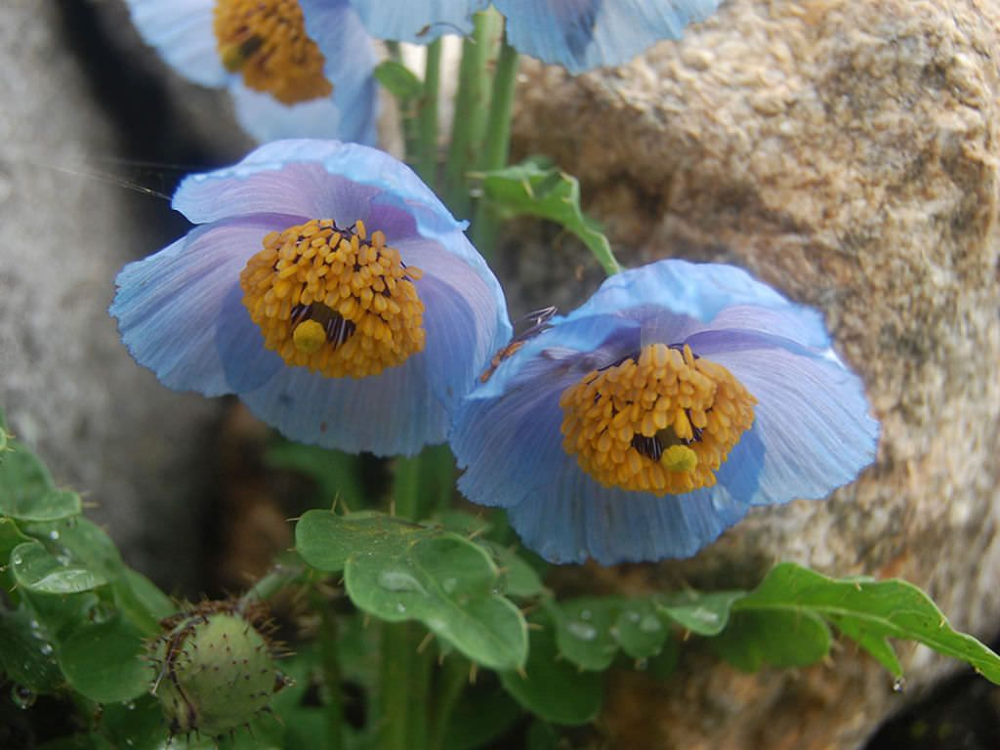

## 白花绿绒蒿 Meconopsis argemonantha
中国植物志>> 第32卷 >> 罂粟科 Papaveraceae >> 绿绒蒿属 Meconopsis
35.白花绿绒蒿（中国植物学杂志）

根不详。叶片狭长圆形至狭椭圆状长圆形，长约6.2厘米，宽约1.3厘米，近基部羽状圆裂，裂片近急尖至圆形，近顶部呈波状，两面疏被刚毛，背面具白粉；叶柄长约2.5厘米。花梗长约8.7厘米，疏被刚毛。花瓣6-8，倒卵形，长约2.5厘米，宽约1.3厘米，先端圆，白色；花丝丝状，花药黄色；子房椭圆形，密被紧贴的皮刺，花柱分离，长约1厘米，柱头头状。产西藏东南部，海拔4140米。模式标本采自西藏东南部。

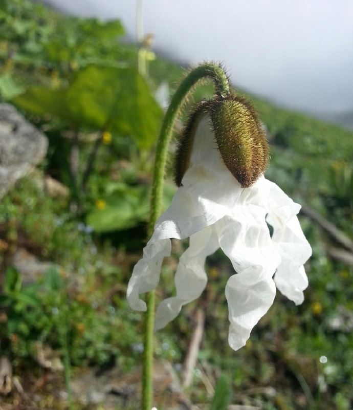

## 久治绿绒蒿 Meconopsis barbiseta
中国植物志>> 第32卷 >> 罂粟科 Papaveraceae >> 绿绒蒿属 Meconopsis
25. 久治绿绒蒿（植物分类学报）

一年生草本，植株基部盖以密集的莲座叶残基。主根萝卜状，长约2厘米，粗约1.2厘米。叶全部基生，叶片倒披针形, 长3-5厘米，宽0.7-1厘米，先端钝或圆，基部渐狭而入叶柄，两面被黄褐色刚毛，边缘全缘或微波状；叶柄宽条形，长2-3厘米，近基部扩大成膜质鞘，无毛或硫被黄褐色刚毛。花葶高30-40厘米，先端细，向基部逐渐增粗，被黄褐色、通常反曲的刚毛，花下毛较密。花单生于基生花葶上；花瓣6, 倒卵形至倒卵状长圆形，长4-4.5厘米，宽2-2.5厘米，顶端平截，边绿微波状，蓝紫色，基部紫黑色；花丝丝状，长的1.5厘米，花药长圆形，长约1.6毫米；子房卵形，长约1厘米，密被锈色刚毛，刚毛近基部具敌枚倒向的短分枝，花柱圈柱状，长约4毫米，粗约2毫米，柱头4-6裂，裂片下延。果未见。花期7-9月。 产青海东南部（久治），生于海拔4400米附近的高山草甸。模式标本采自久治。

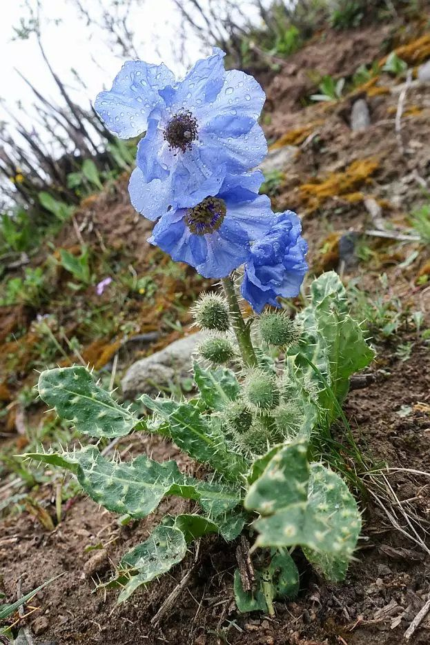

## 藿香叶绿绒蒿 Meconopsis betonicifolia
中国植物志>> 第32卷 >> 罂粟科 Papaveraceae >> 绿绒蒿属 Meconopsis
8. 藿香叶绿绒蒿（中国植物学杂志）

一年生或多年生草本。根茎短而肥厚，盖以残枯的叶柄基，叶基密被锈色、具多短分枝的长柔毛。茎直立，粗壮，高30-90 (-150)厘米，粗达1.3厘米，不分枝，无毛或极稀被锈色长柔毛，具不明显的细条纹。基生叶卵状披针形或卵形，长5-15厘米，基部宽4-7厘米，先端圆或急尖，基部心形或截形，下延成翅，并向叶柄基部逐渐扩大成鞘，边缘宽缺刻状圆裂，两面被稀疏、具多短分枝的长柔毛，边缘和背面毛稍密，背面略被白粉，中脉突起，具数条横向二叉的侧脉；下部茎生叶同基生叶，上部茎生叶较小，无柄，基部耳形抱茎。花3-6朵，生于最上部茎生叶腋内，稀生于下部茎生叶腋内；花梗直立，长达28厘米。花芽宽卵形，硫被锈色长柔毛；花直径6-8厘米；花瓣4, 或顶生花5-6, 宽卵形、圆形或倒卵形，长3-5厘米，宽2-3.5厘米，天蓝色或紫色，具明显的纵条纹；花丝丝状，长5-10毫米．白色，花药长圆形，长约1毫米，橘红色或金黄色；子房椭圆状长圆形．无毛或极稀被锈色长柔毛，花柱棒状，长2-6毫米，柱头淡绿色，4-5（-7）裂，下延于花柱上。蒴果长圆状椭圆形，长2-4.5厘米，粗1-1.5厘米，无毛，稀被锈色、紧贴长硬毛，自顶端4-5微裂或裂至全长的1/3。种子近肾形，长约1毫米，具纵条纹及蜂窝状孔穴。花果期6-11月。

产云南西北部（丽江、鹤庆、德钦）、西藏东南部（林芝、米林、错那），生于海拔3000-4000米的林下或草坡。缅甸北部也有分布。模式标本采自鹤庆瓜拉坡及洱源三叉河。

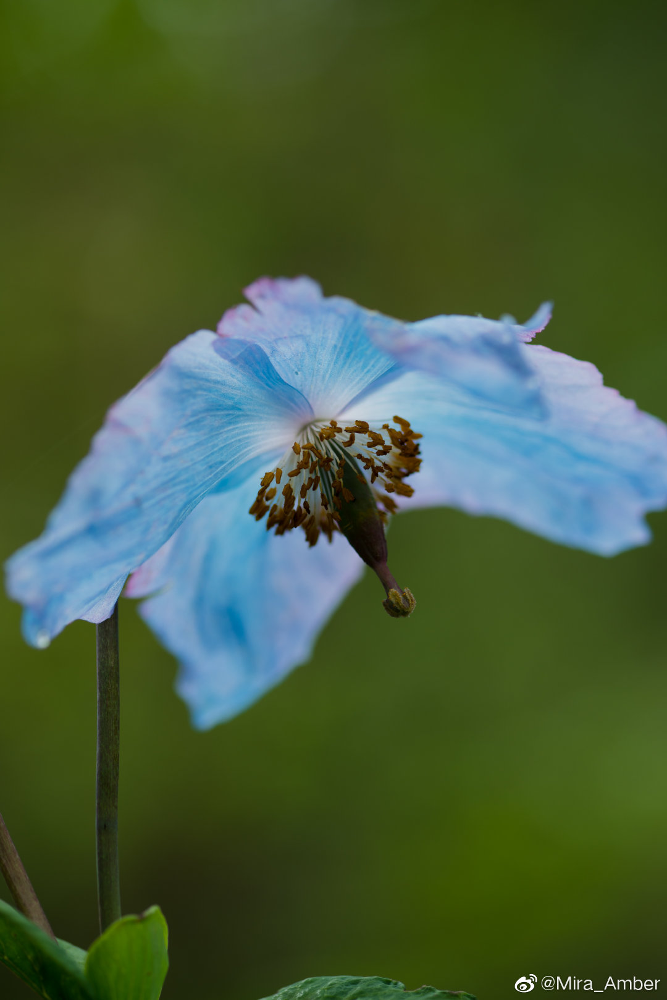

## 椭果绿绒蒿 Meconopsis chelidonifolia
中国植物志>> 第32卷 >> 罂粟科 Papaveraceae >> 绿绒蒿属 Meconopsis
2.椭果绿绒蒿（云南植物志）黄花绿绒蒿（中国高等植物图鉴），断肠草、拟千金子、裂叶蒿、都辣（四川）图版2：1-2

多年生草本，高50-150厘米。根细长，粗3-5毫米，多分枝，分枝纤维状，极细而长，组成庞大的纤维根系；根茎被宿存的叶基和密生黄棕色具多短分枝的刚毛，常生有第二年芽苞。茎直立，绿色带紫，具分枝，有纵沟槽，近基部被黄棕色具多短分枝的刚毛。基生叶和下部茎生叶卵状长圆形或宽卵形，长7-8厘米，宽6.5-7厘米，近基部羽状全裂，顶部羽状浅裂，裂片3-5，疏离，再次羽状深裂或浅裂，小裂片卵形，先端钝或近圆形，两面疏被长硬毛，背面具白粉，有密被黄棕色长硬毛的叶柄；上部茎生叶较小，叶片宽卵形，略被毛，羽状3全裂或3深裂，无柄或近无柄。花1或2朵生于茎和分枝最上部的叶腋内，组成聚伞状圆锥花序；花梗细长，无毛。花芽球形；萼片2，近圆形，直径约1厘米，无毛，边缘一侧膜质；花瓣4，倒卵形至近圆形，直径1.5-2.3厘米，黄色；雄蕊多数，花丝丝状，长约7毫米，花药狭长圆形，长3-4毫米，黄色；子房椭圆形，长5-6毫米，宽4-5毫米，无毛或近基部略被刚毛，花柱短，柱头头状。蒴果椭圆形，长1-1.5厘米，粗0.7-1厘米，无毛，4-5（－6）瓣自顶端向下微裂。种子镰状长圆形，长不足1毫米，种皮具由浅凹痕形成的纵条纹。花果期5-8月。

产四川西部至北部（雷波、马边、美姑的洪溪、越西、冕宁、石棉、峨眉、天全、宝兴、康定、茂汶、平武）和云南西北部（贡山）、东北部（大关、永善），生于海拔1400-2700米的林下阴处或溪边路旁。模式标本采自康定。

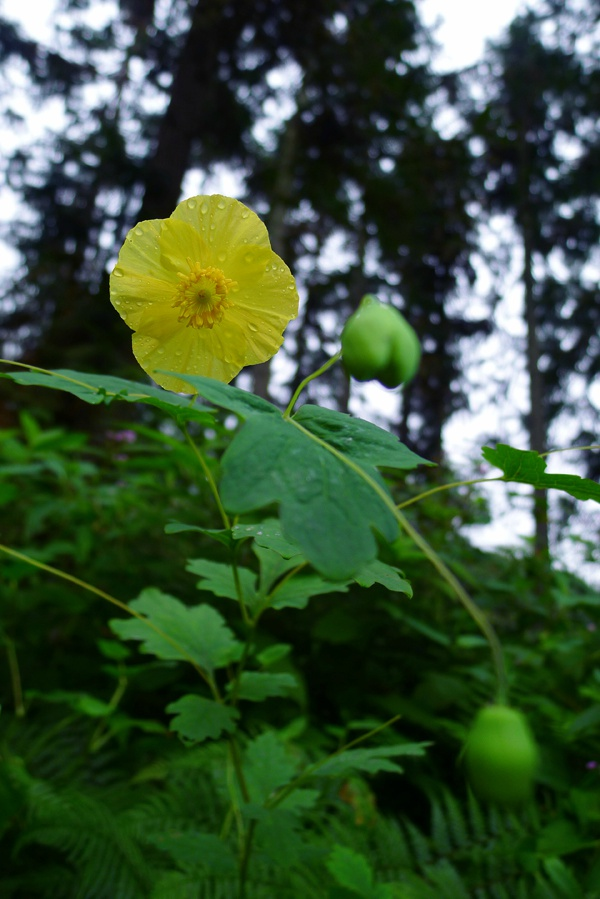

## 优雅绿绒蒿 Meconopsis concinna
中国植物志>> 第32卷 >> 罂粟科 Papaveraceae >> 绿绒蒿属 Meconopsis
26. 优雅绿绒蒿（云南植物志）图版8:3

一年生草本。主根萝卜状，长1.5-4厘米，粗5-7毫米。叶全部基生，稀生于花茎的近基部，叶片小而近肉质，形状多变，倒披针形、长圆状倒披针形、椭圆状倒披针形或匙形，长2-3.5厘米，宽5-8毫米，羽状全裂或二回羽状全裂，有时有少数全缘叶，顶生裂片菱形、长圆形、倒卵形或线形，侧生裂片倒卵形、长圆形、匙形或线形，先端圆，两面无毛，具极细而不明显的叶脉；叶柄狭条形，长2-5厘米，宽1-2毫米。花葶基生或从叶腋间生出，高4.5-10厘米，果时延长达20厘米，无毛或被极稀疏、平伸或卷曲、黄褐色的柔毛。花单生子花葶上；花芽近球形，直径约8毫米；花瓣4，宽倒卵形、卵圆形或近圆形，长1-1.5厘米，宽0.7-1厘米，先端圆或急尖，紫色；花丝丝状，长约4毫米，与花瓣同色，花药卵圆形，长约0.5毫米；子房椭圆形或椭圆状长圆形，长约5毫米，被极稀疏、伸展、黄褐色的硬毛，花柱长约1毫米，带紫色，柱头头状。蒴果椭圆状长圆形或椭圆形，长约1.5厘米．无毛或被极稀疏的硬毛，3-4瓣自顶端微裂。花果期5-8月。

产云南西北部和四川西南部，生于海拔3300-4500米的草坡或杜鹃灌丛中。模式标本采自云南丽江东北金沙江大弯。间断分布于不丹 (据Grierson et Long) 。

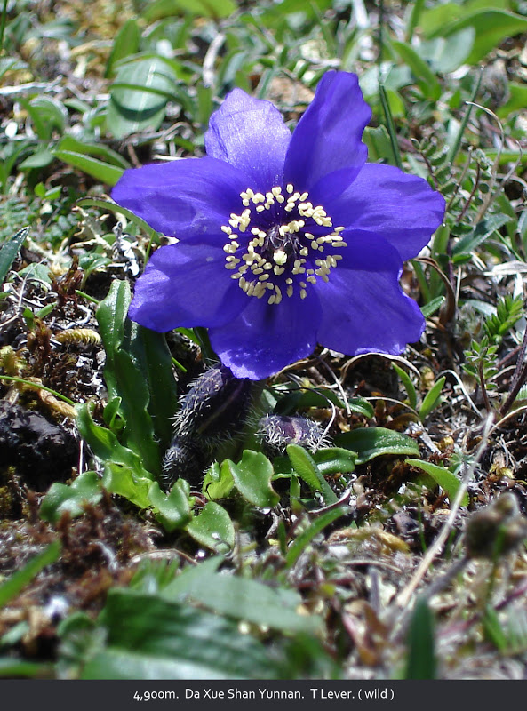

## 长果绿绒蒿 Meconopsis delavayi
中国植物志>> 第32卷 >> 罂粟科 Papaveraceae >> 绿绒蒿属 Meconopsis
28.长果绿绒蒿（云南植物志）图版9: 1

多年生草本。主根圆柱形，上部粗约5毫米，向下延长并渐狭。根茎短，具少数极短的分枝。叶全部基生，密聚于根茎每一短分枝的顶端而成几个叶丛，其间棍生鳞片状叶基，叶片卵形、披针形、狭披针形或近匙形，长2-6厘米，宽1-3.8厘米，先端圆或锐尖，基部渐狭并下延成翅，边缘全缘，两面无毛或疏被紧贴、锈色的长柔毛，表面绿色，背面具白粉，中脉明显，侧脉二歧状分枝；叶柄粗线形，长2-9厘米。花葶1-8，从各自的叶丛中生出，长3-30厘米，果时达60厘米，通常被稀疏、平展的锈色长柔毛。花单生于花葶上，半下垂；花瓣4, 有时6或8,卵形、倒卵形或近圆形，长2-3.5厘米，宽1.5-2.5厘米，先端急尖或稀圆，深紫色或蓝紫色，稀玫瑰色，具多数纤细的纵条纹；花丝丝状，长约1厘米，与花瓣同色，花药长圆形，长约1毫米, 橘红色；子房狭长圆状椭圆形，无毛，花柱长约5毫米，有时极短，无毛，柱头头状或有时近棒状。蒴果狭长圆形或近圆柱形，长5-10厘米，粗约5毫米，无毛，3(-5)瓣自顶端开裂至全长的1/3或通常更短。种子镰状长圆形，种皮光滑或具纵纹。花果期5-10月。特产于云南丽江玉龙山至鹤庆，生于海拔2700-4000米的草坡。模式标本采自玉龙山。

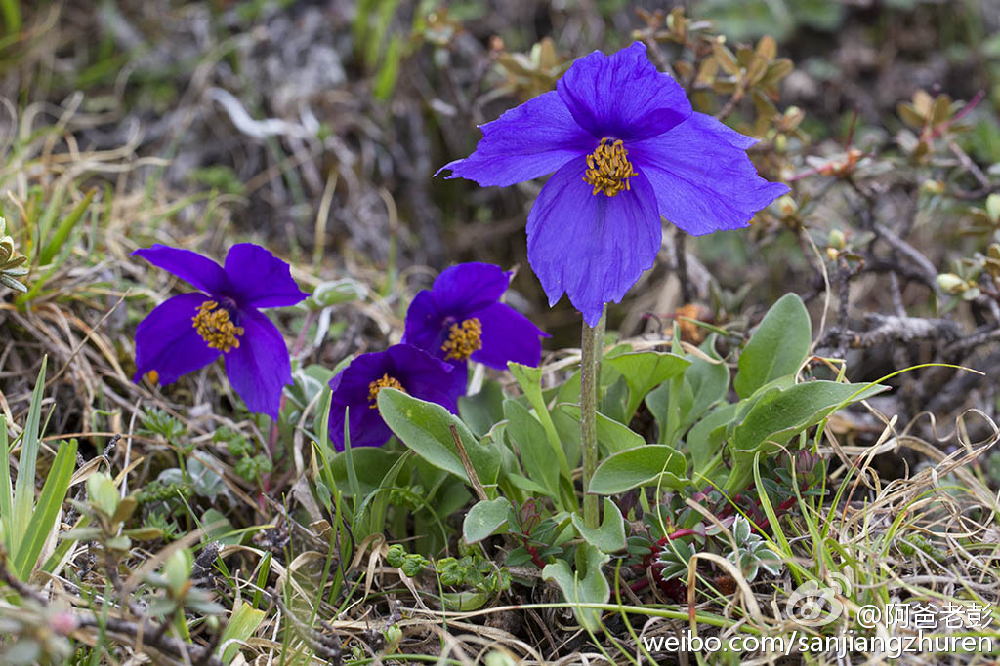

## 毛盘绿绒蒿 Meconopsis discigera
中国植物志>> 第32卷 >> 罂粟科 Papaveraceae >> 绿绒蒿属 Meconopsis
37. 毛盘绿绒蒿（中国植物学杂志）图版11: 2

一年生草本，高30-100厘米。主根萝卜状，长约10厘米, 粗约2厘米，下部通常分枝。茎直立，粗壮，不分枝，具纵条纹，被黄褐色、具多短分枝的刚毛，基部粗约1.5厘米，盖以宿存的叶基，叶基上密被锈色或褐色、具多短分枝的刚毛。基生叶密集成莲座状，叶片倒披针形，连叶柄长达18厘米，宽达3厘米，先端急尖或圆，基部渐狭，边缘全缘或具极稀疏的不规则齿缺，两面被黄褐色、具多短分枝的刚毛，中脉宽，侧脉极细，叶柄长，基部扩大，密被黄褐色刚毛；茎生叶披针形，通常全缘，比基生叶小，无柄，或有时同基生叶。花13-30朵，于花茎上密集排列；花梗长约2.5厘米，果时达3.7厘米，密被刚毛；最上部花无苞片。花瓣4，倒卵形，长约5厘米，宽约4.2厘米，深紫色、紫色、淡蓝色或红色；花丝丝状，长约1.2厘米，与花瓣同色但较深，花药狭长圆形，长约1.5厘米，黄色；子房宽长圆形，长约1厘米，密被黄褐色伸展的刚毛，花柱圆柱形，长4-6毫米，基部扩大成宽而无毛的盘，盘盖于子房之上并突出于子房之外，其边缘呈流苏状，柱头圆裂，裂片分离或扭曲或为棒状。蒴果长圆形，明显具肋，6-10瓣自花柱盘下微裂。种子肾形，种皮具纵凹纹或不明显的网纹。花果期6-9月。产西藏南部（聂拉木、定日），生于海拔4100-4800米的山坡岩石隙。不丹、锡金、尼泊尔中部海拔3600-4100米有分布。

## 西藏绿绒蒿 Meconopsis florindae
中国植物志>> 第32卷 >> 罂粟科 Papaveraceae >> 绿绒蒿属 Meconopsis
12.西藏绿绒蒿（云南植物研究）

一年生草本。主根萝卜状，长约3.7厘米。茎较纤细，无毛，极少疏被长柔毛，高约45厘米。基生叶少数，早枯，叶片倒披针形，长约3.7厘米，宽约1.2厘米，先端急尖或圆，基部渐狭而入叶柄，边缘全缘、深波状、宽圆齿或二回羽状浅裂或全裂，两面无毛或极稀被少数柔毛，背面具白粉，叶柄长约2.5厘米，下部扩大；下部茎生叶同基生叶，上部茎生叶边缘具锯齿，基部略抱茎，或与基生叶同形。花2-6朵，生于上部茎生叶腋内，半下垂；花梗果时长约13厘米，仅于先端硫被刚毛。花瓣通常5-7，稀4，卵形或倒卵形，长约1.3厘米，宽约1厘米，先端急尖或圆，通常具不整齐的细齿，淡黄色；花丝丝状，花药淡橘黄色；子房卵珠形至椭圆状长圆形，无毛或疏被刚毛，花柱明显，长约6毫米，柱头近棒状或具分离的裂片，黄色。蒴果椭圆状长圆形，无毛或被稀疏的刚毛，3-5 (-6)瓣自顶端开裂至全长的1/3。产西藏东南部，海拔3300-3900米。模式标本采自西藏东南部。

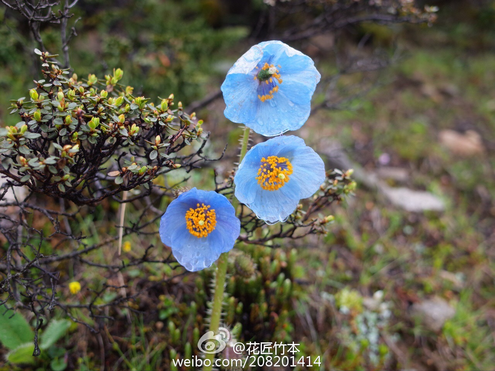

## 丽江绿绒蒿 Meconopsis forrestii
中国植物志>> 第32卷 >> 罂粟科 Papaveraceae >> 绿绒蒿属 Meconopsis
19.丽江绿绒蒿(云南植物志）图版6: 1-2

一年生草本。主根圆锥形或萝卜状，长2-10厘米，粗1-1.5厘米，具纤维状细根。叶通常全部基生，叶片倒披针形、椭圆状长圆形至宽线形，长3-20厘米，宽0.5-2厘米，先端圆或锐尖，基部渐狭成翅，翅基部略扩大成膜质鞘，边缘全缘或略呈波状，两面疏被紧贴、亮褐色的长硬毛，中脉明显，在背面突起。花茎直立，不分枝，高12-30(-60)厘米，顶端渐尖，基部渐细，被亮褐色、平展或稍反曲的长硬毛。花3-7朵，生于花茎上部，无苞片；花梗芽时下垂，花时伸展，长1-3厘米，果时延长达9厘米，被平展、亮褐色的长硬毛。花芽倒卵形或近球形，长1-2厘米，宽0.7-1.3厘米；萼片外面被亮褐色的长硬毛，里面无毛；花瓣通常4，稀5，卵形或宽卵形，长1-2.5厘米，宽1-2厘米，淡蓝色或淡紫蓝色；花丝丝状，长0.5-1厘米，带紫色，花药长圆形，长约1毫米，橘红色或紫黄色；子房狭椭圆状长圆形，无毛或疏被长硬毛，花柱极短或无，柱头3-4裂。蒴果劲直，近狭圆柱形，长约6厘米，无毛或疏被长硬毛，2-4瓣自顶端开裂至全长的1/3。种子镰状椭圆形，种皮具不明显的凹痕。花果期5-9月。产云南西北部（漾濞、丽江、中甸）和四川西南部，生于海拔（3100-）3400-4300米的草坡。模式标本采自丽江。

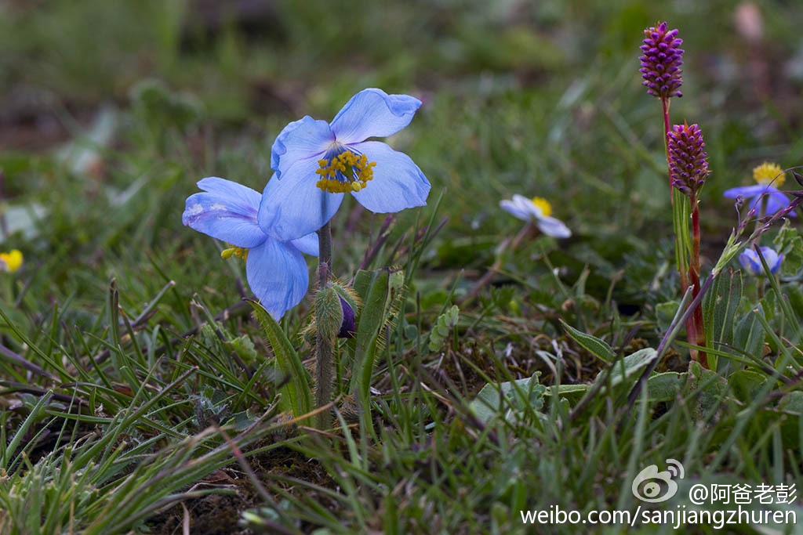

## 黄花绿绒蒿 Meconopsis georgei
中国植物志>> 第32卷 >> 罂粟科 Papaveraceae >> 绿绒蒿属 Meconopsis
11．黄花绿绒蒿（云南植物志）

一年生草本。主根长约7.5厘米，粗约1.2厘米。叶聚生于茎下部，叶片倒披针形，长约10厘米，宽约1.8厘米，先端急尖或圆，基部渐狭成翅，边缘全缘或微波状，两面无毛或疏被硬毛，背面具白粉；叶柄长约5厘米。花茎直立，高达33厘米，近无毛或密被伸展的硬毛；花10朵以上，生于长20厘米、通常被硬毛的花梗上，上部花无苞片，下部花生于上部茎生叶腋内。花瓣5-8，倒卵形，长约3.8厘米，宽约2.5厘米，先端钝、急尖或具小锯齿，黄色；花丝丝状，花药橘黄色至黑色；子房椭圆形至长椭圆形，通常密被浅黄色、伸展的硬毛，花柱长约7毫米，柱头头状。蒴果长椭圆形，被伸展的硬毛，3-5瓣自顶端微裂。种子镰状椭圆形，种皮具不整齐的皱纹或不明显的凹痕。（标本未见，据原描述）特产于云南西北部维西，生于海拔3600-4300米附近。模式标本采自维西富川山。

## 细梗绿绒蒿 Meconopsis gracilipes
中国植物志>> 第32卷 >> 罂粟科 Papaveraceae >> 绿绒蒿属 Meconopsis
3.细梗绿绒蒿（云南植物研究）

一年生草本，高40-60厘米。茎具分枝，被黄褐色、具多短分枝的刚毛，后来变无毛或毛断落留下糙硬的基部。基生叶和下部茎生叶未见；上部茎生叶披针形，长5-12厘米，宽2-3厘米，先端钝，基部耳状，边缘羽状圆裂，裂片先端钝至圆形，两面及边缘疏被黄褐色、具多短分枝的刚毛，后来断落，留下糙硬的基部，中脉宽，在表面具2沟槽, 背面微突起，侧脉细而不明显；无叶柄。花茎具分枝，花多数，排列成总状圆锥花序，下部分枝通常具3花，上部分枝具1花；花梗细长，毛被同茎，但先端较密。花瓣4，倒卵形或近圆形，长约3厘米，宽约2.5厘米，淡黄色；花丝丝状，花药橙黄色至黑褐色；子房近球形至椭圆形，长1.5-1.8厘米，宽0.8-1厘米，密被紧贴或斜展的刚毛，花柱明显．柱头头状。蒴果椭圆形或长圆状椭圆形，密被黄褐色的刚毛，或刚毛断落而留下糙硬的基部，4-7瓣自顶端微裂。种子肾形，长约0.5毫米，黑色。产西藏南部（聂拉木），海拔3340-4800米。尼泊尔中部有分布。

## 大花绿绒蒿 Meconopsis grandis
中国植物志>> 第32卷 >> 罂粟科 Papaveraceae >> 绿绒蒿属 Meconopsis
9.大花绿绒蒿(中国植物学杂志)

多年生草本。主根狭萝卜状或纤维状根系；根茎短，盖以残枯的叶基，其上密被锈色、具多短分枝的长柔毛。茎直立, 粗壮，高40-120厘米，疏被伸展或稍反曲的刚毛。基生叶狭倒披针形至披针状长圆形或椭圆状长圆形，长15-20厘米，宽5-6厘米，先端急尖或近急尖．基部渐狭而入叶柄，边缘具疏离、不规则的锯齿或宽圆齿，两面被棕色、具多短分枝的柔毛，表面绿色，背面淡绿色，中脉宽，侧脉明显，叶柄长10-17厘米，被棕色、具多短分枝的长柔毛，基部扩大成鞘；下部茎生叶同基生叶，上部茎生叶较小．丛生成假轮生状，无柄。花通常不超过3朵，生于最上部假轮生状叶腋内．稀生于下部茎生叶腋内（栽培者生于基生花葶上）；花梗果时达45厘米。花大，下垂；花瓣4（有时达9)，近圆形或宽倒卵形，长约6.8厘米，宽约6.2厘米，紫色或蓝色；花丝丝状，长0.7-1.5厘米, 白色，花药长圆形，长1-2毫米, 橙黄色；子房卵珠形或长圆形，绿色，无毛或密被毛, 花柱长7-10毫米，柱头棒状，4-6圆裂绿色。蒴果狭椭圆状长圆形，自顶端4-6微裂。种子肾形，种皮具浅纵凹痕。花果期6-9月。产西藏中南部（林芝、米林、错那、亚东、定结），生于海拔3000-5100米的冷杉林下、林缘或山坡灌丛中。不丹、锡金、尼泊尔西部有分布。

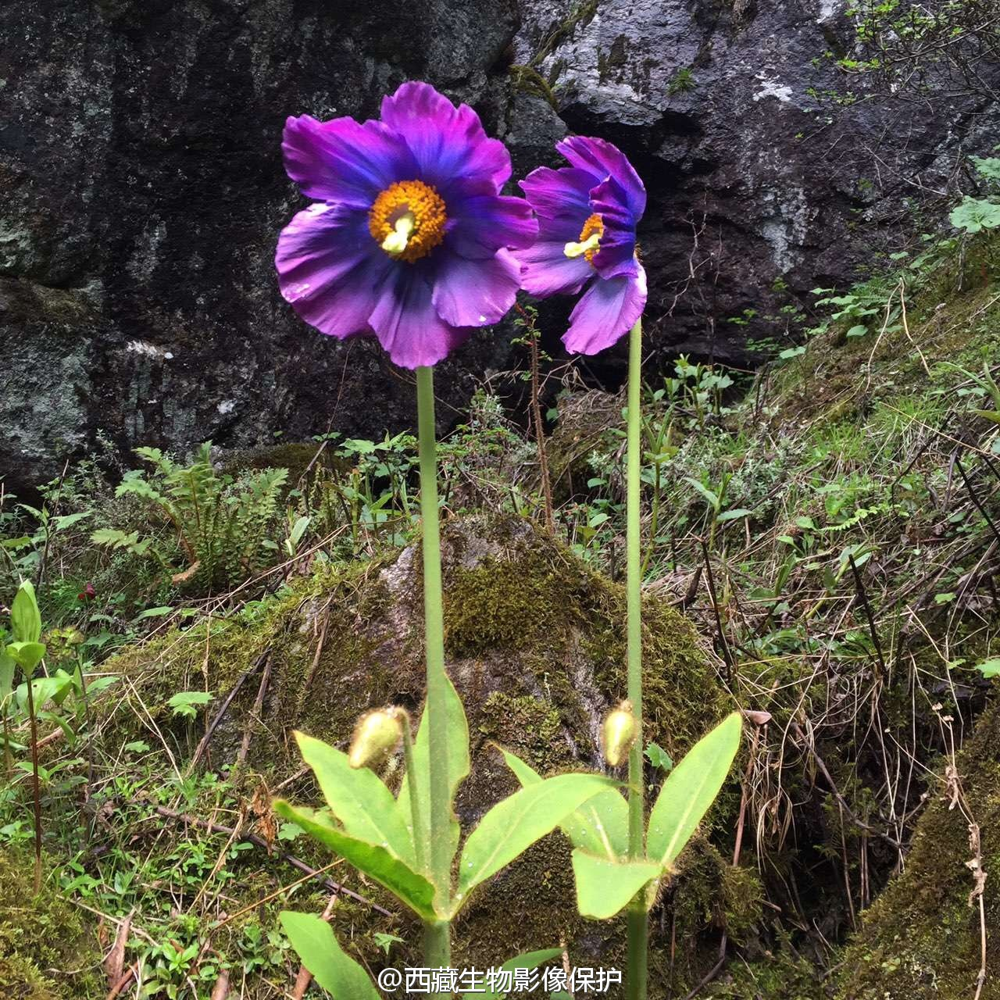

## 川西绿绒蒿 Meconopsis henrici
中国植物志>> 第32卷 >> 罂粟科 Papaveraceae >> 绿绒蒿属 Meconopsis
24.川西绿绒蒿 (云南植物研究) 图版8: 1-2

一年生草本。主根短而肥厚，圆锥形，长4-6厘米，粗约1厘米。叶全部基生，叶片倒披针形或长圆状倒披针形，长3-8厘米，宽0.5-1.5厘米，先端钝或圆，基部渐狭而入叶柄，边缘全缘或波状，稀具疏锯齿，两面被黄褐色、卷曲的硬毛；叶柄线形，长2-6厘米。花葶高15-20厘米，被黄褐色平展、反曲或卷曲的硬毛。花1（-11）朵，单生于基生花葶上；花芽宽卵形，长的1厘米，宽约1.5厘米；萼片边缘薄膜质，外面被黄褐色、卷曲的硬毛；花瓣5-9，卵形或倒卵形，长4-5厘米，宽2-3.8厘米，先端圆或钝，深蓝紫色或紫色；花丝上部1/3丝状，下部2/3突然扩大成条形长约1.5厘米，与花瓣同色，花药长约1毫米，橘红色或浅黄色；子房卵珠形或近球形，长约5毫米，密被黄褐色紧贴的硬毛，花柱长约5毫米，柱头长约5毫米，裂片分离或连合成棒状。蒴果椭圆状长圆形或狭倒卵珠形，长约2厘米，疏被硬毛，4-6瓣自顶端微裂。种子镰状长圆形，种皮具纵条纹或浅凹痕。花果期6-9月。产四川西部和甘肃西南部，生于海拔3200-4500米的高山草地。模式标本采自四川西部。

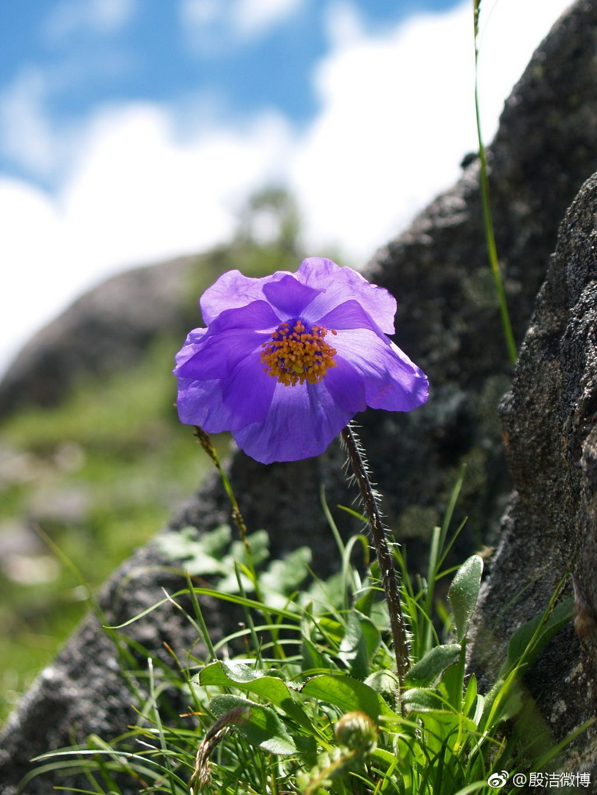

## 多刺绿绒蒿 Meconopsis horridula
中国植物志>> 第32卷 >> 罂粟科 Papaveraceae >> 绿绒蒿属 Meconopsis
33.多刺绿绒蒿（中国植物学杂志）图版10: 3-4

一年生草本, 全体被黄褐色或淡黄色、坚硬而平展的刺，刺长0.5-1厘米。主根肥厚而延长，圆柱形，长达20厘米或更多，上部粗1-1.5厘米，果时达2厘米。叶全部基生，叶片披针形，长5-12厘米，宽约1厘米，先端钝或急尖，基部渐狭而入叶柄, 边缘全缘或波状，两面被黄褐色或淡黄色平展的刺；叶柄长0.5-3厘米。花葶5-12或更多，长10-20厘米，坚硬，绿色或蓝灰色，密被黄褐色平展的刺，有时花葶基部合生。花单生于花葶上，半下垂，直径2.5-4厘米；花芽近球形，直径约1厘米或更大；萼片外面被刺；花瓣5-8，有时4，宽倒卵形，长1.2-2厘米，宽约1厘米，蓝紫色；花丝丝状，长约1厘米，色比花瓣深，花药长圆形，稍旋扭；子房圆锥状，被黄褐色平伸或斜展的刺，花柱长6-7毫米，柱头圆锥状。蒴果倒卵形或椭圆状长圆形，稀宽卵形，长1.2-2.5厘米，被锈色或黄褐色、平展或反曲的刺，刺基部增粗，通常3-5瓣自顶端开裂至全长的1/3-1/4。种子肾形，种皮具窗格状网纹。花果期6-9月。产甘肃西部、青海东部至南部、四川西部、西藏（广泛分布），生于海拔3600-5100米的草坡。尼泊尔、锡金、不丹有分布。 (Griorson et Long用广义, 包括Meconopsis rauemosa Maxim.)

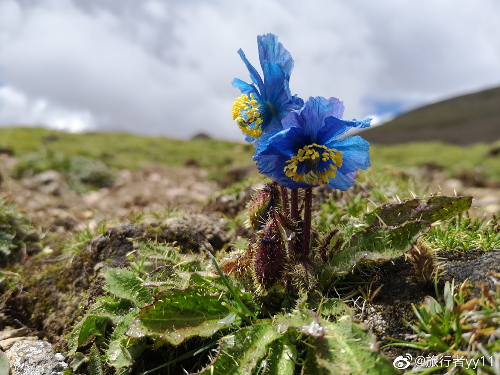

## 滇西绿绒蒿 Meconopsis impedita
中国植物志>> 第32卷 >> 罂粟科 Papaveraceae >> 绿绒蒿属 Meconopsis
34.滇西绿绒蒿（中国植物学杂志）图版10: 1

一年生草本，植株基部盖以宿存的叶基。主根肥厚，长达30厘米，上部粗达1.3厘米。叶全部基生，叶片狭椭圆形、披针形、倒披针形或匙形，长2.5-6厘米，宽0.7-1.3厘米，先端圆或急尖，基部渐狭并下延成翅，边缘全缘或波状，有时不规则的分裂或羽状深裂，两面被锈色或黄褐色的刺毛，表面绿色，背面淡绿色，中脉明显，侧脉二歧状；叶柄长3-7厘米。花葶多数，长达25厘米，果时延长达40厘米，被锈色或黄揭色伸展的刺毛。花单生于花葶上，下垂；花芽球形，直径约1厘米；萼片外面被锈色或黄褐色的硬毛，具明显的线纹；花瓣4-10，倒卵形或近圆形，长1.5-3厘米，宽1.5-2厘米，深紫色或蓝紫色；花丝丝状，长约1厘米，与花瓣同色或较深，花药卵形，长约1毫米，乳白色、黄色、金黄色或橘红色；子房椭圆形、椭圆状长圆形或狭倒卵形，被黄褐色紧贴的硬毛，花柱棒状，长0.3-1厘米，柱头头状，乳白色或绿色。蒴果灰褐色，狭倒卵形至狭长圆状椭圆形，长2-3厘米，粗0.5-1厘米，被黄褐色或锈色伸展的硬毛,3(有时4-5)自顶端开裂至全长的1/3-1/4,种子镰状椭圆形，黑色，种皮具条纹或不明显的纵凹痕。花果期5-11月。产四川西南部（木里、乡城、稻城）、云南西北部（维酉、丽江、贡山、德钦）和西藏东南部（察隅），生于海拔3400-4500米的草坡或岩石坡。缅甸东北部有分布。模式标本采自维西。

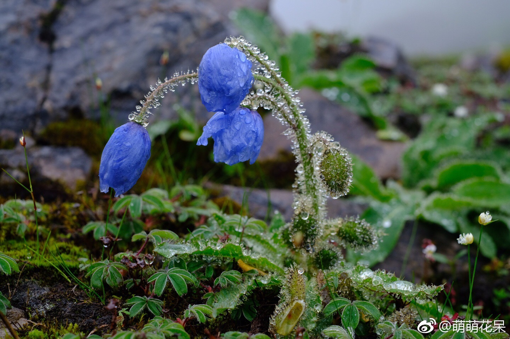

## 全缘叶绿绒蒿 Meconopsis integrifolia
中国植物志>> 第32卷 >> 罂粟科 Papaveraceae >> 绿绒蒿属 Meconopsis
7. 全缘叶绿绒蒿（中国植物学杂志）鹿耳菜（四川），埃贝赛保、阿拍色鲁（青藏藏语），慕琼单圆（西藏），黄芙蓉、雅片花（云南） 图版4：1-2

一年生至多年生草本，全体被锈色和金黄色平展或反曲、具多短分枝的长柔毛。主根粗约1厘米，向下渐狭，具侧根和纤维状细根。茎粗壮，高达150厘米，粗达2厘米，不分枝，具纵条纹，幼时被毛，老时近无毛，基部盖以宿存的叶基，叶基密被具多短分枝的长柔毛。基生叶莲座状，其间常混生鳞片状叶，叶片倒披针形、倒卵形或近匙形，连叶柄长8-32厘米，宽1-5厘米，先端圆或锐尖，基部渐狭并下延成翅，至叶柄近基部又逐渐扩大，两面被毛，边缘全缘且毛较密，通常具3至多条纵脉并在翅上延伸；茎生叶下部者同基生叶，上部者近无柄，狭椭圆形、披针形、倒披针形或条形，比下部叶小，最上部茎生叶常成假轮生状，狭披针形、倒狭披针形或条形，长5-11厘米，宽0.5-1厘米。花通常4-5朵，稀达18朵，生最上部茎生叶腋内，有时也生于下部茎生叶腋内；花梗长（3-）6-37（-52）厘米，果时延长。花芽宽卵形；萼片舟状，长约3厘米，外面被毛，里面无毛，具数十条明显的纵脉；花瓣6-8，近圆形至倒卵形，长3-7厘米，宽3-5厘米，黄色或稀白色，干时具褐色纵条纹；花丝线形，长0.5-1.5厘米，金黄色或成熟时为褐色，花药卵形至长圆形，长1-2（-4）毫米，橘红色，后为黄色至黑色；子房宽椭圆状长圆形、卵形或椭圆形，密被金黄色、紧贴、通常具多短分枝的长硬毛，花柱极短至长1.3厘米，无毛，柱头头状，4-9裂下延至花柱上，略辐射于子房顶。蒴果宽椭圆状长圆形至椭圆形，长2-3厘米，粗1-1.2厘米，疏或密被金黄色或褐色、平展或紧贴、具多短分枝的长硬毛，4-9瓣自顶端开裂至全长1/3。种子近肾形，长1-1.5毫米，宽约0.5毫米，种皮具明显的纵条纹及蜂窝状孔穴。花果期5-11月。

产甘肃西南部（夏河、会川）、青海东部至南部、四川西部和西北部、云南西北部和东北部、西藏东部，生于海拔2700-5100米的草坡或林下。缅甸东北部有分布。模式标本采自甘肃。全草清热止咳；花前采叶入药，治胃中反酸；花退热催吐、消炎，治跌打骨折。

7b. 轮叶绿绒蒿（云南植物志）

与原变种的区别在于叶较小，茎生叶数枚，密聚于茎顶，呈轮生状；花仅1朵，单生于茎顶的长花梗上。产云南西北部（中甸），生海拔4350-4450米的山坡草地。模式标本采自中甸。

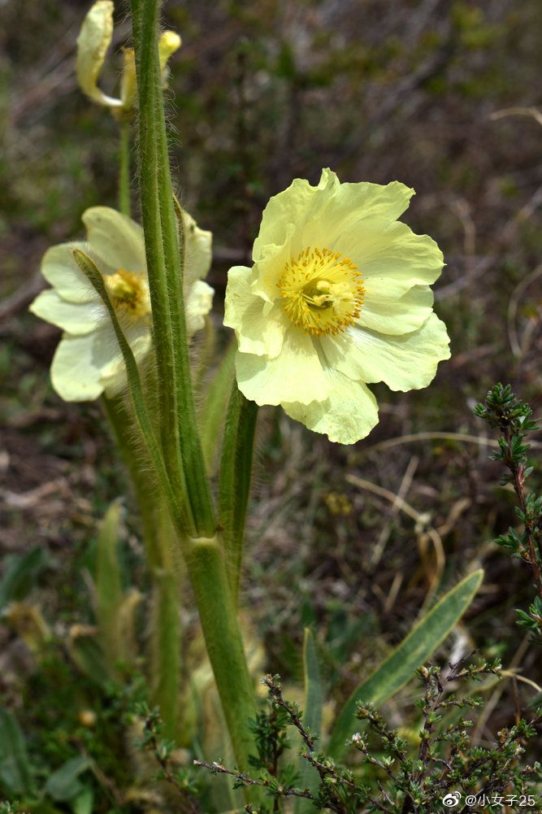

## 长叶绿绒蒿 Meconopsis lancifolia
中国植物志>> 第32卷 >> 罂粟科 Papaveraceae >> 绿绒蒿属 Meconopsis
20.长叶绿绒蒿（中国植物学杂志）图版6：3-4

一年生草本，高8-25厘米。主根萝卜状，长3-8厘米，粗0.5-1厘米。茎直立，被黄褐色、平展或反曲的硬毛，或者无毛。叶基生或有时也生于茎下部，叶片倒披针形、条形、匙形、倒卵形、椭圆状披针形、狭倒披针形，长1-15厘米，宽0.5-1.5厘米，先端圆或急尖，基部楔形，下延成翅，边缘通常全缘，两面无毛或被黄褐色、反曲或卷曲的硬毛，表面黄绿色，背面稍淡，中脉明显，侧脉细；叶柄长2-7厘米。花茎粗壮，中间粗，两端渐狭，具数条细纵肋，疏被黄褐色硬毛；花数朵于花茎上排列成总状花序，无苞片，有时单生于基生花葶上；花梗长0.5-3厘米，通常密被硬毛。花芽近圆形或长圆形，直径0.5-1厘米；萼片外面疏被锈色硬毛；花瓣4-8，倒卵形、近圆形或卵圆形，长1-3厘米，宽0.7-3厘米，先端圆或急尖，有时具细锯齿，紫色或蓝色；花丝丝状，长0.5-1厘米，与花瓣同色，花药长圆形，长1-1.5毫米，黄色至黑褐色；子房长圆形、椭圆状长圆形或椭圆形，被黄褐色、伸展的刺毛，稀无毛，花柱长1-2毫米，柱头头状， 淡黄色，（2-）3-4 (-6)裂。蒴果狭倒卵形、长圆状椭圆形、狭长圆形或稀近圆柱形，长1.5-3.5厘米，绿色，成熟时褐色，花柱及果肋深紫色，无毛或被黄褐色硬毛，3-5瓣自顶端开裂至全长的1/3。种子肾形或镰状椭圆形。花果期6-9月。

产云南西北部、西藏东南部、四川西部至西北部和甘肃西南部，生于海拔3300-4 800米的林下和高山草地。缅甸东北部有分布。合模式标本采自云南大理、鹤庆及洱源。

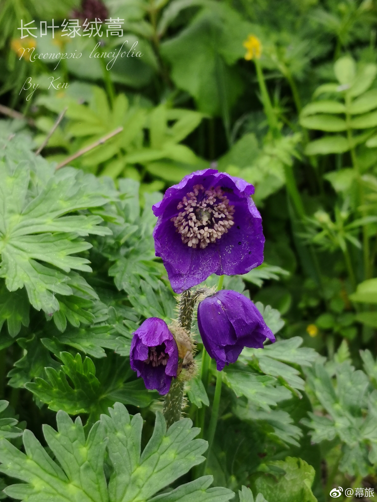

## 琴叶绿绒蒿 Meconopsis lyrata
中国植物志>> 第32卷 >> 罂粟科 Papaveraceae >> 绿绒蒿属 Meconopsis
13.琴叶绿绒蒿（中国植物学杂志）图版5: 1

一年生草本，高5-50厘米。主根通常狭卵形，长约1厘米，有时狭长。茎纤细，不分枝，被黄揭色卷曲或平展的柔毛，有时无毛。基生叶少数，早枯，叶片卵形、长圆状卵形、匙形或倒披针狱，长1.5-4厘米，宽0.5-2厘米，先端圆或急尖，基部楔形或微心形，边缘全缘、圆裂、羽状浅裂或深裂，两面疏被黄褐色柔毛或无毛，表面绿色，背面灰绿色，叶柄长1.5-4厘米；茎生叶与基生叶同形，但下部者具长达6厘米的叶柄，上部叶柄较短。花茎纤细，长达20厘米，被黄褐色卷曲或平展的柔毛。花1-5朵，生于上部蕊生叶腋内，通常仅顶生花开放，半下垂，直径1.5-2.5厘米；花粤无毛；花瓣4，稀5-6，卵形、宽卵形或有时宽披针形，长1.2-1.9厘米，宽0.4-1.5厘米，先端圆或急尖，淡蓝色或稀粉红色、淡玫瑰色、白色；雄蕊12-26，花丝丝状，长5-8毫米，与花瓣同色，花药长圆形至近圆形，长约1毫米，金黄色；子房长圆形或椭圆状长圆形至狭长圆形，长约5毫米，粗约2毫米，无毛，花柱极短，柱头绿色。蒴果狭长圆形或近圆往形，长约4厘米，3-4瓣自顶端开裂至全长的1/3。种子镰状椭圆形，种皮具皱纹。花果期5-9月。

产云南西北部（贡山、德钦）和西藏南部（亚东春王、吉隆），生于海拔3400-4200（-4800）米的草坡和高山草甸。锡金、不丹和尼泊尔有分布。

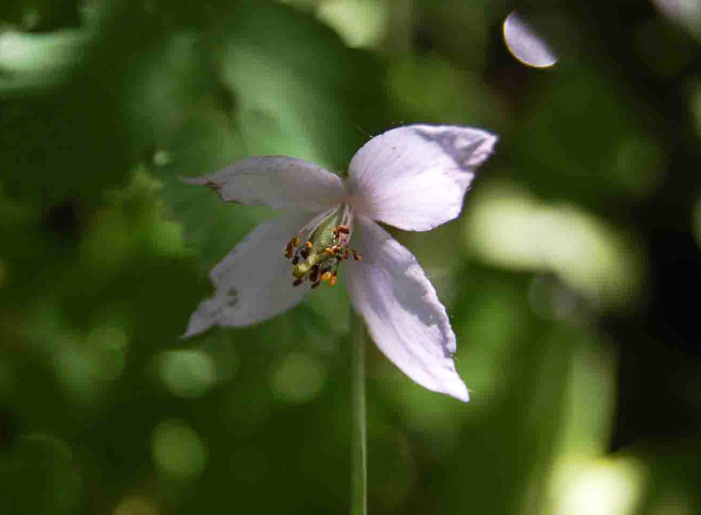

## 威氏绿绒蒿 Meconopsis wilsoni
中国植物志>> 第32卷 >> 罂粟科 Papaveraceae >> 绿绒蒿属 Meconopsis
5.尼泊尔绿绒蒿（中国植物学杂志）山莴笋（云南），埃贝赛保（青海藏语）图版3: 1-2

一年生草本，高60-120厘米，全体被黄褐色、具多短分枝的长柔毛。主根肥厚延长，长约9厘米，粗约2.5厘米，向下渐狭。茎圆柱形，粗壮，粗达3厘米，具分枝，有时纵棱明显，基部盖以宿存的叶基，其上被密集成丛、通常具多短分枝的长柔毛。基生叶密集丛生，长达30厘米，宽达17厘米，形态多变，通常基部羽状全裂，先端羽状半裂，裂片长圆形，先端急尖或圆，边缘缺刻状羽状浅裂，两面被毛，边缘具较密的长柔毛，表面绿色，中脉突起，侧脉不明显，背面淡绿色，中脉和侧脉均隆起，叶柄长达22厘米，上面具沟槽；下部茎生叶与基生叶同形，但具短柄，上部茎生叶长3-13厘米，宽1-5厘米，边缘羽状浅裂、深裂或全裂，先端圆或急尖，基部楔形或耳形，近无柄。花茎具分枝，多花，在茎、枝先端排列成总状圆锥花序；花梗长3-10厘米。花下垂；花芽圆形至卵形，长1-2.5厘米，粗1-1.8厘米；萼片卵圆形；花瓣4，卵形至近圆形，长3-4.3厘米，宽2-3.7厘米，蓝色，稀红色、紫色或白色；雄蕊多数，花丝丝状，长约1厘米，与花瓣同色或较深色，花药橘黄色，长圆形；子房近球形或卵形、椭圆形，长约1厘米，宽0.7-1厘米，密被淡黄色或锈色、紧贴、具多短分枝的长柔毛及微柔毛，花柱棒状，长0.5-1厘米，果时1.2厘米，基部稍粗，柱头头状，5-8裂，深绿色。蒴果长圆形或椭圆状长圆形，长1.5-2.5厘米，粗0.7-1.5厘米，5-8瓣自顶端微裂。种子卵形至宽椭圆形，表面密具乳突。花果期6-9月。

旧名尼泊尔绿绒蒿。产四川西南部（盐源、普格、木里、冕宁）和云南西北部、西南部（泸水）、中部及东北部以及西藏，生于海拔2700-4000米的草坡。尼泊尔、锡金也有分布。全草药用，清热止咳。

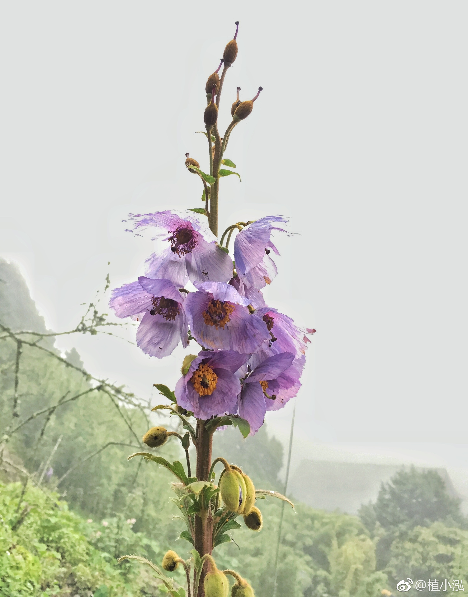

## 柱果绿绒蒿 Meconopsis oliverana
中国植物志>> 第32卷 >> 罂粟科 Papaveraceae >> 绿绒蒿属 Meconopsis
1．柱果绿绒蒿（秦岭植物志）图版2: 3

多年生草本，高50-100厘米，具无色透明的液汁。根细而多；根茎被以宿存的叶基和密被黄棕色具多短分枝的刚毛。茎直立，分枝，具明显的沟槽，近基部疏被刚毛。基生叶卵形或长卵形，长5-10厘米，宽3-5厘米，近基部羽状全裂，近顶部羽状浅裂，裂片3-5，疏离，具柄至近无柄，羽状分裂，小裂片卵形至倒卵形，先端钝圆，基部宽楔形、平截或稍心形，表面深绿色，背面具白粉，两面疏被黄棕色长硬毛，具叶柄，叶柄被黄棕色的长硬毛；茎生叶下部者与基生叶同形，具柄，上部者较小，无柄或近无柄，略抱茎。花1或2朵生于茎和分枝最上部的叶腋内，组成聚伞状圆锥花序；花梗细，长5-10厘米。花芽球形或卵形；萼片2，椭圆形，长7-10毫米，无毛；花瓣4，宽卵形至圆形，长1-1.5(-2)厘米，宽0.8-1.5(-2)厘米，黄色；雄蕊多数，花丝丝状，长4-7毫米，花药长卵形，长约1毫米，黄色；子房狭长圆形或近圆柱形，长约8毫米，粗约1毫米，无毛，花柱极短，柱头4-5裂，裂片略下延。蒴果狭长圆形或近圆柱形，长3-4厘米，粗3-4毫米，无毛，具隆起的肋，4-5瓣自顶端向下微裂。种子多数，椭圆状卵形，长约1毫米，棕褐色，具光泽，种皮明显具纵条纹及窗格状凹痕。花果期5-9月。

产河南（卢氏、灵宝等地）、湖北西部（巴东、神农架）、陕西南部（眉县、太白、略阳、佛坪）、四川东部（城口等地），生于海拔1500-2400米的山坡林下或灌丛中。模式标本采自城口。

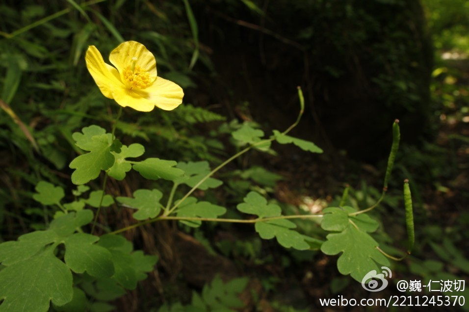

## 锥花绿绒蒿 Meconopsis paniculata
中国植物志>> 第32卷 >> 罂粟科 Papaveraceae >> 绿绒蒿属 Meconopsis
4．锥花绿绒蒿（云南植物研究）图版3：3-4

一年生草本，高达2米。主根萝卜状或狭长，长达18厘米，粗约1.8厘米。茎圆柱形，具分枝，被黄色、具多短分枝的柔毛及星状绒毛。基生叶密聚．叶片形态多变，披针形、长圆形、长圆状椭圆形至倒披针形，长达49厘米，宽达20厘米，通常近基部羽状全裂，近顶部羽状浅裂，裂片披针形、长圆形或三角形，先端急尖或圆，边缘全缘或分裂，下部裂片疏离，两面密被黄色、具多短分枝的柔毛及星状绒毛，叶柄长达28厘米；下部茎生叶与基生叶同形，但具较短柄，上部茎生叶披针形，先端钝或圆，基部抱茎或耳状，无柄，毛被同基生叶。花多数，下垂，排列成总状圆锥花序；花梗长约8厘米，果时达20厘米，被黄色、具多短分枝的柔毛及星状绒毛，先端毛极密。花瓣4,稀5,倒卵形至近圆形，直径达5厘米，黄色；花丝丝状，淡黄色，花药橙黄色；子房球形或近球形，密被紧贴、金黄色、具多短分枝的柔毛及星状毛，花柱明显，长约1厘米，果时达1.3厘米，近基部明显增粗，柱头具6-12裂片，微带紫红色。蒴果长椭圆形，长1.5-2.5厘米，粗0.5-1厘米，密被金黄色、具多短分枝的柔毛及星状毛，后来柔毛逐渐断落，（4-）6-12瓣自顶端微裂。种子肾形，长不足1毫米，表面干时具蜂窝状孔穴。花果期6-8月。

产西藏南部（吉隆、聂拉木、亚东、错那），生于海拔3000-4350米的林下草地或水沟边、路旁。尼泊尔东部到印度阿萨姆东北部有分布。

## 吉隆绿绒蒿 Meconopsis pinnatifolia
中国植物志>> 第32卷 >> 罂粟科 Papaveraceae >> 绿绒蒿属 Meconopsis
36.吉隆绿绒蒿（植物分类学报）图版11：1

一年生草本，高60-100厘米。主根肥厚，长约18厘米，上部粗约1.5厘米，向下渐狭。茎粗壮，基部粗约2厘米，具纵条纹，疏被黄褐色、具多短分枝的刚毛，基部盖以宿存叶基，其上密被锈色、具多短分枝的刚毛。基生叶披针形，长约15厘米，宽约6厘米，先端钝，近基部羽状深裂，裂片披针状长圆形，疏离，近顶端羽状浅裂，两面及边缘疏被黄褐色、具多短分枝的刚毛，中脉宽，侧脉细, 叶柄长约15厘米，宽约5毫米，基部扩大，疏被黄褐色、具多短分枝的刚毛，近基部疏被短刺；下部茎生叶同基生叶，上部茎生叶椭圆形至卵形，两面被毛，无柄。花数朵，生于茎上部叶腋内，最上部花无苞片；花梗长0.6-2.5厘米，被刚毛；花瓣4，宽倒卵形，长3-5厘米，宽2-3厘米，先端平截，具不规则的细齿，紫红色；花丝丝状，长1-1.5厘米, 花药长圆形，长1.5-2毫米；子房近球形，长1-1.8厘米，密被黄褐色、具多短分枝的刚毛，花柱圆柱形，长5-7毫米，基部扩大成盘并盖于子房之上，盘边缘深裂，裂片浅三角形，柱头长5-8毫米。幼果长圆形，长1-2厘米，粗0.7-1厘米，两端平截，密被毛。花果期6-9月。

产西藏南部（吉隆、聂拉木），生于海拔3500-4200米的山坡岩石隙。模式标本采自吉隆。

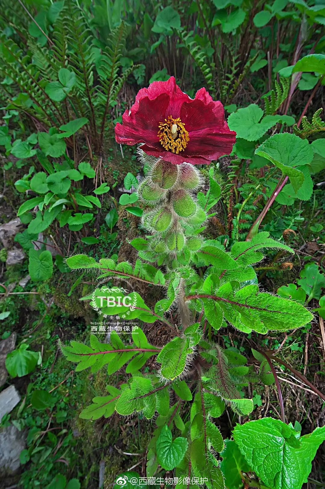

## 报春绿绒蒿 Meconopsis primulina
中国植物志>> 第32卷 >> 罂粟科 Papaveraceae >> 绿绒蒿属 Meconopsis
14.报春绿绒蒿（云南植物研究）

一年生草本，高约20厘米。主根萝卜状或狭长，长约7.5厘米，粗约7.5毫米；根茎盖以残枯的叶基。茎短。基生叶匙形，长1-2厘米，早枯，在开花期仅具密集成丛、宿存的膜质叶基；茎生叶生于茎的近基部，叶片倒披针形至椭圆形，长约4厘米，宽约1厘米，全缘，两面无毛或密被刚毛，下部叶柄长约3.7厘米，上部叶无柄。花通常3朵（极稀单生）生于长约25厘米的腋生花梗上，花梗无毛至疏被反折的刚毛。萼片无毛；花瓣6-8，狭卵形，长约2.5厘米，宽约1厘米，蓝色；雄蕊多数，花丝丝状，比子房长，与花瓣同色, 花药金黄色；子房狭卵形，长约1.5厘米，无毛，花柱长约5毫米，柱头近棒状，4裂，裂片多少下延。蒴果狭倒卵形至狭长椭圆形，4瓣开裂。（标本未见，据原描述）

产西藏中南部，海拔3900-4500米。不丹西部有分布。模式标本采自不丹和我国西藏的邻近地区。

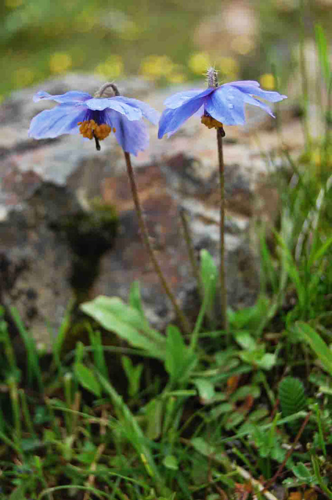

## 拟多刺绿绒蒿 Meconopsis pseudohorridula
中国植物志>> 第32卷 >> 罂粟科 Papaveraceae >> 绿绒蒿属 Meconopsis
32.拟多刺绿绒蒿（西藏植物志）图版10：2

一年生草本，全体被黄褐色坚硬而平展的刺。主根长，上部粗约5毫米。叶全部基生，叶片卵形或狭卵形，长1.5-2.5厘米，宽0.7-1厘米，先端圆或钝，基部楔形，下延而入叶柄，边缘羽状圆裂，裂片约3对，表面黄绿色，背面具白粉，两面被黄褐色坚硬的刺，叶脉在背面明显；叶柄长1.5-2厘米，有翅，基部扩大。花葶数枚，粗壮，长5-9厘米，被黄褐色坚硬而平展的刺，花下刺尤密。花单生于花葶上；花芽近球形；萼片外面被刺；花瓣宽倒卵形，长约1.7厘米，宽约1.3厘米，淡青紫色；花丝丝状，长5-7毫米，与花瓣同色，花药圆形至长圆形，长约0.5毫米，橙黄色；子房卵形，长0.8-1.3厘米，宽5-8毫米，被黄褐色坚硬而平展的刺，花柱长2-3毫米，柱头头状。果未见。花果期7-8月。

产西藏东南部（林芝），生海拔4700米的山地。模式标本采自林芝。

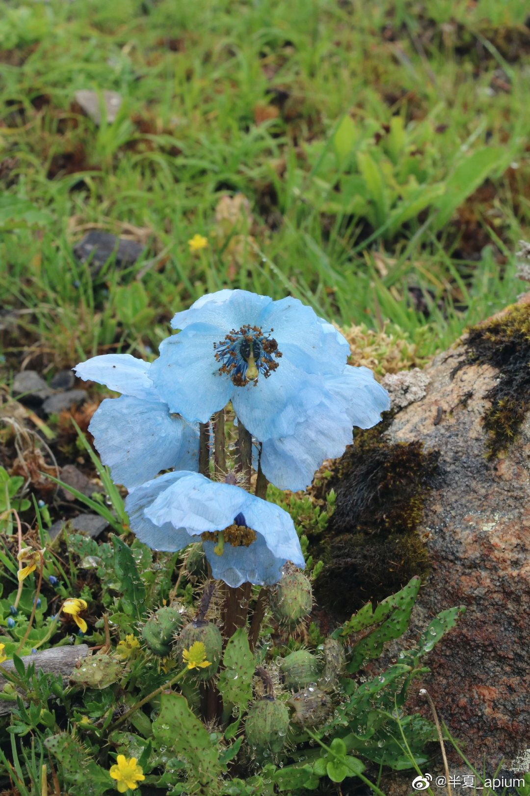

## 拟秀丽绿绒蒿 Meconopsis pseudovenusta
中国植物志>> 第32卷 >> 罂粟科 Papaveraceae >> 绿绒蒿属 Meconopsis
30. 拟秀丽绿绒蒿（中国植物学杂志）图版9: 2-3

一年生草本，植株基部密盖宿存的叶基。主根肥厚而延长，长10厘米以上，上部粗达2.5厘米。叶全部基生或稀生于花茎下部，叶片卵形、椭圆形、披针形或倒披针形，长2-5厘米，宽1-2厘米，先端急尖或圆，基部楔形，通常羽状深裂或二回羽状深裂，稀全缘或波状，两面无毛或中脉散生刚毛，近基出脉数条，两面均明显；叶柄线形，长达11厘米。花葶4-15，长10-20厘米，果时达35厘米，无毛或被平伸的刚毛，花葶有时基部合生。花生于基生花葶上，稀生于无苞片的花茎上而与基生花葶混生。花芽近球形，直径1-1.5厘米；萼片无毛或散生刚毛；花瓣4-10，椭圆形、倒卵形或近圆形，长2-3.5厘米，宽1-2.5厘米，先端圆或急尖，基部楔形，边缘具不规则的缺刻，深紫色；花丝丝状，长约1厘米，与花瓣同色，花药长圆形，长约1毫米，橘黄色至深褐色；子房椭圆形或椭圆状长圆形，长3-6毫米，疏被紧贴或伸展的刚毛，花柱长1.5-1.8毫米，柱头头状。蒴果狭倒卵形至狭椭圆形，长2-3厘米，粗0.5-1厘米，疏被锈色、平展或反曲的刚毛，3-4瓣自顶端微裂，花柱延长达6毫米。种子镰状椭圆形，种皮具不明显的纵凹痕。花果期6-10月。

产云南西北部（中甸、维西）、四川西南部和西藏东南部（波密），生于海拔3400-4200米的高山草甸、岩坡或高山流石滩。模式标本采自中甸。

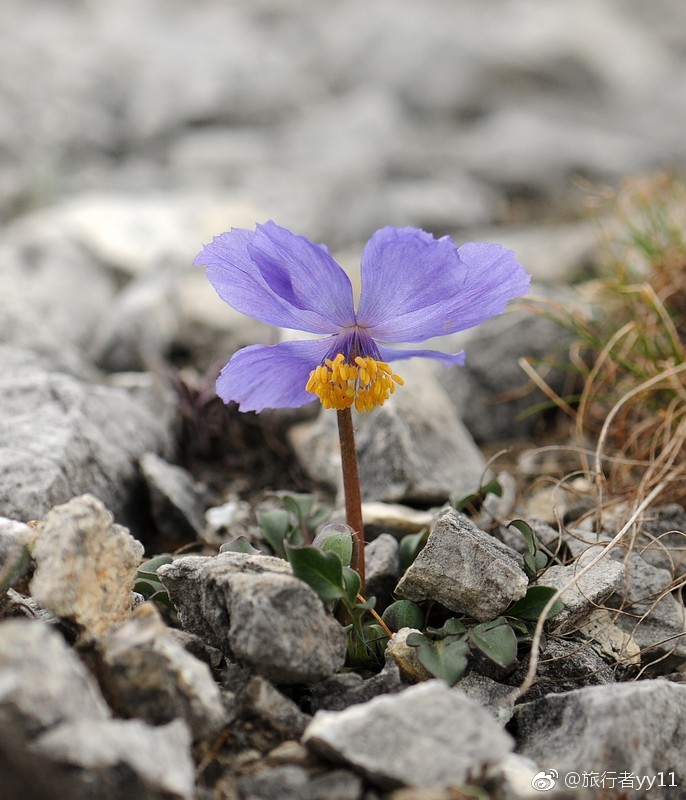

## 红花绿绒蒿 Meconopsis punicea
中国植物志>> 第32卷 >> 罂粟科 Papaveraceae >> 绿绒蒿属 Meconopsis
21.红花绿绒蒿（中国植物学杂志）阿柏几麻鲁（藏语）图版7: 3-4

多年生草本，高30-75厘米，基部盖以宿存的叶基，其上密被淡黄色或棕褐色、具多短分技的刚毛。须根纤维状。叶全部基生，莲座状，叶片倒披针形或狭倒卵形，长3-18厘米，宽1-4厘米，先端急尖，基部渐狭，下延入叶柄，边缘全缘，两面密被淡黄色或棕褐色、具多短分枝的刚毛明显具数条纵脉；叶柄长6-34厘米，基部略扩大成鞘。花葶1-6，从莲座叶丛中生出，通常具肋，被棕黄色、具分枝且反折的刚毛。花单生于基生花葶上，下垂：花芽卵形；萼片卵形，长1.5-4厘米，外面密被淡黄色或棕褐色、具分枝的刚毛；花瓣4，有时6，椭圆形，长3-10 厘米，宽1.5-5厘米，先端急尖或圆，深红色：花丝条形，长1-3厘米，宽2-2.5毫米，扁平，粉红色，花药长圆形，长3-4毫米，黄色；子房宽长圆形或卵形，长1-3厘米．密被淡黄色、具分枝的刚毛，花柱极短，柱头4-6圆裂。蒴果椭圆状长圆形，长1.8-2.5厘米，粗1-1.3厘米，无毛或密被淡黄色、具分枝的刚毛，4-6瓣自顶端微裂。种子密具乳突。花果期6-9月。

产四川西北部、西藏东北部、青海东南部和甘肃西南部，生于海拔2800-4300米的山坡草地。模式标本采自四川西北部和西藏东北部的邻近地区。花茎及果入药，有镇痛止咳、固涩、抗菌的功效，治遗精、白带、肝硬化。

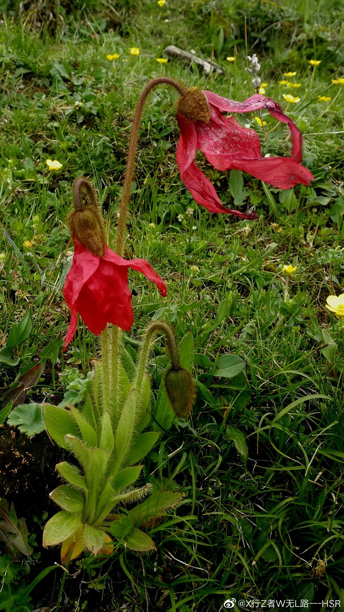

## 五脉组绒蒿 Meconopsis quintuplinervia
中国植物志>> 第32卷 >> 罂粟科 Papaveraceae >> 绿绒蒿属 Meconopsis
23.五脉组绒蒿（中国植物学杂志）欧摆完保（藏语），毛叶兔耳风、毛果七（陕西），野毛金莲（青海）

23a. 五脉绿绒蒿 var. quintuplinervia
多年生草本，高30-50厘米，基部盖以宿存的叶基，其上密被淡黄色或棕褐色、具多短分枝的硬毛。须根纤维状，细长。叶全部基生，莲座状，叶片倒卵形至披针形，长2-9厘米，宽1-3厘米，先端急尖或钝，基部渐狭并下延入叶柄，边缘全级，两面密被淡黄色或棕褐色、具多短分枝的硬毛．明显具3-5条纵脉；叶柄长3-6厘米。花葶1-3,具肋，被棕黄色、具分枝且反折的硬毛，上部毛较密。花单生于基生花葶上，下垂。花芽宽卵形；萼片长约2厘米，宽约1.5厘米，外面密被棕黄色、具分枝的硬毛；花瓣4-6，倒卵形或近圆形，长3-4厘米，宽2.5-3.7厘米，淡蓝色或紫色；花丝丝状，长1.5-2厘米，与花瓣同色或白色，花药长圆形，长1-1.5毫米，淡黄色；子房近球形、卵珠形或长圆形，长5-8毫米，密被棕黄色、具分枝的刚毛，花柱短，长1-1.5毫米，柱头头状，3-6裂。菇果椭回形或长圆状椭圆形，长1.5-2.5厘米，密被紧贴的刚毛，3-6摇自顶端微裂。种子狭卵形，长约3毫米，黑褐色，种皮具网纹和皱褶。花果期6-9月。

产湖北西部（神农架）、四川西北部（茂汶、黑水、马尔康、松潘、若尔盖、色达）、西藏东北部、青海东北部（祁连、门源、互助、大通）、甘肃南部（岷县、舟曲、西固、临潭）、陕西西部（宝鸡、眉县、太白），生于海拔2300-4600米的阴坡灌丛中或高山草地。模式标本采自甘肃。全草入药，清热解毒、消炎、定喘，治小儿惊风、肺炎、咳喘。

23b.光果五脉绿绒蒿（植物研究）
var. glabra P. H. Yang et M. C. Wang in Bull. Bot Res. 10 (4): 43. 1990
与原变种的区别是子房和蒴果无毛。产陕西（宁陕），生于海拔2400-2900米的林下。模式标本采自宁陕莱子坪。

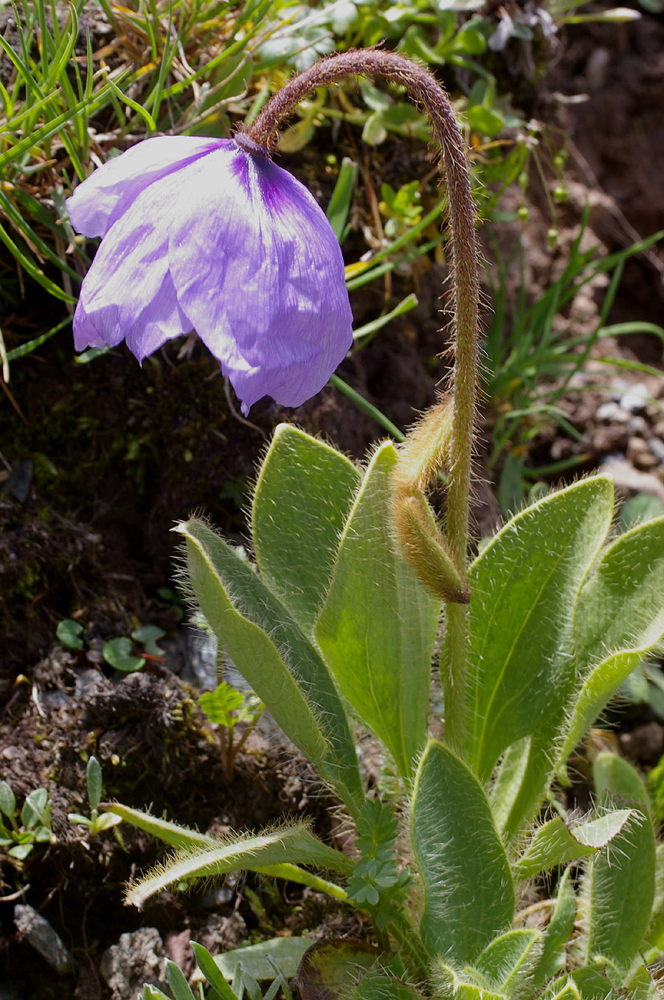

## 总状绿绒蒿 Meconopsis racemosa
中国植物志>> 第32卷 >> 罂粟科 Papaveraceae >> 绿绒蒿属 Meconopsis
16.总状绿绒蒿（云南植物志）刺参、条参、鸡脚参、红毛洋参、雪参（云南）图版5：2-3

16a.总状绿绒蒿
var. racemosa
一年生草本，高20-50厘米，全体被黄褐色或淡黄色坚硬而平展的硬刺。主根圆柱形，长达20厘米，上部粗0.5-1.5厘米，向下渐狭。茎圆柱形，不分枝，有时混生基生花葶，近基部粗0.5-1厘米，基部盖以光滑、宿存的叶基。基生叶长圆状披针形、倒披针形或稀狭卵形、条形，长5-20厘米，宽0.7-4.2厘米，先端急尖或钝,基部狭楔形，下延至叶柄基部，边缘全缘或波状，稀具不规则的粗锯齿，两面绿色，被黄褐色或淡黄色平展或紧贴的刺毛，有时刺毛基部呈紫色，中脉在背面隆起，侧脉在两面均明显，叶脉延伸至翅，叶柄长3-8厘米；下部茎生叶同基生叶，上部茎生叶长圆状披针形，有时条形，长3-17厘米，宽0.6-3厘米，全缘，两面被刺毛，具短柄、近无柄至最上部者无柄。花生于上部（约1/3）茎生叶腋内，最上部花无苞片，有时也生于基生叶腋的花葶上；花梗长2-5厘米。花芽近圆形或卵形，直径约1厘米; 萼片长圆状卵形，外面被刺毛；花瓣5-8，倒卵状长圆形，长2-3厘米，宽1-2厘米，天蓝色或蓝紫色，有时红色，无毛；花丝丝状，长约1厘米，紫色，花药长圆形，黄色；子房卵形，长5-8毫米，密被刺毛，花柱圆锥形，长2-4毫米，具棱，无毛，柱头长圆形，长1-2毫米。蒴果卵形或长卵形, 长0.5-2厘米，粗0.4-1.2厘米，密被刺毛，4-6瓣自顶端开裂至全长的1/3；果梗长1-15厘米，被刺毛；宿存花柱长0.7-1厘米，粗达2毫米。种子长圆形，长1-2毫米，种皮具窗格状网纹。花果期5-11月。

产云南西北部、四川西部和西北部、西藏、青海南部和东部、甘肃南部，海拔3000-4600（-4900）米的草坡、石坡有广泛分布，有时生于林下。模式标本采自四川北部和青海交界处。

西藏用全草消炎、止骨痛、治头伤、骨折；云南用根入药，治气虚下陷、浮肿、脱肛、久痢、哮喘；青海以花、茎入药，治腰痛、腿痛。

16b. 刺瓣绿绒蒿（植物分类学报）
与原变种的区别在于花瓣两面中下部疏生细刺；花柱具4棱，棱呈膜质翅状，宽约1.5毫米，花丝窄线形。产青海南部（玉树），海拔4000米附近。模式标本采自玉树。

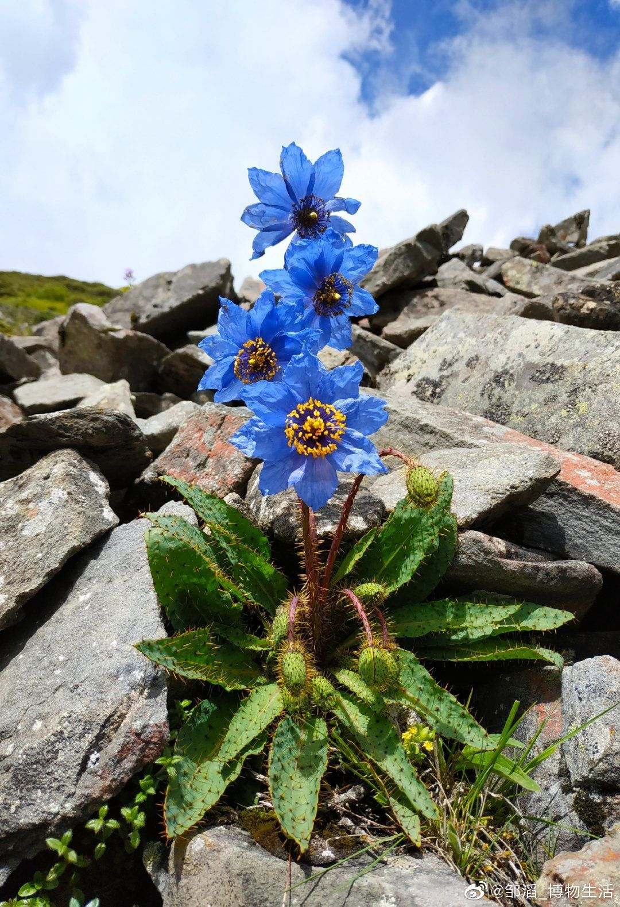

## 单叶绿绒蒿 Meconopsis simplicifolia
中国植物志>> 第32卷 >> 罂粟科 Papaveraceae >> 绿绒蒿属 Meconopsis
22.单叶绿绒蒿（中国植物学杂志）图版7: 1-2

一年生或多年生草本，高20-50厘米，基部覆盖密集残枯的叶基，其上密被棕色或金黄褐色、具多短分枝的刚毛。纤维根细，长约13厘米。叶全部基生，莲座状，叶片倒披针形、披针形至卵状披针形，长达16厘米，宽达5厘米，先端急尖或钝，基部渐狭而入叶柄，边缘全缘或具不规则的锯齿或圆齿，两面被具多短分枝的长柔毛，背面中脉和侧脉均明显；叶柄条形，长达20厘米，基部扩大。花半下垂，单生于基生花葶上，花葶1-5，被刚毛，刚毛初时紧贴或伸展，后反折。花芽宽卵形；萼片外面密被具分枝的刚毛；花瓣5-8，倒卵形，长4-5厘米，宽3-4厘米，紫色至天蓝色；花丝丝状，长1-1.5厘米，与花瓣同色，花药长圆形，长约2毫米，橘黄色；子房狭椭圆形至长圆状椭圆形，长1.5-2厘米，无毛或被刚毛，花柱明显, 长约7毫米，柱头头状或近棒状，4-9裂，绿色。蒴果狭长圆形至长圆状圆形，长2.5-5厘米，被反折的刚毛，4-9瓣自顶端开裂至全长的1/3。种子椭圆形或肾形，种皮密具乳突。花果期6-9月。

产西藏东南部至中南部（林芝、米林、错那、亚东、聂拉木），生于海拔3300-4500米的山坡灌丛草地或石缝中。尼泊尔中部、锡金、不丹有分布。

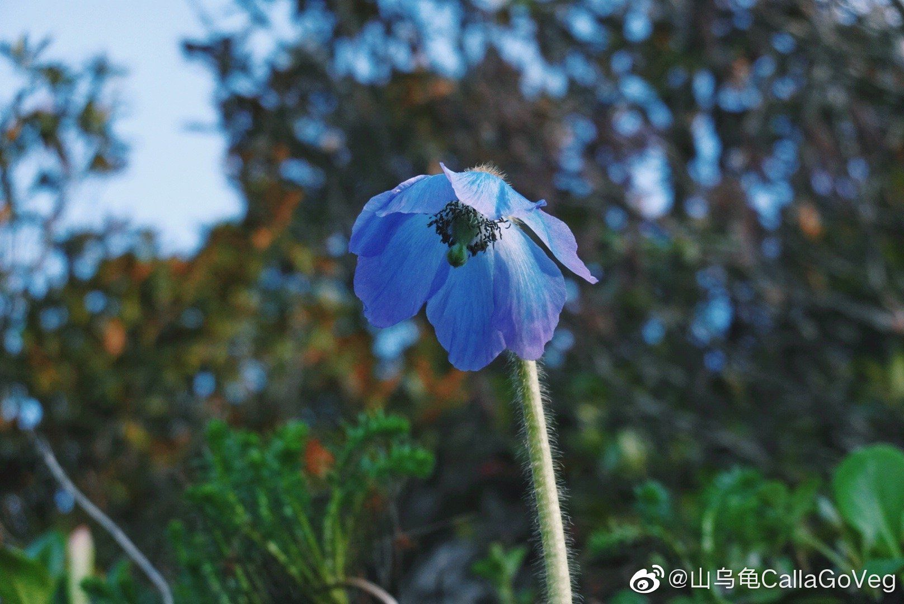

## 贡山绿绒蒿 Meconopsis smithiana
中国植物志>> 第32卷 >> 罂粟科 Papaveraceae >> 绿绒蒿属 Meconopsis
6.贡山绿绒蒿（云南植物志）图版4: 3

多年生草本。根茎短而肥厚，具宿存的叶基及密集丛生、褐色、通常具多短分枝的长硬毛。茎不分枝，高30-90厘米，被稀疏、平展或稍反曲、通常具多短分枝的长硬毛。基生叶未见；茎生叶疏离，下部叶具长2.5-4厘米的柄，柄被平展或反曲的长硬毛，叶片羽状3小叶，长约8厘米，宽7-8厘米，两面被稀疏紧贴的长硬毛，顶生小叶宽卵形或近圆形．通常具7个圆裂片，两侧小叶离顶生小叶1-2厘米或更多，具长约1厘米的小叶柄或无柄，通常具3个圆裂片，上部叶具长约1厘米的柄或无柄，柄被平展或反曲的长硬毛，叶片宽卵形，羽状浅裂，向上渐小和裂片渐减。花约4朵，排成具苞片的总状花序。萼片被毛；花瓣4，宽倒卵形，长和宽约1.8厘米，先端微缺，黄色；子房近球形，密被紧贴、褐色的长硬毛，花柱缺或极短，柱头5裂。蒴果倒圆锥状，长约1.5厘米，顶部宽约1厘米，疏被褐色长柔毛，7瓣自顶端开裂至全长的1/3。种子椭圆形，具纵向隆起的条纹。花果期7-10月。

产云南酉北部（贡山），生于海拔3120-3400米的潮湿林中、林缘或山坡湿草地。缅甸东北部有分布。模式标本采自贡山。

## 美丽绿绒蒿 Meconopsis speciosa
中国植物志>> 第32卷 >> 罂粟科 Papaveraceae >> 绿绒蒿属 Meconopsis
17.美丽绿绒蒿（中国植物学杂志）

一年生草本，高15-60厘米，全体被锈色或淡黄色刺毛。主根粗而长，长达30厘米，粗达2.5厘米。茎圆柱形，不分枝，有时有基生花葶混生，被锈色或淡黄色刺毛，基部盖以宿存的叶基。基生叶披针形或狭卵形，长5-13厘米，宽2.5-4厘米，先端圆或急尖，基部渐狭而入叶柄，边缘羽状深裂，裂片长圆形，先端圆，稀急尖，裂片间通常圆缺刻，中脉宽，具浅沟，侧脉细，叶柄长2-11厘米，连翅宽2-6毫米；茎生叶同基生叶，但较小，具短柄、近无柄至无柄。花多数，极香，生于上部茎生叶腋内，有时生于混生的基生花葶上，稀基生花葶基部连合于短茎上；下部花具苞片，上部花苞片退化，最上部花无苞片；花梗劲直，长2-8厘米。花芽近球形，直径1-2厘米；花萼外面被黄褐色刺毛；花瓣4-8，倒卵形至近圆形，长2-4.5厘米，宽2-4厘米，先端圆，蓝色至鲜紫红色；花丝丝状，长约1厘米，与花瓣同色但较深，花药长圆形，长约1毫米；子房近球形至卵形，长约5毫米，密被锈色刺毛，花柱长2-4毫米，具棱，有时近基部具刺毛，柱头长圆形，长2-3毫米。蒴果椭圆形，长1.5-2.5厘米，粗0.5-1.2厘米．密被锈色而基部紫色或者黄褐色刺毛，花柱粗壮，延长达1厘米， 4-8瓣自顶端开裂至全长的1/3。种子肾形．种皮具纵凹痕。花果期7-10月。

产四川西部（康定）、云南西北部（维西、贡山、德钦）和西藏东南部（墨脱），生于海拔3700-4400米的高山灌丛草地、岩坡、岩壁和高山流石滩。模式标本采自德钦。

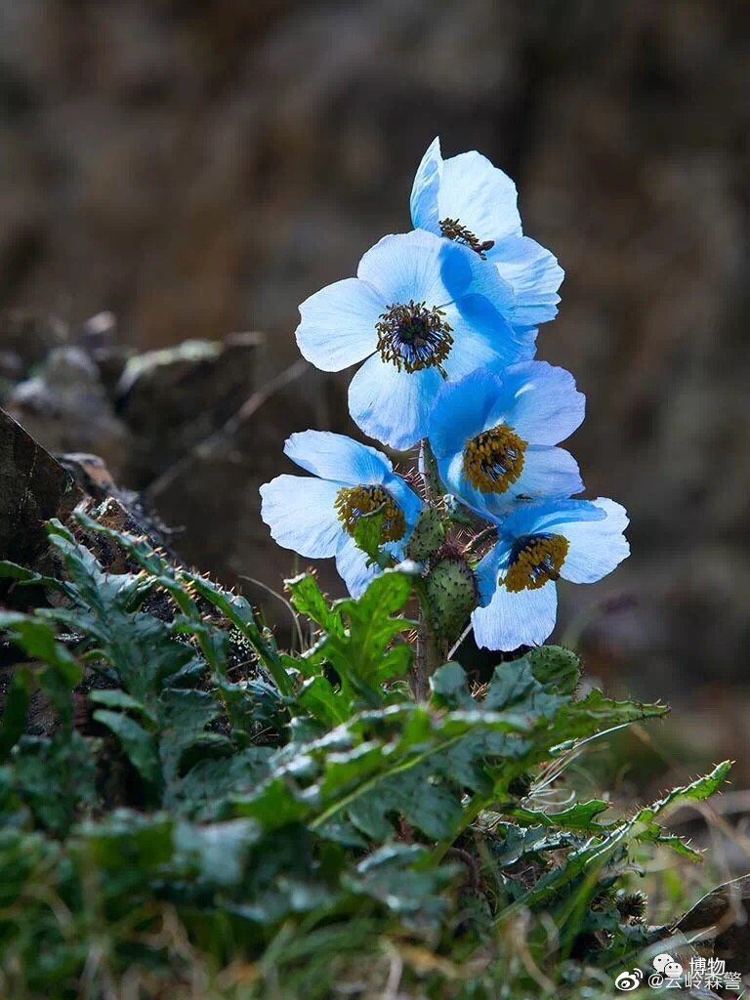

## 高茎绿绒蒿 Meconopsis superba
中国植物志>> 第32卷 >> 罂粟科 Papaveraceae >> 绿绒蒿属 Meconopsis
10.高茎绿绒蒿（中国植物学杂志）

一年生草本，高达1米，全体被紧贴、通常银白色的柔毛。主根萝卜状。基生叶在冬季宿存成密集莲座状，叶片倒披针形、倒披针状长圆形、椭圆形或卵状长圆形，长约35厘米，宽约9厘米，先端急尖，基部渐狭，边缘具细齿．幼时被绢毛和长柔毛，后长柔毛脱落，叶柄宽，长约5厘米；下部茎生叶同基生叶，但叶柄较短，上部茎生叶无柄，基部耳形。花单生于最上部茎生叶腋内；花梗粗壮，长达11厘米，密被紧贴的绒毛。花瓣4，顶生花通常6，倒卵形至近圆形，长和宽约6厘米，白色；花丝丝状，白色，花药深黄色；子房近球形至长椭圆形，被紧贴绒毛，花柱明显，长约9毫米，柱头明显具裂片，深紫色。蒴果长椭圆形，7-11瓣自先端开裂。种子肾形，种皮密具乳突。（标本未见，据原描述）

产西藏中南部，海拔约4000米。不丹西部有分布。模式标本采自西藏中南部。

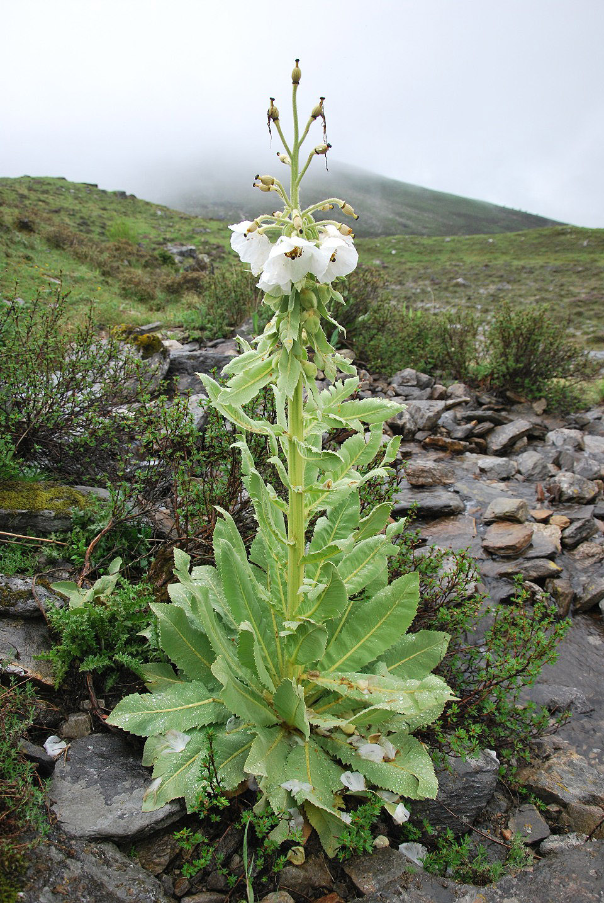

## 毛瓣绿绒蒿 Meconopsis torquata
中国植物志>> 第32卷 >> 罂粟科 Papaveraceae >> 绿绒蒿属 Meconopsis
38. 毛瓣绿绒蒿（中国植物学杂志）图版11：3

一年生草本。茎直立，基部盖以宿存的叶基，叶基上密被锈色、具多短分枝的刚毛。基生叶多数，莲座状，叶片倒披针形，连叶柄长约13厘米，宽约2.5厘米，先端钝或近急尖，基部楔形，边缘全缘或不规则的波状，两面被黄褐色、具多短分枝的刚毛，叶柄线形，基部具鞘，密被刚毛；下部茎生叶同基生叶，上部茎生叶较小，边缘为不规则的圆裂，无柄。花茎高约40厘米，粗壮，密被伸展或稍反折、具多短分枝的刚毛。花约25朵．紧密排列于茎先端；花梗长约6毫米，密被刚毛，顶端扩大成一宽的托；上部花无苞片；花瓣4或更多，倒卵形，长约3.7厘米，宽约1.8厘米，淡红色，外面疏被刚毛；花丝丝状，长约1.2厘米，花药狭长圆形，长约2毫米，黄色；子房倒卵形或椭圆状长圆形，长约1厘米，密被斜展、具多短分枝的刚毛，花柱极短，基部扩大成紫红色、无毛的盘，盘盖于子房之上且突出于子房之外，边缘波状，具8棱，柱头近头状。蒴果倒卵形或椭圆状长圆形，明显具肋，自花柱盘下部8瓣微裂。种子卵圆形，种皮具网纹。花果期6-9月。

产西藏南部，生于海拔3400-3800米的山坡上。模式标本采自西藏中南部。

## 秀丽绿绒蒿 Meconopsis venusta
中国植物志>> 第32卷 >> 罂粟科 Papaveraceae >> 绿绒蒿属 Meconopsis
31.秀丽绿绒蒿（中国植物学杂志）图版9: 4-5

一年生草本，植株基部盖以宿存的叶基。主根肥厚，长达23厘米，上部粗达2厘米。叶全部基生，叶片厚且近肉质，卵形或长圆形，长1.5-3厘米，宽1-1.5厘米，羽状深裂或常为3裂片，顶生裂片卵形或近圆形，侧裂片匙形至倒卵形，先端圆，两面无毛，极稀在背面散生刚毛，表面绿色，叶脉不明显，背面具白粉，脉极细；叶柄宽线形或狭条形，长3-8厘米。花葶4-13，长6-20厘米，果时达30厘米，无毛或极稀散生硬毛。花单生于花葶上；花芽卵圆形，长0.8-1.2厘米，宽5-8毫米；花瓣4,倒卵形至近圆形，长2.5-4厘米，宽2-2.7厘米，先端圆或急尖，淡蓝色、淡紫色或深紫色；花丝丝状，长约8毫米，与花瓣同色，花药长圆形，橘黄色；子房狭椭圆形或椭圆状长圆形，长约6毫米，被斜展的硬毛，花柱长约5毫米，柱头头状，3-4裂片。蒴果狭长圆形或近圆柱形，长4-9厘米，粗约5毫米，疏被锈色或黄褐色平展的刺毛， 3-4瓣自顶端开裂至全长的1/3。种子狭长圆形或椭圆状长圆形，种皮具细纵纹。花果期7-8月。

产云南西北部，生于海拔3300-4650米的山坡。模式标本采自丽江和中甸。

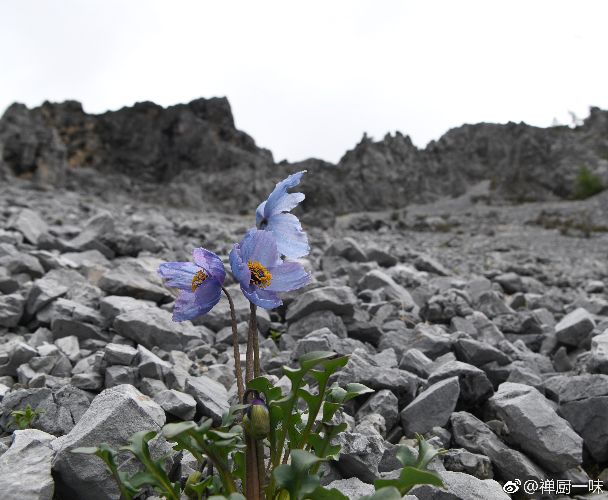

## 紫花绿绒蒿 Meconopsis violacea
中国植物志>> 第32卷 >> 罂粟科 Papaveraceae >> 绿绒蒿属 Meconopsis
15.紫花绿绒蒿（中国植物学杂志）

一年生草本。主根萝卜状。基生叶密集莲座状，叶片长约16厘米，宽约4厘米，羽状全裂或深裂，裂片长圆形或披针状长圆形，先端急尖, 边缘全缘或不整齐的分裂，两面特别中脉和边缘被长柔毛并混生短毛，叶柄长约7.5厘米；下部茎生叶同基生叶，但叶柄较短，上部茎生叶无柄, 基部耳形，略抱茎，最上部茎生叶羽状分裂。花茎长达180厘米，被长柔毛和绒毛；花下垂，生于上部茎生叶腋内；花梗细，长约6.2厘米，果时达13厘米，先端密被毛。花瓣4（有时5-6）, 倒卵形至近圆形，长约3.7厘米，宽约2.5厘米，浅蓝色、丝光紫罗兰色或有时紫色；花丝丝状，上部与花瓣同色，基部白色，花药亮橘黄色；子房椭圆形至椭圆状长圆形，密被紧贴或斜展、淡金黄色毛，花柱明显，长达7毫米，通常较细，柱头近棒状或略具分离的裂片，淡绿色。蒴果椭圆状长圆形，密被宿存、紧贴的毛或基部被硬毛，7-9瓣自先端微裂。种子椭圆状长圆形至肾形，种皮密具乳突。（标本未见，据原描述）

产西藏东南部，海拔3000-3900米。缅甸北部有分布。模式标本采自缅甸北部和我国西藏东南部文界处。

## 乌蒙绿绒蒿 Meconopsis wumungensis
中国植物志>> 第32卷 >> 罂粟科 Papaveraceae >> 绿绒蒿属 Meconopsis
27. 乌蒙绿绒蒿（云南植物志）图版8: 4

一年生草本。主根萝卜状，长约4厘米，上部粗3-7毫米，末端狭圆柱状延长达10厘来。叶全部基生，叶片宽卵形至披针形，长1.5-4.5厘米，宽1-2厘米，先端圆，基部心状楔形，下延成翅，边缘顶部浅圆裂、中部深圆裂、近基部全圆裂，裂片近圆形，有时有少数全缘叶混生，两面无毛，中脉在表面突起，在背面常具2纵沟，侧脉明显，二歧状；叶柄狭条形，长4-6厘米，基部扩大成宽达4毫米的鞘。花葶1-2,长约11厘米，黄褐色、平展或反曲的硬毛。花单生于花葶上；花芽狭卵形，长约l.5厘米，宽约6毫米；萼片无毛；花瓣4，倒卵形，长约3厘米，宽约2厘米，蓝紫色；花丝丝状，长约1厘米，花药长圆形，长1.5-2毫米；子房狭椭圆形，长约8毫米，粗约3毫米，疏被黄褐色的硬毛，花柱长约2毫米，柱头头状，4裂下延于花柱上。果未见。花期6月。

产云南中部（禄劝），生于海拔3600-3800米的湿润石上、岩壁上。模式标本采自禄劝乌蒙山。

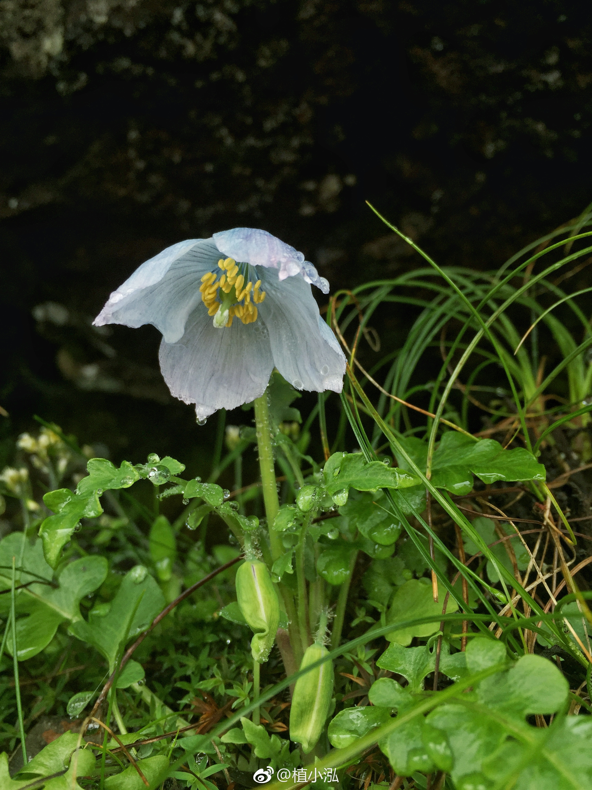

## 藏南绿绒蒿 Meconopsis zangnanensis
中国植物志>> 第32卷 >> 罂粟科 Papaveraceae >> 绿绒蒿属 Meconopsis
29. 藏南绿绒蒿（植物分类学报）

多年生丛生草本，植株基部盖以极密集的纤维状叶基。主根圆柱形，肥厚，粗约5毫米。叶全部基生，叶片披针形或狭菱形，长(0.5-)1-1.5(-2)厘米，宽（2-）3-5（-8）毫米，先端圆，基部楔形并下延入叶柄，边缘全缘，表面绿色，背面具白粉，两面无毛或稀背面散生刚毛，叶脉基出，二歧状分枝，在背面较明显；叶柄线形，长1.5-2.5厘米。花葶1-5，长8-15厘米，被黄褐色伸展的刚毛。花单生于花葶上，常下垂；花芽卵形，长约1厘米；萼片外面被毛，边缘膜质；花瓣4，宽倒卵形，长2-3厘米，宽1.5-2厘米，先端圆或平截，边缘具不规则的缺刻，天蓝色；花丝丝状，长6-8毫米，花药长圆形，长约1.5毫米，黄色；子房椭圆形，长5-7毫米，被斜展的刚毛，花柱长1.5-2毫米，柱头4裂，裂片下延。蒴果椭圆形，长1-1.2厘米，疏被刚毛（成熟果未见）。花果期7-8月。

产西藏东南部（错那），生于海拔4300-4600米的高山草甸。模式标本采自错那。

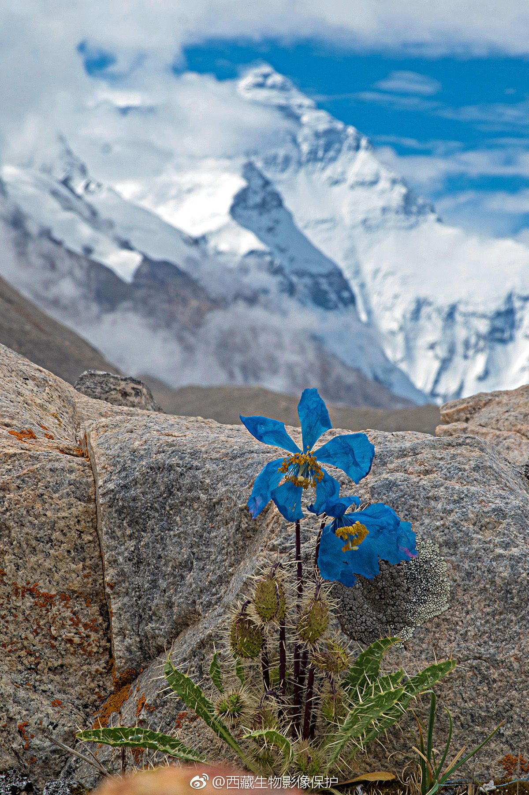

## 人工种植进展

基于对绿绒蒿的保护，中国科学院昆明植物研究所丽江高山植物园于2017年与北京植物园合作开展绿绒蒿的引种保育工作，并提供种苗参展2019年中国北京世界园艺博览会。 

绿绒蒿属当前拥有79个物种，还有新种在陆续发表。丽江高山植物绿绒蒿属植物引种保育工作初见成效，目前引种保育绿绒蒿有26个种和13个品种，10000余株幼苗，1500余株成苗。这些物种来自西藏（亚东、聂拉木、山南、拉萨）、云南（滇西北）、四川（阿坝），同时也包括西南野生生物种质资源库及国外种子公司（Jelitto）提供的种子萌发而成。目前引种的绿绒蒿物种有来自林区的尼泊尔绿绒蒿（Meconopsis napaulensis），也有来自高山草甸的全缘叶绿绒蒿（Meconopsis integrifolia）；既有广布的多刺绿绒蒿（Meconopsis horridula），也有狭域的细梗绿绒蒿（Meconopsis gracilipes）。

当前，由于绿绒蒿野生种群过度采挖，生态环境破坏，全球气候变化等因素，导致绿绒蒿属的许多物种面临生存困境。而绿绒蒿对生存环境要求很高，人工引种驯化工作一直收效甚微。 丽江高山植物园位于丽江玉龙雪山南坡，园区拥有2400m-3600m的海拔跨度。低纬度、高湿度、高海拔、强光照，拥有绿绒蒿引种的天然地理和气候环境优势。 目前种质资源收集保育工作还在继续进行，丽江高山植物园将通过发挥独有的引种栽培优势，努力打造中国甚至是世界绿绒蒿属植物引种保育中心。 